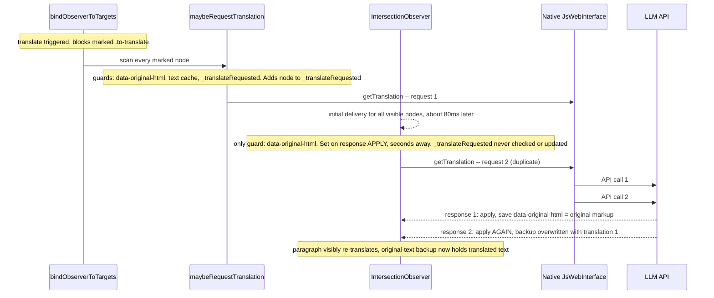
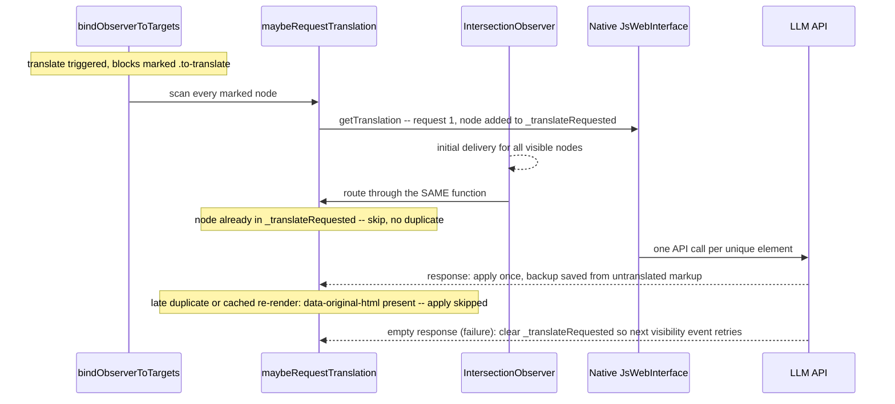

2026-07-11

# EinkBro: In-place translation requested every paragraph twice

## What was broken

With in-place translation (OpenAI/Gemini) on news.naver.com, paragraphs visibly re-translated: a paragraph would render its translation, then flash and render a *slightly different* translation moments later — LLM output isn't deterministic, so the second response rarely matched the first. On e-ink that's a double full refresh per paragraph. Behind the scenes every visible paragraph cost two LLM API calls, and on scroll-heavy pages some elements fired up to five times. A subtler casualty: after the double apply, the element's `data-original-html` backup — the stored original markup used to restore untranslated text — contained the *first translation* instead of the original, so restoration was silently broken for most of the page.

## Root cause

`text_node_monitor.js` requests translations from two independent code paths, and their dedup guards didn't overlap:

1. **Bind-time scan** — when the translate scripts are injected (and again on every MutationObserver rebind), `bindObserverToTargets()` runs `maybeRequestTranslation()` over every marked node. This path checks *and populates* the `_translateRequested` WeakSet.
2. **IntersectionObserver** — observing the same nodes, its in-place branch guarded only on the `data-original-html` attribute. But that attribute is set when a *response is applied*, seconds after the request. The observer neither checked nor updated `_translateRequested`.

An IntersectionObserver always delivers an initial batch of entries for already-intersecting elements right after `observe()`. So every visible element was requested once by the bind scan and again ~80ms later by the observer's initial delivery — deterministically, on every page. news.naver.com made it worse: the page mutates its DOM constantly (lazy modules, ad slots), each mutation re-runs the rebind loop, and scrolling re-crosses the observer's ±400px rootMargin — every such event re-fired any element whose response was still in flight. With rate-limited providers the in-flight window is long, so the duplicates compounded.

Two adjacent latent bugs surfaced during the investigation:

- **Orphaned observer on re-injection.** Each re-injection of `text_node_monitor.js` disconnected the old IntersectionObserver and created a new one — but the rebind loop skips nodes already in `_translateObservedNodes`, so previously observed nodes were detached from the old observer and never attached to the new one. After a second injection (common: multiple `onPageFinished` per load, mode switches), off-screen content could silently never translate on scroll.
- **No retry after failure.** The native side only invoked the JS callback on success. A failed request left its element flagged in-flight forever — before the fix the duplicate storm masked this by accidentally acting as retry.

## The fix

One request path, one guard set, and failures unblock their element:

In `text_node_monitor.js`:

- The IntersectionObserver's in-place branch now calls `maybeRequestTranslation()` instead of requesting directly, so both paths share the full guard set (`data-original-html` + session text cache + `_translateRequested`). A bonus: observer-triggered elements now also benefit from the instant cache-apply path.
- The sibling (by-paragraph) branch got the same `_translateRequested` guard — its "empty `nextElementSibling`" check has the identical in-flight race.
- The observer is reused across re-injections (`window._translateObserver = window._translateObserver || new IntersectionObserver(...)`) instead of disconnect-and-recreate, fixing the orphaning. The callback resolves its helpers as globals at call time, so re-injected definitions still apply.
- `_applyTranslationToElement` returns early when `data-original-html` already exists — a late duplicate response can no longer churn the text nodes or overwrite the backup.
- `myCallback` treats an empty response as failure: clears the element's in-flight flag (enabling retry on the next visibility event) and skips caching.

In `JsWebInterface.kt`, the callback is invoked even when translation fails (empty string) so the JS side can do that cleanup. All five provider paths already catch exceptions and return empty, so no new crash path.

## How it was proven

Static reading suggested the race, but the numbers came from instrumenting the live WebView over CDP (debug builds expose `webview_devtools_remote_<pid>`): a JS proxy wrapped `androidApp.getTranslation` and recorded every call with element id, text, and a stack trace attributing it to its calling path. The stack traces showed exactly the predicted split — bind-scan requests followed ~80ms later by IntersectionObserver duplicates.

Same article, same provider (OpenAI in-place), before vs after:

| | before | after |
|---|---|---|
| Initial view | 75 calls / 47 elements (28 requested twice) | 46 calls / 46 elements |
| API calls | 63 for 45 unique texts | 1 per unique element |
| After five pages of scrolling | 3–5x per pending element | 68 calls / 68 elements, zero duplicates |
| Corrupted `data-original-html` backups | 33 of 47 | 0 |
| Visible untranslated leftovers | up to 29 stuck in one run | 0 |

A false lead worth remembering: the first "reproduction" showed every text requested exactly twice in two waves ~9.4s apart — but the waves turned out to be two different *modes* (the saved by-paragraph mode auto-firing, then the user's switch to in-place re-triggering translation). Per-call stack attribution on a clean single-mode run was what separated the real mechanism from the artifact.

Merged as PR #620.
