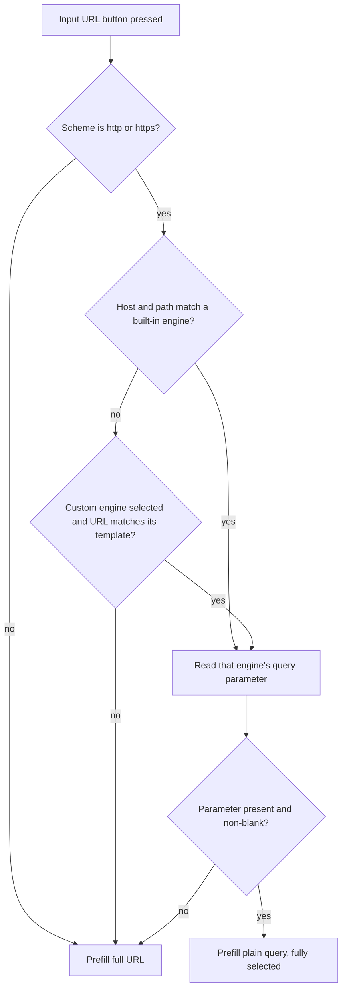

2026-07-14

# EinkBro: Prefill the plain search query when editing a search result URL

GitHub issue #69 pointed out that the value of the toolbar's **Input URL** button collapses the moment a search result URL picks up tracking parameters. Right after typing a search, the URL is short and the query is easy to edit; but after switching tabs or tapping the page's own search form, the same page's URL balloons with `sxsrf`, `ei`, `source` and similar noise. Faced with that, users give up on editing and open a new tab to search again.

The fix: when the input bar opens on a search engine result page, prefill it with just the plain search query — `wireless keyboard amazon` — instead of the full URL. The query is fully selected, matching the existing select-all behavior, so typing immediately replaces it and pressing enter resubmits the search through the configured engine. Non-search pages keep prefilling the full URL exactly as before.

## How it works

`UrlHelper.getQueryFromSearchUrl(url)` inspects the page URL and returns the query if the URL is recognized as a search result page, or `null` to fall back to the full URL. `InputBarDelegate.focusOnInput()` — the single entry point for opening the input bar — calls it when building the prefill text.

Recognition is a host-suffix match (with `www.` stripped) plus, where the engine hosts more than search, a path check to avoid false positives on other pages of the same site:

- Google: any regional TLD (`google.*`), path exactly `/search`, param `q`
- DuckDuckGo, Qwant, SearX: whole host, param `q`
- Startpage: params `query` then `q`
- Bing and Ecosia: path starts with `/search`, param `q`
- Baidu: params `wd` then `word` (desktop and mobile variants)
- Yandex: any `yandex.*` host with `/search` path, param `text`

The issue's author suggested covering only the top one or two engines, but the full built-in list costs nothing extra since the engines' URL templates already live in `UrlHelper`.

## The custom engine case

Users can configure a custom search engine as a URL template like `https://example.com/search?q=%s`. Rather than hardcoding anything, the parser derives the recognition rule from the template itself: parse the template (with `%s` removed), take its host and path, and find the query parameter left with an empty value — that's the search parameter. This only runs when the custom engine is actually selected, so a stale template from a previously tried engine can't hijack URLs after the user switches back to a built-in one.

One trap discovered while reading the code: the custom template is stored with a `%s` placeholder but `queryWrapper()` appends the query with plain string concatenation, so the parser strips `%s` before parsing rather than trusting the template to be well-formed.

## Verification

Verified end-to-end on the emulator: a Google result URL carrying junk tracking parameters prefilled just the query; DuckDuckGo's different URL shape (query on the root path, no `/search`) also extracted correctly; a plain non-search page still prefilled its full URL; and submitting an edited query performed a fresh search. Existing unit tests pass.
