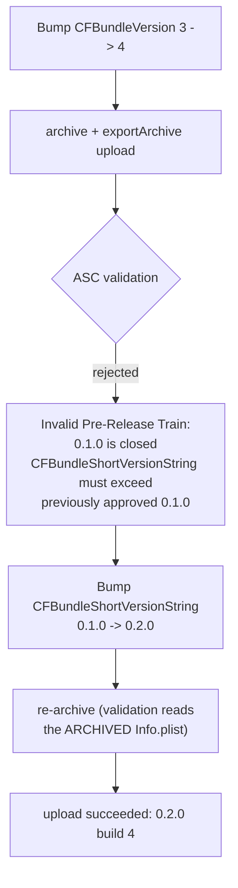

2026-08-02

# EinkBro iOS 0.2.0 to TestFlight, and why it still can't be the default browser

Shipping the plain-http fix (see `einkbro-ios-plain-http-ats-exception.md`) to
TestFlight turned up two things worth writing down: a release-numbering rule that
only bites once an app has been *approved*, and a capability that looks like a
one-line entitlement but is gated behind Apple for weeks or months.

## The build-number bump was not enough

The documented recipe says to bump `CFBundleVersion` because App Store Connect
rejects duplicate build numbers. That is true but incomplete. Build 4 at version
`0.1.0` was rejected outright:

```
Invalid Pre-Release Train. The train version '0.1.0' is closed for new build submissions
CFBundleShortVersionString [0.1.0] must contain a higher version than the
previously approved version [0.1.0]
```

The distinction that matters: while a version is merely *uploaded*, you can keep
pushing builds into its train. Once that version is **approved**, the train closes
permanently, and the *marketing* version — `CFBundleShortVersionString` — has to
rise before any further build is accepted. `0.1.0` had been approved since the
earlier uploads, so no amount of `CFBundleVersion` bumping would have worked.

Bumped to `0.2.0` and re-archived. Re-archiving is mandatory, not cosmetic:
validation reads the `Info.plist` *inside the archive*, so editing the source plist
and re-running only the export step would have re-submitted the old value.



Uploaded as **0.2.0 build 4**, tagged `v0.2.0-4`. Everything else in the recipe held:
the Xcode-logged-in Apple ID handled cloud signing and upload headlessly, no ASC API
key involved.

## Default browser: the code is ready, the entitlement is not

The natural assumption is that "let the app claim it's a browser" is an `Info.plist`
edit. It isn't. Appearing under *Settings > Apps > Default Apps > Browser* requires
the `com.apple.developer.web-browser` entitlement, and that is a **managed**
entitlement — Apple grants it only on request, by email to
`default-app-requests@apple.com`. Developer-forum reports describe waits running
from weeks to several months.

Two consequences make this more than a waiting game:

1. **Managed entitlements require manual code signing.** This project is
   `CODE_SIGN_STYLE: Automatic`. Accepting the grant means moving off automatic
   signing and installing a matching profile — a real change to the release
   pipeline, not a plist line.
2. **Adding it early actively breaks the build.** An entitlement the provisioning
   profile doesn't carry fails signing. This repo already has that scar: the LAN
   multicast entitlement sits commented out in `iosApp/project.yml` for exactly the
   same reason. Adding the browser entitlement "to be ready" would have broken the
   very TestFlight upload it was requested alongside.

So the entitlement was deliberately *not* added. Instead `project.yml` gained a
comment block mirroring the multicast one, recording the request address, the
manual-signing consequence, and the open question of whether `http`/`https` also
need listing in `CFBundleURLTypes` (worth confirming against Apple's docs at grant
time — it is inert without the entitlement either way).

What is already done is the part that would otherwise be real work. The app can
already receive and open a handed-off web URL:

- `iOSApp.swift` — `onOpenURL` forwards every incoming URL to `handleExternalUrl`.
- `ExternalUrlBridge.normalize` — returns any non-`einkbro://` URL unchanged, so
  `http(s)` URLs flow straight into a new tab.

That path is exercised today by the `einkbro://` scheme and `.webarchive` opens.
When Apple grants the entitlement, the work is signing configuration plus possibly
the URL-types declaration — not plumbing.

## Practical upshot

The order of operations for a default-browser attempt is: request the entitlement
first, ship everything else meanwhile. The request is the long pole by a wide
margin, and nothing about it blocks normal releases — 0.2.0 went out with the http
fix while the question stays open.
