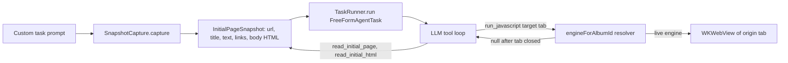

2026-07-18

# EinkBro iOS: AI custom task could never see the current page

## What was broken

The AI action > Tasks > Custom task agent failed on essentially every prompt that
referred to the page the user was looking at. Asking it to "add some javascript to
the current tab" reliably produced answers like *can't find the page*, *the source
is already gone and can't be modified*, or *can't find the named element* — the
model's paraphrases of the tool errors it kept receiving.

## Root cause

`BrowserScreen.runCustomTask` started the agent with

```kotlin
taskRunner.run(FreeFormAgentTask(prompt))
```

— no `InitialPageSnapshot`. That snapshot is the *only* thing the agent's
initial-page surface keys off, so with it absent every one of these failed from
birth, regardless of what the LLM tried:

- the system-prompt hint ("The user is currently viewing …") was never added, so
  the model didn't even know a page existed;
- `run_javascript {"target":"tab"}` hit `initialSnapshot?.originEngineProvider ?: return null`
  → "the originating tab is no longer available";
- `read_initial_page` / `read_initial_html` returned "error: no initial page
  text/HTML captured", so the model could never locate elements the user described;
- `set_domain_javascript` / `set_domain_css` silently no-opped (no host to key on).

The Android original doesn't have this gap: `TaskMenuDelegate.runCustomTask`
captures url, title, raw text, page links, `document.body.innerHTML`, and a
`WeakReference` to the originating WebView before handing off to the agent. The
iOS port had built the whole snapshot plumbing (`InitialPageSnapshot`,
`BrowserToolsImpl`, `TaskRunner.run(task, initialSnapshot)`) but never wired the
capture at the launch site — the parameter just defaulted to null.

## The fix

Port the capture block:



- **`task/SnapshotCapture.kt`** (new): main-thread capture of the snapshot from the
  current engine — reader raw text via `WebContentHelper.getRawText`, anchor links
  via the same JS as `BrowserToolsImpl.LINKS_JS`, and `document.body.innerHTML`.
  Every JS round-trip is time-bounded (15s extract / 10s eval) because the
  WKWebView callback is not guaranteed to fire. Unlike Android, WKWebView hands JS
  strings back verbatim, so no JSON unescaping step.
- **`BrowserViewModel.engineForAlbumId(albumId)`** (new): live lookup into the
  private engines map. Tab close removes the entry, so the lookup naturally turns
  null once the originating tab is gone — the iOS analogue of Android's
  `WeakReference<EBWebView>`.
- **`BrowserScreen.runCustomTask`**: capture first, then
  `taskRunner.run(FreeFormAgentTask(prompt), snapshot)`.

## Verification

Driven end-to-end in the iPhone simulator with a real OpenAI key: on example.com,
the prompt "Use javascript to change this page background color to yellow" made the
agent call `read_initial_page`, then `run_javascript {"target":"tab"}` — the live
page visibly turned yellow behind the progress dialog, and the task finished with a
correct summary.
