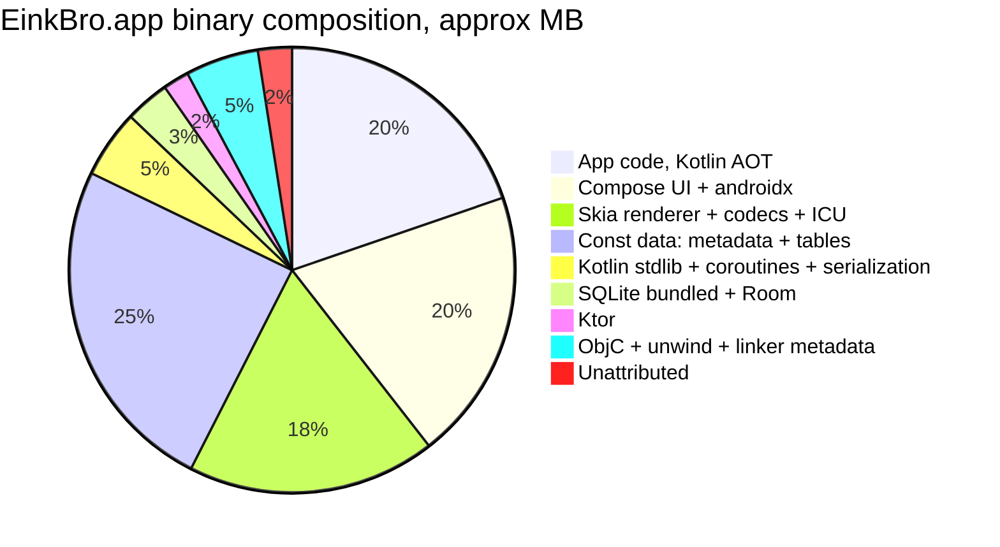

2026-07-19

# EinkBro iOS: why the app is 53MB, and what a Swift rewrite would buy

The 0.1.0 App Store build of the iOS port weighs 53.1MB, an order of magnitude more than the Android EinkBro APK (~5MB). This ADR records where the bytes actually go, why that is structural to Compose Multiplatform rather than a build misconfiguration, and the decision to accept the size.

## Where the bytes go

The bundle is essentially one file. Of the 54MB `.app`, the `EinkBro` executable is 53.9MB; compose-resources are 1.1MB and icons ~0.2MB. Nothing is misconfigured: the binary is arm64-only, release-mode, and stripped (the 60MB dSYM ships separately in the archive).

Attributing the binary via the archive's dSYM symbols (`nm -n` on the DWARF companion, bucketing symbol-address deltas by prefix — `kfun:androidx.compose.*`, Skia C++ manglings, `sqlite3*`, etc.):

Buckets are approximate (~38 of 39.4MB of `__text` attributed cleanly; SQLite and Skia's C dependencies blur into a shared "plain C" pool). Two lines deserve explanation:

- **App code is 10.4MB not because EinkBro has 10MB of logic.** Kotlin/Native's AOT output for Compose code is extremely verbose — every `@Composable` carries slot-table bookkeeping. `BrowserScreen` alone compiles to 261KB of machine code; each dialog composable is 40–100KB.
- **The ~13MB of `__const`** is Kotlin type metadata and string literals plus Skia/ICU data tables — it travels with the runtimes, not with app logic.

## Why this is structural

A native iOS app gets its UI toolkit, renderer, text shaping, codecs, networking, and database from the OS. Compose Multiplatform ships all of that in the binary: Compose itself, the Skia renderer (because CMP does not draw with CoreGraphics), ICU, HarfBuzz, image codecs, the Kotlin runtime, Ktor, and — because of `sqlite-bundled` — even a private copy of SQLite. On Android the same app is small because Compose is compact JVM bytecode shrunk by R8 and Skia lives in the OS; on iOS everything is AOT-compiled native code in the executable. An empty CMP iOS app already starts around 20MB uncompressed.

A related consequence: the store download barely compresses. FairPlay encrypts the executable before compression, so for a single-big-binary app the download size stays close to install size.

## The Swift/SwiftUI counterfactual

A full native rewrite was estimated at roughly 6–12MB total — about 5–8x smaller — because every framework line of the table drops to zero bytes:

| Ships today | Native equivalent |
|---|---|
| Compose UI + androidx (~10.4MB) | SwiftUI/UIKit — in the OS |
| Skia + codecs + ICU + HarfBuzz (~9.5MB) | CoreGraphics/CoreText/ImageIO — in the OS |
| Kotlin stdlib + coroutines + serialization (~2.6MB) | Swift stdlib (ABI-stable, in OS) + Codable |
| Ktor (~1MB) | URLSession |
| Bundled SQLite + Room (~1.7MB) | System libsqlite3 / CoreData / GRDB |
| ~13MB const data | Mostly disappears with the runtimes that own it |
| App code, 10.4MB Kotlin AOT | Same logic in Swift: roughly 3–6MB |

Nothing in EinkBro's feature set (WKWebView, AVSpeechSynthesizer, SQLite, JSON APIs for translate/OpenAI) requires shipping any third-party runtime; comparable WKWebView-based browsers land in the 5–15MB range.

## Decision

Accept the ~53MB. The entire porting strategy of this project is keeping `info.plateaukao.einkbro.*` files diffable against the Android originals so behavior can be copied and kept in sync; a Swift rewrite trades ~45MB of binary for maintaining two divergent codebases forever. The size is well under the 200MB cellular-download threshold, so it costs perception, not installs.

Modest levers if size ever matters: dropping `sqlite-bundled` for the system SQLite (~1.5–2MB) and trimming unused Ktor/serialization surface — perhaps 2–4MB combined. The ~30MB Compose + Skia + Kotlin baseline is irreducible while the app is Compose Multiplatform.
