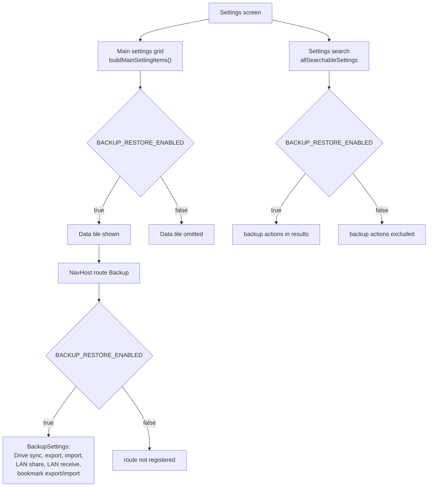

2026-07-29

# Backup/restore goes behind a build flag for the first App Store submission

## Why the screen had to go

The iOS port is going through Apple Review for the first time, and the "Data" settings screen is the one place in the app that a reviewer cannot exercise on its own terms.

Its five app-data actions split into three groups, and two of them are dead ends for a reviewer sitting alone with a single device:

- **Share app data / Receive app data** need a second device on the same local network. They also want the restricted multicast entitlement, which this team has not been granted — `iosApp/project.yml` deliberately omits the entitlements block for exactly that reason, so the pairing would not work even with two devices.
- **Sync with Google Drive** opens an interactive Google account sign-in before it will display anything at all. Putting a reviewer in front of a credential prompt in order to see what a feature does is the specific situation worth not creating on a first submission.

Only export/import of a local ZIP and the two bookmark actions are self-contained, and they are not worth keeping a screen for when the other five entries on it lead somewhere a reviewer cannot follow.

The decision was to hide the whole screen for now rather than trim it down to the demonstrable actions. Trimming would mean deciding what a reduced "Data" screen should look like, and that is a design question that does not need answering to ship 0.1.0. A flag defers it.

## What the flag gates

`BuildConfig.BACKUP_RESTORE_ENABLED` is a plain `const val` in the hand-written `BuildConfig` object (this project has no generated BuildConfig — the file is a small source-compatibility shim carried over from the Android tree). It defaults to `false`.

The screen is reachable three ways, and all three are gated, so nothing is left half-visible:

The search index is the one that is easy to miss. `allSearchableSettings` in `SettingActivity.kt` is assembled separately from the grid — it flat-maps every per-screen item list into `(category, item)` pairs — so gating only `buildMainSettingItems` would have left "Export app data" and "Sync with Google Drive" one search away from being tapped. Both `buildMainSettingItems` and `allSearchableSettings` switch from `listOf` to `listOfNotNull` so the gated entry can be an `if (…) … else null` expression in place, which keeps the item still referenced in source and avoids an unused-variable warning on `dataSettingItems`.

`BackupSettings.kt`, `BackupManager` and `GoogleDriveRepository` are untouched. Flipping the const to `true` restores the screen with no other edit.

## The version suffix

Same commit, unrelated concern: `VERSION_NAME` dropped its `-ios` suffix, going from `0.1.0-ios` to `0.1.0`. That string is what the "About EinkBro" settings row renders, so the row read "About EinkBro v0.1.0-ios".

The suffix was a porting-era marker distinguishing this build from the Android original it was being diffed against. On the App Store there is nothing to distinguish it from — the listing is already an iOS app — and it now agrees with `CFBundleShortVersionString` in `Info.plist`, which was `0.1.0` all along.

## Verification

Driven in the simulator rather than reasoned about, since the failure mode here is a leftover entry point rather than a compile error:

- The settings grid reads Appearance / Toolbar / Behavior / Gestures, then Site Settings / Data Control / Search. No Data tile.
- Searching `app data` returns nothing. Searching `Google` returns only Location, Translation languages and Google Gemini — the three unrelated entries that mention Google in a title or summary — and not Sync with Google Drive.
- Settings search is not simply broken: searching `Floating` still returns Floating Button position and Use gestures on floating button. Worth checking, because "no results" is what a gated-out entry and a dead index look like alike.
- The About row reads "About EinkBro v0.1.0".

## What is still in the binary

The Google Sign-In `CFBundleURLTypes` entry remains in `iosApp/iosApp/Info.plist`, and the backup/Drive Kotlin code is still compiled in — just unreachable from the UI. That is fine for review, which looks at behavior rather than dead code, and it is what makes the flag a one-line reversal. Stripping the URL scheme is a separate call if the goal ever becomes "no Google OAuth surface in the submitted binary at all".
