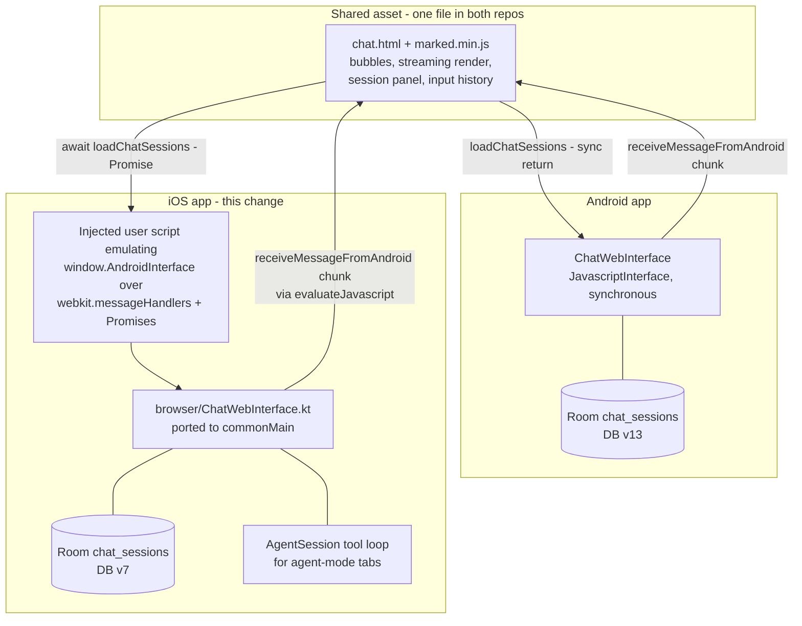

2026-08-03

# EinkBro iOS: chat-with-web moves into Android's shared chat.html

Chat-with-web on iOS now runs inside the same `chat.html` page Android ships — loaded into an ordinary browser tab — and chat sessions finally persist: every conversation autosaves to a new `chat_sessions` Room table, and the page's built-in session panel (hamburger button) lists, restores, and deletes saved chats, surviving app relaunch. This retires the native Compose chat surface (`ChatTabContent`, `viewmodel/ChatSession`, `AlbumType.Chat`) added three weeks earlier.

## Why a web page instead of the native pane

The session started as "the chat popup is inconvenient, I can't switch tabs, and sessions don't save like Android". Exploration showed the popup was already gone on `main` (chat ran in native Compose tabs), but persistence was genuinely missing — iOS chats were in-memory only, deliberately excluded from tab restore, with no session list anywhere.

Two candidate fixes were weighed: extend the native chat tabs with Room persistence plus a new session-list screen, or port Android's `chat.html` web-tab approach wholesale. The decision was the port, on an explicit maintenance principle: **one implementation serving both platforms beats a nicer-native iOS alternative**, because every future chat feature otherwise has to be designed twice against two different architectures. Android's chat page is also the far more complete artifact — session persistence, the slide-in panel, 50-session pruning, input history, and backup support all already exist there, battle-tested.

The two standard objections to the port both dissolved on inspection:

- **"WKWebView has no synchronous JS bridge."** True — Android's `@JavascriptInterface` returns values synchronously and `chat.html` relied on that. But only 2 of the 8 bridge methods return values (`getWebMetadata`, `loadChatSessions`). Making those two call sites `async/await` costs nothing on Android (awaiting a plain string is a no-op) and lets iOS resolve them as Promises.
- **"marked.js comes from a CDN."** Chat needs network anyway, and bundling `marked.min.js` (47 KB) beside the page removes the dependency entirely — on both platforms.

## How the bridge works

The key trick is that `chat.html` guards every bridge call with `typeof window.AndroidInterface.x === 'function'`, so iOS injects a document-start user script that *defines* `window.AndroidInterface` — fire-and-forget methods post JSON through a `WKScriptMessageHandler`, and the two value-returning methods return Promises that Kotlin completes by evaluating `__einkbroBridgeResolve(id, value)` back into the page. No engine API changes were needed: the existing `installUserScript` / `addMessageHandler` / `evaluateJavascript` / `loadFile` seams cover everything. Kotlin→JS streaming is Android's mechanism verbatim (`receiveMessageFromAndroid(chunk, true, false)` per chunk).

The shared file diverges from Android's current copy by exactly three edits, all Android-compatible: the local `marked.min.js` reference, `await` on the two value-returning calls, and `font-size: 16px` on the message input (stops iOS's focus auto-zoom; cosmetically neutral on Android). **Upstreaming = copy `chat.html` + `marked.min.js` into Android's `assets/` — then the file is byte-identical in both repos.**

Other pieces:

- `browser/ChatWebInterface.kt` is a close port of Android's file (chat history assembly, web-content injection, error mapping). Where Android embeds its agent loop inline, iOS routes agent turns through the existing `AgentSession`, with its progress/finish sinks streaming into the page — same UX, no duplicated loop.
- `chat_sessions` (DB v6→7) mirrors Android's v12→13 table exactly, `messages` kept as the page's opaque JSON array — so backup/restore interop with Android exports stays possible.
- Chat tabs are now plain albums flagged `isAIPage` (Android's `EBWebView.isAIPage`): the engine mounts normally, tab switching keeps the WKWebView alive (no reload), and the flag excludes them from history records and tab restore. The DB sessions are what survive relaunch.
- `chat.html` + `marked.min.js` are compose resources materialized to a `chat/` directory via `FileStore` at open time, then loaded with `loadFileURL` so the relative script URL resolves.

## Verified in the simulator

Full flow on iPhone 16: chat opens as a real tab (tab strip shows it, toolbar stays live) → typed message renders a user bubble and streams the reply path (exercised via an invalid key: the 401 maps to "AI provider rejected the API key" and renders as an assistant bubble) → the session row appears in `einkbro.db` with Android-shaped messages JSON → app restart drops the chat *tab* but the session panel lists the saved chat with date, message count, link line, and preview → tapping it repaints the full transcript → switching to a web tab and back preserves everything.

Not verified: streaming with a valid API key (none available in the simulator), and the deferred split-screen chat variant.

## Deliberately inherited quirks

Two known Android bugs were ported as-is rather than fixed unilaterally, since fixing them in the shared page/bridge later fixes both apps at once: reopening a saved session repaints the DOM but does not rehydrate the LLM-facing `chatHistory` (the model still sees the tab's original conversation), and the injected page text stays the *tab's*, not the reopened session's. One iOS-only touch quirk: the session cards' hover-revealed action buttons mean the first tap on a card acts as hover — a second tap switches sessions.
