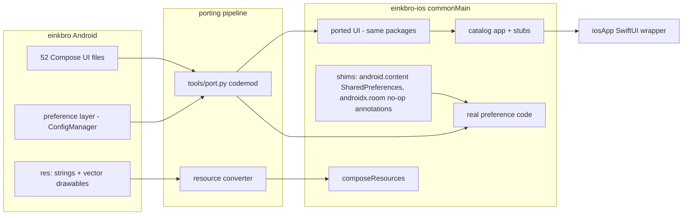

2026-07-16

# EinkBro iOS: porting the entire Compose UI to iOS with Compose Multiplatform

EinkBro's user interface — settings tree, browser dialogs, toolbar, bookmarks,
tab/history overview, some 14,500 lines of Jetpack Compose across 52 files — now
runs natively on iOS. A new sibling repository, `einkbro-ios`, holds a Kotlin
Multiplatform project whose `commonMain` contains the ported UI in the original
package layout, wrapped by a thin SwiftUI host app. The app currently launches as
a **UI catalog**: every ported screen and dialog is listed and opens with
representative sample data, so the whole surface can be verified visually on an
iPhone simulator before any browser engine work begins.

The motivation: Compose Multiplatform (stable on iOS since 1.8) makes the UI
layer — by far the largest part of EinkBro that isn't WebView plumbing — directly
reusable. Porting it first, as a catalog, front-loads the risky unknowns
(resource pipeline, Material 2 fidelity, drag-reorder, navigation) while leaving
the platform-specific browser engine as a clean later phase against an already
proven UI.

## How the port works

Three decisions did most of the heavy lifting:

1. **Source-compatible shims instead of rewrites.** Kotlin/Native has no sealed
   package namespaces, so the project declares a tiny in-memory
   `android.content.SharedPreferences` and no-op `androidx.room` annotations.
   With those in place, the entire preference layer (ConfigManager and its eight
   sub-configs) and all Room entities compile essentially unchanged — the
   settings screens in the catalog manipulate *real* preference code, not mocks.

2. **A mechanical codemod plus written conventions.** `tools/port.py` handles the
   repetitive transforms (`R.string.x` → `Res.string.x`, resource-helper imports,
   `Bitmap` → `ImageBitmap`, `LocalConfiguration` → window-metrics helpers,
   `@Preview` stripping), and `tools/PORTING.md` fixes the judgment calls — most
   importantly that Android's `Int` resource IDs become typed `StringResource` /
   `DrawableResource` fields (with `0` sentinels becoming `null`). This let five
   parallel workers port ~40 files against one shared rulebook with only two
   small collisions at integration.

3. **Stubs that stay visible.** Android-only services (toasts, dialogs, file
   pickers, TTS) are stubbed, but the stubs publish into observable Compose
   state that the catalog host renders — a tapped action shows a real toast
   overlay, a confirmation flow shows a real dialog — so dead-ends are visible
   rather than silent.

Vector drawables came across nearly verbatim; the only preprocessing was
resolving theme-attribute tints and `@color/` references to literal colors,
acceptable because EinkBro's e-ink UI is essentially black-and-white. The
multiplatform `sh.calvin.reorderable` library replaced itself — the same library
the Android app uses — so toolbar drag-reordering works on iOS unmodified.

## iOS-specific traps discovered

These cost real debugging time and will bite any similar port:

- **Compose Multiplatform hard-crashes at first render** unless the host app's
  Info.plist sets `CADisableMinimumFrameDurationOnPhone` to true.
- **Exported Kotlin type names can shadow Swift types.** The `Context` shim class
  is exported into the framework's Swift namespace and silently shadows
  SwiftUI's `Representable.Context` typealias, breaking protocol conformance in
  the wrapper; the fix is spelling out `UIViewControllerRepresentableContext`.
- **A public `BuildConfig.DEBUG` breaks the ObjC framework header**, because the
  generated property collides with Xcode's `#define DEBUG 1`. Keeping such
  objects `internal` keeps them out of the header.
- **`viewModelScope` is `Main.immediate` on Kotlin/Native**: a coroutine launched
  from a constructor `init` block runs synchronously up to its first suspension,
  and reading a property declared *below* the init block is a segfault, not an
  exception. One ported ViewModel crashed exactly this way.

## What is deliberately not there yet

No WebView, no networking, no on-disk persistence: browsing, translation
backends, TTS engines, and file flows are sample data or toasts. Those form the
next phase — wiring a real WKWebView behind the already-ported `Album`/toolbar
abstractions and replacing the in-memory shims with NSUserDefaults and Room KMP.
