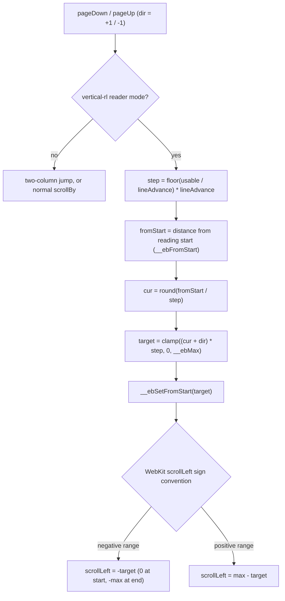

2026-07-16

# EinkBro iOS: content pipeline — reader mode, vertical CJK reading, CSS slots (migration Phase 3)

Phase 3 brings EinkBro's reading features to the iOS port: Readability-based
reader mode, vertical right-to-left CJK reading with furigana, per-site font
and colour styling, an e-ink image filter, colour inversion, and audio-only
mode. All of it runs on WKWebView, driven from a new per-tab
`WebContentHelper` — the common-code port of Android's `WebViewReaderHelper`
plus the reading half of `WebViewJsBridge`.

## What it does and how it is built

The Android app injects a set of JavaScript and CSS assets into the WebView to
transform pages. Those 14 assets (MozReadability, the reader and vertical
stylesheets, text-node processing, line-advance measurement, a scroll fix, and
a CSS-slot updater) now ship as Compose resources, preloaded once at startup by
a small `Assets` object.

Styling is applied through a **CSS-slot system**: named `<style>` slots
(`main`, `reader`, `readerSettings`, `vertical`) are written by Base64-encoding
the CSS and handing it to `update_css_slot.js`. Turning a feature off writes an
empty blob to its slot — so every toggle is reversible without reloading the
page. `WebContentHelper.updateCssStyle()` composes the `main` slot from the
per-URL font family, text size, bold / black-text / white-background toggles,
the e-ink image filter, inversion, and any custom CSS.

Two WKWebView constraints shaped the implementation, and are worth recording
because they will recur in later phases:

- **No `textZoom`.** Android scales text natively through
  `WebSettings.textZoom`; WKWebView has no equivalent. Text size instead rides
  in the CSS slot as `html { -webkit-text-size-adjust: N% }`.
- **User scripts, not per-load injection.** The always-on scripts (the scroll
  fix, video-autoplay suppression) are installed once per tab as `WKUserScript`
  at document start / end, rather than re-evaluated on every navigation.

Reader state is per-DOM, so `BrowserViewModel` resets it on each page load and
re-applies the base style.

## The vertical-rl paging fix

Vertical reading is the subtle part. Pages are anchored at the document's right
edge — the reading start — and advance by an exact multiple of the measured
line advance, so a page turn never slices a vertical text line at the viewport
edge. This mirrors Android's `WebViewNavigationHelper`, which does the same
math against `webView.scrollX`.

The catch is that Android's `scrollX` is a *native view* offset that is always
non-negative regardless of writing mode, whereas the browser's own scroll
coordinate is not normalized. On modern WebKit a `vertical-rl` document uses a
**negative** `scrollLeft` range: 0 at the reading start (right edge), down to
`-(scrollWidth - clientWidth)` at the end (left edge). The first cut of the iOS
paging code carried over Android's assumption and computed a positive target in
`[0, anchor]`, then called `scrollTo({left: positiveTarget})`. Every positive
value is out of range for a negative scroller, so it clamped to 0 — each page
turn silently jumped back to the reading start instead of advancing.

The fix routes all vertical scrolling through the same sign-agnostic helpers
already used by jump-to-top / jump-to-bottom, which probe the engine's
convention once and express everything as "distance from the reading start":

With the paging branch expressed in the same "distance from start" terms as the
jump helpers, `dir = +1` cleanly advances toward the end (leftward) and
`dir = -1` retreats, in whole line-advance steps.

## Verification

Checked on the iPhone 16 simulator against a long Japanese-language article:
reader-mode extraction, the vertical-rl layout opening at the reading start
with furigana intact, and page turning that moved by exactly one line-grid step
forward and back (instrumented briefly to confirm the scroll position advanced
0 → 351 → 702 and back, then the instrumentation was removed). Colour inversion
was confirmed to toggle on and off, re-inverting images so photographs render
normally rather than as negatives.

## Notes for later phases

- Custom TTF fonts are stubbed: they need a URL-scheme handler on WKWebView to
  serve the font bytes, which belongs to a later phase.
- The two-column landscape reader path is wired but only lightly exercised so
  far; the portrait vertical and single-column paths are the verified ones.
