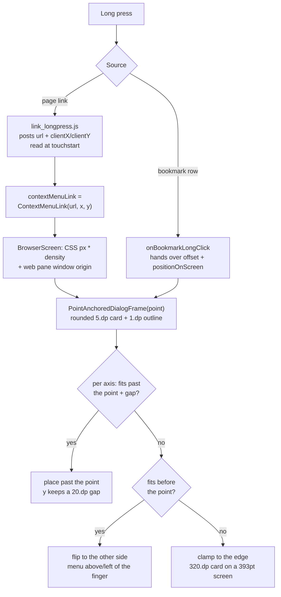

2026-07-26

# Context menus anchor at the long-press point

## What was wrong

Two long-press context menus in the iOS port — the one on a page link and the one on a bookmark row — rendered dead-center on screen with square corners. Every other dialog in the app goes through `AnchoredDialogFrame`, which wraps content in a 5.dp rounded `Surface` with a 1.dp `onBackground` outline; these two were hosted in a bare `Dialog` instead. The link menu's `Surface` took the Material default `shape = RectangleShape` with `border = null`, and the bookmark menu had no `Surface` at all, just a `Column` with a shapeless `.background(...)`.

The missing border is what made the centering conspicuous rather than merely wrong. EinkBro's `NoDimDialog` forces the dialog scrim transparent (Android's `ComposeDialogFragment` sets `dimAmount` to 0f), so with no outline the card had no visible edge — it read as loose text floating over the page instead of as a card sitting in the middle of the screen. Adding the outline first, in isolation, made the pre-existing centering suddenly obvious and looked like a regression; it wasn't one. `git log -L` on the link-menu block shows `Dialog { Surface(color = …) { … } }` unchanged since Phase A introduced it, and `BookmarksDialog` carried a comment saying so outright: *"Android anchors the context-menu window at the touch point; CMP dialogs are centered, so the point is unused."*

That comment points at the real gap. The position was never anchored on iOS:

- **Bookmark menu** — the touch `Point` was already plumbed all the way to the call site (`offset.toScreenPoint(boxPosition)`) and then discarded.
- **Link menu** — no coordinates existed at all. `link_longpress.js` reported only `{url, text}`, and `contextMenuLink` was a `String?`.

## How it works now

`PointAnchoredDialogFrame` joins `AnchoredDialogFrame` in `DialogComposables.kt`, sharing its card chrome so both menus match the rest of the app's dialogs. It places the card's top-left at a window point the way Android's `ContextMenuDialogFragment` and `BookmarkContextMenuDlgFragment` do — `Gravity.TOP|START` with the window's `x`/`y` set to the touch point — and keeps Android's `Point.isValid()` rule, falling back to centered when the point is (0, ·) or (·, 0).

### Placement improves on Android

Android hands placement to the window manager, which clamps a menu that runs off an edge — sliding it back over the very link that was pressed. The frame instead decides per axis: put the card past the point when it fits there, otherwise flip it to the point's *other* side, and only edge-clamp when neither side has room. So a link near the bottom of the page gets its menu above the finger rather than on top of it.

The vertical axis additionally holds a 20.dp gap on whichever side it lands. The reported point sits *inside* the pressed line of text, so placing the card's edge exactly at it clipped the link that was long-pressed; a line-height of clearance keeps that text readable. The gap is vertical only — the pressed text runs horizontally through the point, so a horizontal offset would not uncover anything.

Edge-clamping still happens in one real case: the link menu is 320.dp wide on a 393pt-wide phone, so neither side of the finger can hold it horizontally. Nothing can be done there, and the vertical flip is what carries the interaction.

### Coordinate plumbing

The link path needed coordinates threaded from JS to a Compose dialog window, crossing two coordinate spaces:

- `link_longpress.js` now posts `{url, text, x, y}`. The coordinates are captured at `touchstart`, **not** inside the 500ms long-press timer — `e.touches` is empty by the time it fires. They are viewport CSS px, the same space `selection_change.js` already reports selection rects in.
- `contextMenuLink` changed from `String?` to a `ContextMenuLink(url, x, y)` holder rather than adding a parallel point state, so the url and its point cannot desync. Every `contextMenuLink.value = null` site kept compiling unchanged.
- `BrowserScreen` converts CSS px to the window pixels the frame expects: `x.dp.toPx()` for the density step, plus the web pane's window origin, captured with `onGloballyPositioned` on the pane's `BoxWithConstraints`. The pane starts below the status bar and, with the toolbar on top, below the toolbar too, so that offset is not negligible.

The bookmark path needed none of this — its `Point` was already in screen coordinates, which coincide with window coordinates for a fullscreen iOS app.

## Verification

No test suite exists here; verification is a compile plus driving the simulator. A local page with links pinned to all four corners plus the middle exercised each placement branch:

| Press | Result |
|---|---|
| `TOP-LEFT` | menu below-right of the point, link text fully legible above the card |
| `BOTTOM-RIGHT` | menu flipped above the point, link text fully legible below the card |
| bookmark row | menu top edge at the pressed row, clamped horizontally |

A first pass without the 20.dp gap showed the card's top edge cutting through the pressed link — the gap exists because of that screenshot, not on principle.

## Note to self

The first version of this work added only the rounded borders, shipped to the device, and read as having *caused* the centering. Two lessons, both cheap: a purely cosmetic change can still surface a latent layout problem, and `git log -L` on the exact block settles "did I break this?" in one command. The fix for the complaint was never to revert the borders — it was to finish the job the Android original describes.
