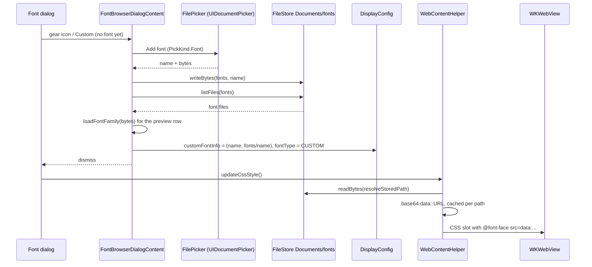

2026-09-03

# einkbro-ios: real custom-font browser and @font-face injection

## What it does

The gear icon next to "Custom" in the font dialog (and tapping "Custom"
when no font is set) opens a font browser. The browser lists the font files
the user has imported, imports new `.ttf` / `.otf` files through the system
document picker, previews every row in its real typeface, and lets a row be
deleted. Selecting a font applies it to every page (normal browsing or
reader mode, each with its own selection), matching Android's
`FontBrowserDialogFragment` + `WebViewReaderHelper.getCustomFontCss`. The
"Custom Font Scale" button in both font dialogs now prompts for a value.

Before this change the icon did nothing: `BrowserScreen` handed it a
callback that only re-applied CSS, the browser was a catalog stub (five
sample file names, a "would open the system folder picker" toast, a
platform-serif preview), and `WebContentHelper` emitted an empty string for
`FontType.CUSTOM`. This came out of a sweep of every remaining stub in the
iOS tree, now recorded in `docs/STUBS.md` in the repo.

## How it works

### Storage

Fonts live in `Documents/fonts`. `CustomFontInfo.url` stores the
Documents-relative form from `storedPathFor` because iOS mints a new
container UUID on every reinstall; `resolveStoredPath` re-roots it at use.
Android instead stores a SAF folder URI and lists the folder; iOS has no
persistent folder grant, so "Select Font Folder" became "Add font…" and a
per-row delete icon replaces managing the folder in a file manager.

New seams: `FileStore.listFiles(subDir)`, a `PickKind.Font` argument on
`FilePicker.pick` (mapped to `UTTypeFont`), and `loadFontFamily(identity,
bytes)` (expect/actual over Compose's byte-array `Font`) so the preview row
renders the actual typeface. Parsing runs off the main thread via
`produceState`, since CJK fonts run to tens of MB.

### Applying the font in the page

Android serves the file by intercepting a synthetic *same-origin* URL
(`src: url('mycustomfont')`) in `shouldInterceptRequest`, so the browser
sees a normal https font. WKWebView offers no interception of https
requests. The alternatives were:

- **`WKURLSchemeHandler` custom scheme**: WebKit treats a custom scheme as
  insecure from an https page, so the font request is blocked as mixed
  content; it would also need CORS headers on a synthetic response.
- **`file://`**: blocked outright from https origins.
- **Loopback HTTP server**: would need a server in the app just for fonts.
- **`data:` URL**: always allowed for fonts and same-origin by definition.

`WebContentHelper.customFontCss` therefore ports `CUSTOM_FONT_CSS` verbatim
and substitutes a `data:font/ttf;base64,…` URL for `mycustomfont`. The
encoded string is cached per file path in the companion so each tab's
style refresh does not re-read and re-encode the file, and the family name
is versioned by the path hash (as on Android) so switching fonts forces a
refetch while repeated style updates keep the loaded face.

Trade-off: the payload rides in every page's style injection. For a 16 MB
CJK font that is roughly 22 MB of base64 per page load, a few hundred
milliseconds on an A-series chip. A loopback server would remove that cost
if it shows up on real devices.

### Wiring

`BrowserScreen` gains `showFontBrowser`; both `FontDialogContent` and
`ReaderFontDialogContent` close the font dialog and open the browser, and
dismissing the browser re-runs `updateCssStyle()` and clears
`customFontChanged`, which is what `BrowserActivity.onResume` does on
Android. The custom-scale button calls `DialogManager.getTextInput` with the
`custom_scale` / `custom_scale_desc` strings and writes the value to the
normal or reader font size plus `customFontSize`, like the two Android
fragments.

## Verification

Simulator: staged Chalkduster.ttf in the Files app's local storage, opened
menu → Font size → gear, imported it through the picker (file landed in
`Documents/fonts`, pref stored `Chalkduster.ttf::fonts/Chalkduster.ttf`),
the row previewed in Chalkduster, selecting it re-rendered the https user
guide entirely in Chalkduster, the font dialog read "Custom
(Chalkduster.ttf)", and "Custom Font Scale" opened the prompt with the
current value. Installed to the iPhone 17 Pro afterwards.
