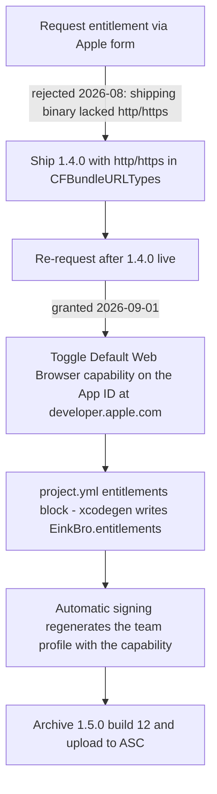

2026-09-01

# EinkBro iOS: default-browser entitlement adopted (1.5.0 build 12)

Apple granted `com.apple.developer.web-browser` to team 3WD42GF27D for
`info.plateaukao.einkbro.ios` on 2026-09-01. With this release EinkBro is
offered in **Settings > Apps > Default Apps > Browser** on iOS. The receiving
code needed no changes — `iOSApp.swift`'s `onOpenURL` already hands every
incoming URL to `handleExternalUrl`, and `ExternalUrlBridge.normalize` passes
non-`einkbro://` URLs through unchanged — so the whole change is signing
configuration.

## The path to the grant



Two findings from this session worth keeping:

1. **The grant email is not the last gate.** "Assigned to your account ... you
   can now configure this capability" means the capability becomes *available*
   in the App ID configuration — it still has to be toggled on manually at
   developer.apple.com (Identifiers → bundle id → Capabilities → Default Web
   Browser → Save, confirming the profile-invalidation warning). Until then,
   builds fail with *"Provisioning profile doesn't include the Default Web
   Browser capability"* even though the entitlement is granted.

2. **Automatic signing handles this managed entitlement.** The long-standing
   assumption in `project.yml`'s comments (inherited from the multicast
   research) was that managed entitlements force manual signing. Wrong: once
   the App ID lists the capability, `CODE_SIGN_STYLE: Automatic` plus
   `-allowProvisioningUpdates` regenerates the team provisioning profile with
   the capability included. No signing changes were needed at all.

## How it was wired

`iosApp/project.yml` gained a real `entitlements` block:

```yaml
entitlements:
  path: iosApp/EinkBro.entitlements
  properties:
    com.apple.developer.web-browser: true
```

XcodeGen *generates* `EinkBro.entitlements` from `properties`, so the file
stopped being hand-maintained; the stale hand-written multicast key it used to
hold (never granted, would fail provisioning) was dropped in the process. When
the multicast grant eventually lands, it is one more line in `properties`.

The release itself is 1.5.0 build 12 — a new short version because the 1.4.0
train closed on approval — carrying the two small UI commits since 1.4.0
(menu subtitle removal, theme border/inset fixes) plus the entitlement.
