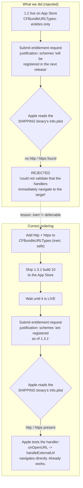

2026-08-20

# EinkBro iOS: Apple rejected the default-browser entitlement over a missing Info.plist declaration

## What broke

Apple rejected the `com.apple.developer.web-browser` managed-entitlement request submitted on 2026-08-11:

> The application does not take the 'http' and 'https' URL schemes. This means that they are not contained in the `CFBundleURLSchemes` member of the `CFBundleURLTypes` dictionary in the Info.plist. Because of this, we could not validate that the handlers for these URL Schemes immediately navigate to the requested link target.

Without that entitlement, EinkBro cannot appear in **Settings → Apps → Default Apps → Browser** on iOS 18.2+, which was the entire point of the request.

## Root cause: a precondition mis-ranked as a nice-to-have

The requirement was not missed. It was found, correctly identified as unmet, and then filed under "optional". The session that drafted the request said, verbatim:

> The only gap is that `CFBundleURLTypes` currently registers only the `einkbro` scheme — `http`/`https` need to be added, but that's inert (and harmless) without the entitlement, so it can ship with the post-grant build.

and wrote the deferral straight into the justification text pasted into Apple's form:

> The HTTP and HTTPS schemes **will be registered** in CFBundleURLTypes in the next release, as required for apps holding this entitlement.

Two claims were tangled together. One is true: the declaration really is inert without the entitlement, because iOS ignores `http`/`https` claims from apps that don't hold it. The other does not follow: **inert is not the same as deferrable.** The reasoning assumed a human reviewer would read a justification narrative and accept a commitment about a future build. In reality Apple validates the request against the *shipping App Store binary's* `Info.plist`, mechanically, and only then goes on to test that the declared handlers navigate directly to the link target. A promise has nothing to validate against.

The same inverted ordering had been baked into the repo. The comment block in `iosApp/project.yml` told a future reader to confirm the `CFBundleURLTypes` requirement "at grant time" — i.e. *after* the thing that grant depends on.

Worth recording: the wrong call survived a direct challenge. When asked "isn't this already done?", the response re-confirmed the gap accurately but repeated the framing — "it's safe to add anytime" — and the change was reasonably deferred on that basis, with 1.3 shipping with no browser-related changes.



## The fix

`iosApp/iosApp/Info.plist` gains a second `CFBundleURLTypes` entry, kept separate from the existing `einkbro` custom-scheme entry so the two concerns stay legible:

```xml
<dict>
    <key>CFBundleURLName</key>
    <string>info.plateaukao.einkbro.ios.web</string>
    <key>CFBundleURLSchemes</key>
    <array>
        <string>http</string>
        <string>https</string>
    </array>
</dict>
```

No code change accompanies it. The behavior Apple said it could not validate has been implemented since the migration: `iOSApp.swift`'s `onOpenURL` hands every incoming URL to `handleExternalUrl`, and `ExternalUrlBridge.normalize` passes non-`einkbro://` URLs through unchanged, so an http(s) hand-off already opens the requested target directly in a tab. Only the declaration that lets Apple *reach* that path was missing.

The `project.yml` comment was rewritten from "confirm at grant time" into an explicit precondition, naming the rejection so the ordering can't be re-derived wrongly. The one item that genuinely does belong at grant time stayed there: managed entitlements require **manual** signing, so `CODE_SIGN_STYLE: Automatic` must change and a matching profile must be installed — that part cannot be prepared in advance.

Editing was done textually rather than with `plutil -replace`, which strips XML comments (it silently ate the ATS rationale comment during an earlier release).

## Release

Shipped as **1.3.1 build 10**. `CFBundleShortVersionString` had to rise rather than stay on the 1.3 train — 1.3 was already approved, and App Store Connect closes an approved train to new build submissions ("Invalid Pre-Release Train"), so a `CFBundleVersion` bump alone would have been rejected at upload.

## Re-submission checklist

1. 1.3.1 build 10 must be **live on the App Store**, not merely on TestFlight — Apple checks the public binary.
2. Verify the shipped plist rather than the source: `plutil -extract CFBundleURLTypes xml1 -o - <archived .app>/Info.plist`.
3. Re-submit at `developer.apple.com/contact/request/default-browser-entitlement`, signed in as the **Account Holder** of team `3WD42GF27D`.
4. Rewrite the justification sentence to the past tense: "The HTTP and HTTPS schemes are registered in CFBundleURLTypes as of version 1.3.1, currently live on the App Store."
5. Leave `com.apple.developer.browser.app-installation` (the EU alternative-marketplace entitlement) unchecked; it is unrelated to default-browser status.

## The transferable rule

For any Apple **managed** entitlement, ship the `Info.plist` prerequisites in a released build *first*, then request. The request is graded against what is already on the store, never against a description of what is planned. More generally, "this change has no runtime effect yet" is an argument for landing it early, not for postponing it.
