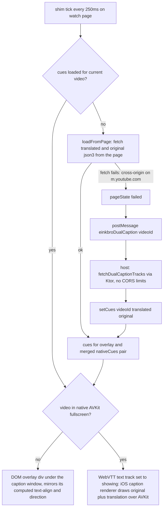

2026-08-05

# EinkBro iOS: dual YouTube captions — overlay rendering and native-fullscreen support

Dual captions (parity Phase M) show a second-language line under YouTube's own
captions. On Android this is elegant: `shouldInterceptRequest` answers the
player's own `timedtext` request with merged JSON (`DualCaptionProcessor`), and
the player renders both lines itself. WKWebView has no interception seam for
https subresources, so the iOS port has been chasing substitutes — and this
session fixed the three failures the current substitute had: the second caption
never appeared at all, it was mis-aligned once it did, and it vanished in
fullscreen.

## What was broken, in the order it was found

### 1. The second caption was never fetched: a function that didn't exist

The overlay rewrite of `dual_caption_shim.js` drives everything from a 250ms
`tick()`. Its primary cue source was `loadFromPage(videoId)` — which was never
written. Every tick threw `ReferenceError: loadFromPage is not defined` inside
the interval callback, which a page swallows silently. The three helpers it was
meant to tie together (`playerTracks`, `activeTrack`, `translatedTrackUrl`) sat
in the file, defined and unused.

The miss was doubly protected from discovery: the throw happened *before* the
attempt counter incremented, so the state machine never reached `'failed'` —
and the native fallback (message handler → `YouTubeCaptionFetcher`) only
engages on `'failed'`. Both cue sources were dead, the overlay had nothing to
draw, and no error surfaced anywhere. The fix wrote the missing function:
read the player's live track list, fetch the `tlang`-translated json3 copy of
the track the player is actually showing, parse to cues, and drive
`pageState` (`inflight` → `done` / `failed`) so the fallback chain works.

### 2. Alignment: the overlay hardcoded `text-align:center`

YouTube centers regular caption windows but left-aligns rolling ASR windows
(and right-aligns RTL tracks). The overlay now copies the caption window's
computed `text-align` and `direction` instead of assuming center, so the
second line sits exactly like the first in all three cases.

### 3. Fullscreen: AVKit never paints the page

Entering fullscreen made both captions disappear. The instinctive fix —
enable `WKPreferences.elementFullscreenEnabled` so the DOM player fullscreens
in-page — compiled, shipped, and changed nothing: tapping the fullscreen
button still presented AVKit's native player (X button, AirPlay, ±10s skips).
m.youtube.com UA-sniffs iPhones and calls `video.webkitEnterFullscreen()`
regardless of whether the Fullscreen API is available. In AVKit fullscreen the
web page is simply never painted — no DOM overlay can exist there, and none of
YouTube's own DOM captions either (which is why fullscreen showed *no*
captions, not just ours missing).

The one channel that does draw over AVKit fullscreen is the native caption
renderer: WebKit feeds it from the video element's WebVTT text tracks. So the
cues ride a real text track (`video.addTextTrack`), filled lazily on first
fullscreen entry and flipped to `showing` only while
`video.webkitDisplayingFullscreen` is true. In-page it stays `disabled` — the
DOM overlay draws there, and a showing track would double-render as `::cue`
boxes on top of YouTube's captions. The mode is re-asserted every tick because
YouTube's player manages the track list too.

`elementFullscreenEnabled` stays on anyway: it matches Safari 16.4+ behavior
for sites that feature-detect properly (guarded by `respondsToSelector`, since
the deployment target is iOS 15.0 and the API is 15.4+).

### 4. Fullscreen showed only the translation — debugged through the caption itself

The fullscreen track worked but showed a single Chinese line, not the intended
"original + translation" pair. There is no console access into a WKWebView
from the CLI, so the caption became the debug console: a temporary marker
prefixed every cue with `[pageState|source|count]`, and the next screenshot
read **`[failed|T|407]`** — page path *failed*, cues were *translated-only*,
407 of them.

That marker settled two things at once. First, the in-page fetch path fails
outright on m.youtube.com: the watch page's origin differs from the caption
URL's, and the shim's `fetch` of it dies cross-origin (the player itself
fetches captions through its own plumbing, not subject to our fetch's CORS
posture). Second, the cues therefore always come from the native fallback —
which only fetched the translated track, hence the lone Chinese line.

So the host now carries the pair: `fetchTranslatedTrack` became
`fetchDualCaptionTracks`, fetching both the original and the
`tlang`-translated timedtext over Ktor (native code, no CORS), and
`BrowserViewModel` hands both JSONs to `setCues`. The page merges them into
"original\ntranslation" cues, joined on cue start time — the same join key
Android's `DualCaptionProcessor` merges on, valid because `tlang` preserves
the source track's event timings.

## The resulting architecture

Design points worth keeping in mind later:

- **The player's request path is never touched.** The earlier fetch/XHR
  interception shim was the source of every prior caption bug (request
  amplification → 429s, double-processing → duplicated lines). The overlay
  approach leaves the player alone and renders the second line itself, which
  also means we own the line spacing instead of inheriting YouTube's wide
  caption-block leading.
- **The in-page path is kept although it currently fails on m.youtube.com.**
  Its value is segmentation fidelity — it reads the track the player is
  actually rendering, so cue boundaries match the first line. Desktop-mode
  pages (www.youtube.com, same-origin caption URLs) can still take it. When it
  fails, the host path's segmentation is close enough in practice.
- **Fullscreen degrades gracefully.** Host path without an original track (or
  original fetch failure in either path) shows the translation alone in
  fullscreen rather than nothing.
- **The dual-caption language picker** (`showDualCaptionLocale`, Android
  parity) is now a real dialog; "None" clears the pref, which uninstalls the
  shim on the next engine.

## Verification

Driven end-to-end in the iPhone 16 simulator against the Ken Robinson TED talk
(French manual track active, `zh-TW` as the dual locale): inline shows the
French caption with the Chinese line snug beneath it, matching alignment;
entering fullscreen shows the native-rendered pair; exiting returns to the
overlay. The debug-marker build was used mid-session to read the cue-source
state off a screenshot, then removed. Installed to the physical iPhone after
the fix.
