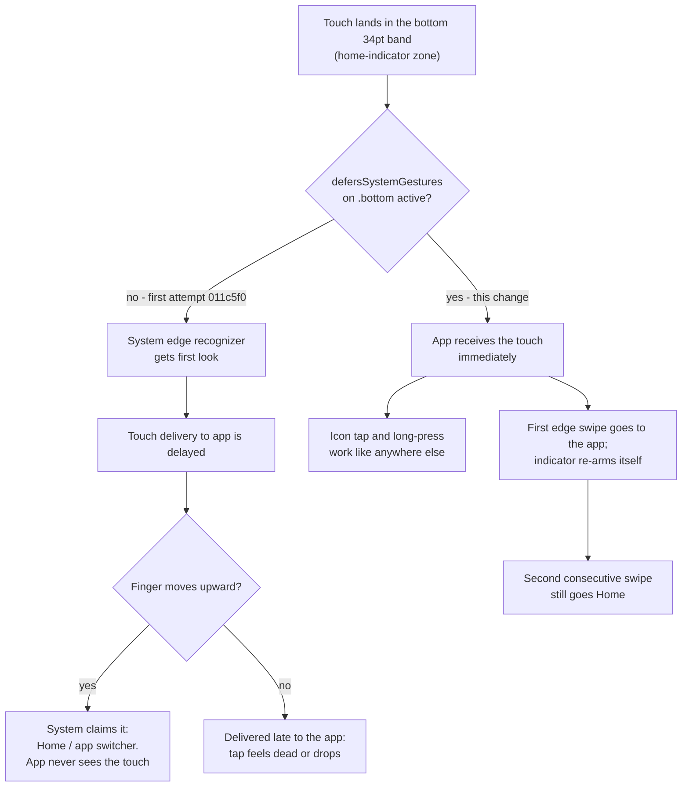

2026-08-03

# EinkBro iOS: edge-to-edge bottom toolbar, with the home-indicator gesture deferred

The bottom toolbar now extends into the iPhone's home-indicator band, so the
web page gets the ~34pt that used to be reserved as bottom safe-area padding.
A new Appearance toggle — "Extend toolbar to screen bottom", default **on** —
lets the user switch back to the Safari-style padded layout at any time, and
the change applies live without a restart.

## Why this needed a second attempt

This was tried once before (`011c5f0`) and walked back a day later
(`2feed48`): with toolbar icons flush against the physical bottom edge, taps
and drags on them kept triggering the iOS home-indicator system gesture, or
arrived late enough to feel dead. No Compose-side fix (padding tweaks, larger
hit targets, gesture handlers) could help, because the interception happens
before the touch ever reaches the app process — the system's edge recognizer
gets first look at every touch in the band.

The missing piece was iOS's one real lever for this: **system-gesture
deferral** (`defersSystemGestures(on: .bottom)`, iOS 16+). With deferral
active, touches in the band are delivered to the app immediately; the Home
gesture still works but requires two consecutive swipes.

## Design constraints discovered

**The lever must live on the SwiftUI side.** UIKit resolves the deferral
preference through the window's root view controller — SwiftUI's
`UIHostingController` — which answers from SwiftUI view preferences, not from
represented child controllers. Setting
`preferredScreenEdgesDeferringSystemGestures` on the wrapped Compose view
controller would be silently ignored. So `iOSApp.swift` applies the modifier,
and Kotlin drives it through the same `HostBridge` listener pattern already
used for status-bar hiding: `setDefersBottomSystemGesture()` on the Kotlin
side, a replay-on-registration listener on the Swift side.

**Deferral is scoped, not global.** The double-swipe-to-Home cost is only
paid while a bottom toolbar is actually rendered in the band:
`BrowserScreen` turns deferral on only when the toolbar is at the bottom (or
vertical) and not hidden by fullscreen, hide-on-scroll, or the URL input.
The moment the toolbar hides, a single swipe goes Home again.

**iOS 15 keeps the old behavior.** The SwiftUI modifier is iOS 16+, and the
deployment target is 15. `HostBridge.supportsBottomGestureDeferral` gates the
whole feature: on iOS 15 the pref is inert and the toolbar keeps the
Safari-style padding (background painted to the physical edge, tap targets
lifted above the band).

## Touch points

- `UiConfig.edgeToEdgeToolbar` (default true), in the `uiKeys` live-refresh
  set so the toggle applies without restart.
- `HostBridge` common/iOS: `supportsBottomGestureDeferral`,
  `setDefersBottomSystemGesture()`.
- `iOSApp.swift`: `defersBottomEdgeGesturesCompat` modifier + listener.
- `BrowserScreen.kt`: deferral effect + conditional `navigationBars` padding.
- Settings → Appearance: "Extend toolbar to screen bottom" toggle.

Verified in the iPhone 16 simulator: icons flush at the physical edge with
taps landing inside the band, the toggle switching layouts live. The tactile
side of deferral (instant edge taps, indicator dimming, double-swipe Home)
only manifests on a physical device.
