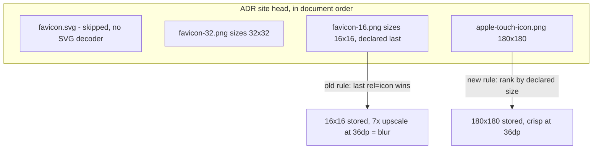

2026-08-06

# EinkBro iOS: rank favicon candidates by declared size, largest first

## What was broken

Favicons for some sites — noticed on the ADR site (`plateaukao.github.io/ADR/`) — rendered visibly blurry in the tab overview and history lists. The stored icon in the `favicons` table was a 16×16 PNG (byte-identical to the site's `favicon-16.png`), upscaled ~7× to fill the 36 dp slot (108 px at 3×) in `HistoryAndTabs`.

## Root cause

WKWebView never pushes favicons the way Android's `WebChromeClient.onReceivedIcon` does, so the iOS port resolves candidate icon URLs with an injected JS snippet (`FAVICON_URL_JS` in `WKWebViewEngine.kt`) and fetches the first one that decodes. That snippet deliberately mimicked Android WebView's semantics: iterate `link[rel~=icon]` tags in **reverse document order** — "last one wins" — with apple-touch icons demoted to last resort (they bake in a white background) and SVG skipped (no decoder in Skia or ImageIO).

The problem: sites conventionally declare their icons largest-first, smallest-last. The ADR site's head is exactly that shape — SVG, then 32×32, then 16×16, then a 180×180 apple-touch icon. Reverse document order therefore put `favicon-16.png` first in the candidate list; it fetched and decoded fine, so the 32×32 icon and the 180×180 touch icon were never even tried. The `sizes` attribute was ignored entirely.

## The fix

`FAVICON_URL_JS` now scores every candidate by its `sizes` attribute (max numeric token; a missing attribute scores 32, the common single-favicon case) and emits three buckets, each sorted largest-first:

1. `rel=icon` links declared ≥ 48 px
2. apple-touch icons (180 by convention when undeclared)
3. `rel=icon` links under 48 px

with `/favicon.ico` still the final fallback. The 48 px threshold encodes the judgment that upscaling blur looks worse than an apple-touch icon's opaque white background. Ties keep the old reverse-document order, and a site with a single unsized favicon behaves exactly as before — the Android-parity fallback survives for the shapes it handled well.

Stale small icons already stored in the `favicons` table need no migration: the DAO inserts with `OnConflictStrategy.REPLACE` and `fetchFavicon` runs on every page finish, so each domain self-heals on the next visit.

## Verification

The ranking logic was unit-checked in Node against four site shapes (ADR-style smallest-last, single unsized favicon, declared 192 px icon, no icons at all), then verified live in the simulator: after clearing the stored row and reloading the ADR site, the `favicons` table held a 180×180 PNG byte-identical in size to the site's `apple-touch-icon.png`, and the tab-overview rows rendered the icon crisp.
