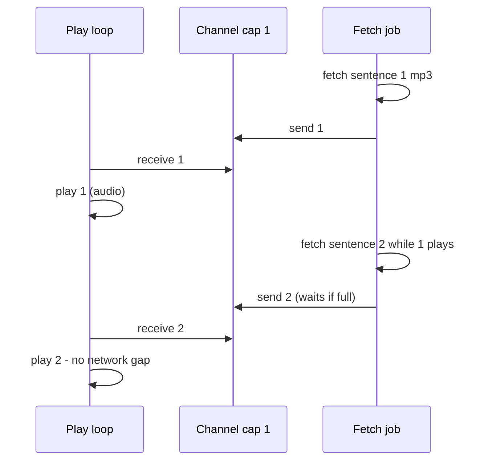

2026-07-17

# EinkBro iOS: favicons, TTS pipeline, .user.js, and the settings parity audit

A round of user-reported gaps in the iOS port, each fixed by reading the
Android original first and mirroring it, plus a full parity audit of every
settings item. Committed as `00379d0` on einkbro-ios.

## Favicons existed nowhere on iOS

Android gets favicons pushed by `WebChromeClient.onReceivedIcon`, which feeds
two sinks: the tab's album cover (tab bar, overview grid) and the `favicons`
Room table (bookmark/history rows). WKWebView has no such callback, so the
port had never captured one — the bookmarks dialog and tab bar always showed
the default globe.

The fix adds the missing push at the engine level: after `didFinishNavigation`,
a small JS snippet resolves the page's `link rel=icon` (falling back to
`/favicon.ico`), NSURLSession fetches the bytes, and the same two sinks are
fed. Decoding needed a new `decodeImageBitmap` expect/actual: Skia decodes
PNG/JPEG but not real `.ico` containers, so the iOS actual falls back to
ImageIO (`UIImage`) and re-encodes to PNG for Skia. `BookmarkManager` mirrors
Android's in-memory favicon list + per-domain bitmap cache so composition-time
lookups stay synchronous. One deliberate divergence: incognito tabs set the
album cover but skip the disk write — the iOS engine promises a non-persistent
store in private mode, which Android's implementation doesn't honor for
favicons.

## ReadAloud stalled between sentences

The ported TTS view model fetched sentence N's mp3, played it, then fetched
N+1 — a full network round-trip of silence between every sentence. Android's
`readByEngine` avoids this with a `Channel(1)` pipeline: a fetch job runs
ahead of playback, so the next sentence is already downloaded when the current
one ends. The iOS view model now uses the same structure:

Stop/next now tear down the pipeline the way Android's `stop()` does (cancel
channel, silence player) instead of the old `skipArticle` flag. Separately,
the TTS dialog's play button had been calling `IntentUnit.readCurrentArticle`
— a no-op stub — so tapping play did nothing and the UI looked frozen. The
dialog now takes a `readCurrentArticleAction` from the browser screen that
extracts the page text and queues it, which is the Compose equivalent of
Android's intent back into `BrowserActivity`.

## Wire-up class of bugs

Several "missing features" turned out to be one missing connection each,
exactly as PARITY_PLAN predicted:

- **Tab bar toggle** — the strip and the setting both existed, but the screen
  read the pref once via `remember`. A pref-change listener (mirroring
  `BrowserActivity`'s `K_SHOW_TAB_BAR` reaction) makes it live. The
  SharedPreferences shim's listener interface became a `fun interface` so
  lambda call sites port cleanly.
- **Overview alignment** — `HistoryAndTabs` supported `shouldReverseHistory`
  but the caller never passed it; the panel now anchors at the toolbar edge.
- **Settings links** (About/Manual) — `IntentUnit.launchUrl` was a toast stub;
  it now feeds `ExternalUrlBridge`, which the browser already collects into a
  new tab. This un-stubbed every other `launchUrl` call site too.
- **.user.js** — the install flow (fetch → prefilled editor) was fully ported
  but unreachable. The WKWebView navigation delegate now cancels `.user.js`
  navigations and routes them to the manager, like Android's
  `shouldOverrideUrlLoading`.

## Settings audit

Four parallel audits checked every item on all 13 settings screens for an
actual behavior read-site (the setting UI itself doesn't count). Result:
55+ items genuinely wired; ~10 quick wins landed the same day (split-search
editor button, `useOpenAiTts` as a facade over `ttsType`, FAB long-click +
position, history thumbnail grid, Save-Data header); the remaining inert or
partial items are catalogued with their Android reference points in
`docs/SETTINGS_AUDIT.md` as the work-list for coming phases. Items that are
platform-impossible (volume keys, self-quit, default selection menu) stay
documented in PARITY_PLAN §7 rather than faked — and the Quit and
home-screen-Shortcut menu items were removed from the UI outright, which also
retired the porting-era catalog screen (Quit was its only entry point).

## UX polish in the same round

Toast redesigned to the e-ink language (bordered, pure white/black following
dark mode); fullscreen now drops the bottom safe-area inset so content reaches
the physical bottom edge under the home indicator.
