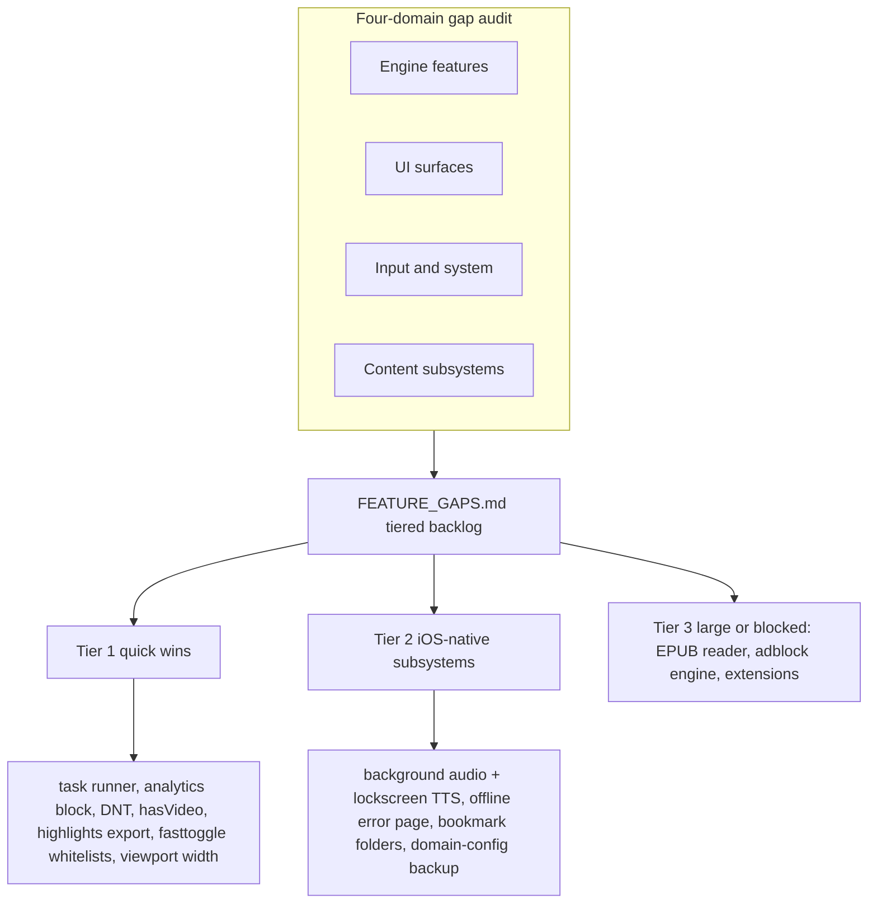

2026-07-18

# EinkBro iOS: feature-gap audit and overnight implementation batch

A full Android-vs-iOS feature audit, a prioritized backlog document, and a
night of implementing the top items — task runner through offline error page.

## The audit

Four parallel exploration agents swept the Android app against the port, one
per domain: browser engine, UI surfaces/dialogs, input/system integration, and
content subsystems. The synthesis is `docs/FEATURE_GAPS.md` — a tiered backlog
(companion to PARITY_PLAN for structure and SETTINGS_AUDIT for per-setting
state). The headline finding: the port is far more complete than the original
plans imply — the entire web engine, reader/translation/TTS/AI/userscript/EPUB
-export stacks and all settings screens are done. What remained clustered into
quick wire-ups, self-contained iOS-native subsystems, and a few large or
platform-blocked items.

## What got built

**AI task runner** (the user's trigger — "why does Tasks say not available?").
The `task/` package had been ported but was stubbed at the UI. Wired the
built-in task menu and, for custom prompts, a new `FreeFormAgentTask`: a full
LLM tool-calling agent loop over the ported `BrowserTools` surface (port of
Android `ChatWebInterface.agentLoop`, ~16 tools). This needed the tool-calling
gap the port flagged — added `OpenAiRepository.chatWithTools` + tool-message
serialization. Progress streams into the existing AI result dialog.

**Background audio + lock-screen TTS** — the biggest input/system gap. A new
`MediaSession` expect/actual bridges `MPNowPlayingInfoCenter` +
`MPRemoteCommandCenter`, with `UIBackgroundModes:audio` and an active playback
session, so TTS/AI audio survives backgrounding and is controllable from
Control Center and headsets.

**Offline error page** — main-frame failures now render the ported
`error_page.html` (friendly reason, failed URL, Retry, horse-jump game) instead
of a toast; `einkbro://retry` re-fetches through the nav delegate, which also
learned to render the `einkbro://` error base without the leave-app prompt.

**Engine quick-wins** — analytics/tracker fast-block (ANALYTICS_DOMAINS →
WKContentRuleList), always-on `DNT: 1` header, `AudioOnly` menu row gated on a
real DOM video check, per-site desktop viewport-width injection, FastToggle
whitelist pencil-icons opening the real editor, and Highlights HTML export via
the share sheet.

**Backup/data integrity** — Chrome/Netscape bookmark import now preserves
nested folders (parent-id stack, no Jsoup), and per-site domain configurations
join the backup ZIP.

## Deferred, with reasons (in FEATURE_GAPS.md)

App Quick Actions (Swift lifecycle + device-only verification); blob downloads,
custom-font import (UIDocumentPicker + WKURLSchemeHandler), remaining backup
tables, tap-to-select — Tier 2 follow-ups. Tier 3 large/blocked: EPUB reader,
a real adblock filter-list engine, and the Share/Action extensions and
default-browser role (new Xcode targets / Apple provisioning).

Each implemented item was compiled, simulator-verified where it has a visible
surface, committed, and installed to the device. Twelve commits; the working
tree is clean for morning review.
