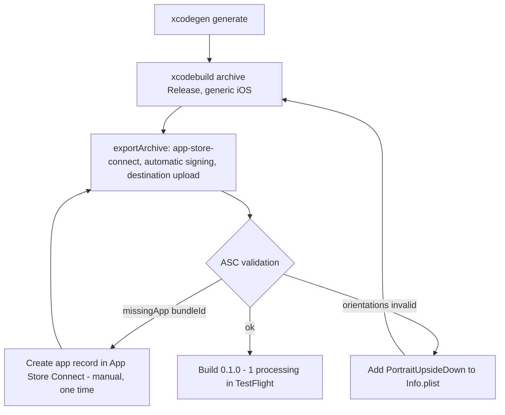

2026-07-18

# EinkBro iOS: first upload to App Store Connect (0.1.0 build 1)

Covers commit `6f2f6b4` (the `Info.plist` orientation fix) and the release
process itself; tagged `v0.1.0-1` in einkbro-ios.

## The release path that worked

Unlike NerLan (see `nerlan-ios-testflight-tutorial.md`), no App Store Connect
API key was needed. The `xcodebuild -exportArchive` upload authenticated with
the Apple ID session already logged into Xcode. NerLan's script works around a
"Cloud signing permission error" because its ASC API key has the App Manager
role, which Apple won't let mint cloud-managed distribution certificates —
but that limitation is specific to API-key auth. The logged-in account here is
the Account Holder of the individual team, so plain automatic signing with
`-allowProvisioningUpdates` handled the distribution certificate and App Store
profile end to end. Manual signing, the stored `.p8` key, and its issuer ID
were all unnecessary.

Export options that worked (`method: app-store-connect`, `signingStyle:
automatic`, `destination: upload`, `teamID: 3WD42GF27D`); the archive was
written into `~/Library/Developer/Xcode/Archives/` so it also shows up in
Xcode's Organizer.

## The two first-upload failures

**Missing app record.** The first upload attempt failed with
`DistributionAppRecordProviderError.missingApp(bundleId:
"info.plateaukao.einkbro.ios")`. Uploading requires the app to already exist
in App Store Connect; automatic signing registers the *identifier* on the
developer portal, but nothing creates the *app record*. Created manually in
ASC: name **EinkBro**, primary language **English (U.S.)**, SKU
**einkbro-ios** (internal-only, immutable after creation — the short slug
keeps sales reports readable).

**Orientation validation.** The second attempt was rejected by ASC package
analysis: an iPad-capable bundle listing only three of the four orientations
in `UISupportedInterfaceOrientations` fails validation, because iPad
multitasking requires all four. Fixed by adding
`UIInterfaceOrientationPortraitUpsideDown` (commit `6f2f6b4`) rather than
opting out via `UIRequiresFullScreen`, which Apple is deprecating. Notch-era
iPhones ignore upside-down portrait, so iPhone behavior is unchanged. This
required rebuilding the archive — validation reads the archived `Info.plist`.

## For next time

1. Bump `CFBundleVersion` (and `CFBundleShortVersionString` as appropriate)
   in `iosApp/iosApp/Info.plist` — ASC rejects re-uploads of an existing
   build number.
2. `cd iosApp && xcodegen generate`, archive, then export with the options
   above. Everything runs headless off the Xcode login; no API key required.
