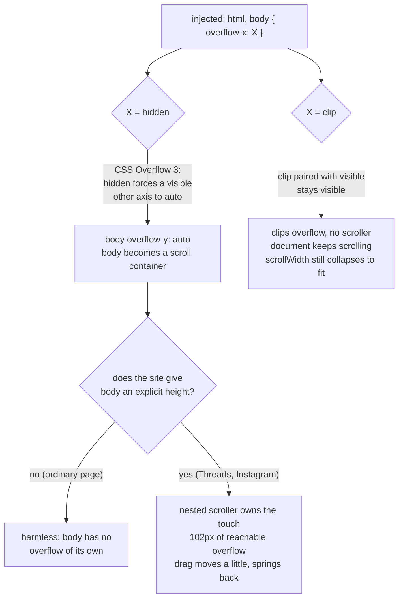

2026-07-26

# Instagram and Threads stopped scrolling: overflow-x hidden made body a scroller

Instagram and Threads became nearly unscrollable. A drag moved the feed a little
and then sprang back to where it started — most of the time, on most drags.
Ordinary pages were fine.

## Root cause

Commit `3693696` (2026-07-25) added a fit-width safety net so a page laid out
wider than the viewport could not be pinch-zoomed out below 1.0:

```kotlin
const val FIT_WIDTH_CSS = "html, body { overflow-x: hidden !important; }"
```

Per CSS Overflow 3, `hidden` on one axis forces a `visible` other axis to compute
to `auto`. So the injected rule silently gave `body` an `overflow-y: auto` —
**body became a nested scroll container** on every normal page.

On ordinary pages body's height is auto, so the box has no overflow of its own
and nothing changes. But Meta's virtualised feeds give body an explicit pixel
height, and then the nested scroller sits in front of the document with a sliver
of scrollable overflow — and WebKit hands the touch gesture to the innermost
scroller that can move.



## Getting ground truth

Guessing was going nowhere: the site is a client-rendered SPA, WKWebView content
is invisible to the accessibility tree, and automated flick gestures in the
simulator happened to scroll fine. So a temporary diagnostic was added to
`notifyFinished` — dump the native `UIScrollView` state (`contentSize`, `bounds`,
`zoomScale`/`minimumZoomScale`, insets) plus a JS snapshot of the page's scroll
geometry (computed `overflow-x`/`-y`, heights, `scrollHeight`/`clientHeight` for
html and body, the effective viewport meta) to stdout, captured with
`xcrun simctl launch --console-pty`. It fired on a schedule (3s, 15s, 30s, …) so
the page could be measured *after* dismissing Threads' interstitial, not only
while it was up.

threads.com, interstitial dismissed:

```
before:  html sh=7247 chh=709   body ox=hidden oy=AUTO     sh=7349 chh=7247
after:   html sh=6295 chh=709   body ox=clip   oy=visible  sh=6295 chh=6193
```

Before the fix, 102px of feed was trapped inside the body scroller — content the
document's own scroll could never reach, in a box that intercepted the gesture.
After it, body is not a scroller and the document's `scrollHeight` holds the
whole feed.

While the interstitial was showing, the pre-fix numbers were worse still: native
`contentSize` matched `bounds` exactly (393x709) with 69px of overflow stuck in
the body box, so a drag was pure rubber-band — the literal "bounces back to the
original position".

## The fix

Use `clip` instead of `hidden`. Per the same spec section, `clip` paired with
`visible` leaves the other axis `visible`: it clips overflow without creating a
scroll container.

The fit-width guarantee survives, which was the whole point of the rule.
Verified that `documentElement.scrollWidth == clientWidth == 393` on
m.facebook.com and on a synthetic page with a 1500px-wide child, so the fit scale
is still exactly 1.0 and there is still no zoom-out below it. Wikipedia scrolls
normally with no sideways pan.

One caveat: `overflow: clip` needs Safari 16 / iOS 16, and the deployment target
is iOS 15. There, the declaration is simply dropped — the safety net degrades to
pre-`3693696` behaviour rather than breaking scrolling, which is the right way
round.

## Aside

Part of the reported "can't scroll Threads" is not ours: the site's
"Get the full app experience" interstitial reappears repeatedly, locks page
scrolling while it is up, and sometimes renders with no close button at all.
Worth remembering before chasing a scroll bug on that site — dismiss the dialog
first, then measure.
