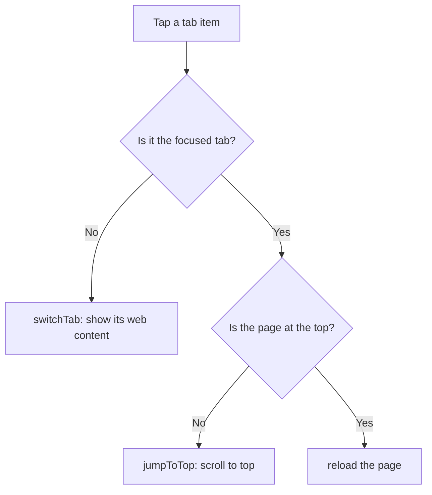

2026-07-24

# EinkBro iOS: focused-tab tap scrolls to top, then reloads

## What it does

Tapping a tab item now behaves like the Android original's three-state gesture:

- Tap a **non-focused** tab — switch to it and show its web content.
- Tap the **already-focused** tab, scrolled down — scroll it to the top.
- Tap the **already-focused** tab, already at the top — reload the page.

Previously every tab tap ran `switchTab`, which is a no-op on the current tab, so
re-tapping the focused tab did nothing. This closes a small parity gap with the
Android app and gives the tab item a useful second and third function.

The gesture applies at both tap sites: the horizontal tab strip in the toolbar
and the tab list inside the overview panel.



## How it was built

The behavioral reference is Android's `Album.showOrJumpToTop()`:

```
if (isCurrentAlbum) {
    if (isAtTop()) refreshAction() else jumpToTop()
} else {
    showAlbum()
}
```

The iOS port models tabs differently — `BrowserViewModel` owns the engines rather
than the `Album` holding a callback — so the logic landed as a new VM method,
`BrowserViewModel.showOrJumpToTop(album)`, that switches when the tapped album is
not current, and otherwise reloads-if-at-top / jumps-to-top on the current engine.
Both tap sites in `BrowserScreen` (`onAlbumClick` for the toolbar strip,
`onTabClick` for the overview list) were repointed from `switchTab` to it. The
overview path still closes the panel afterward, matching Android's
`OverviewDialogController` doing `hide(); showOrJumpToTop()`.

The one new capability the engine seam needed was an "am I at the top?" query, so
`WebViewEngine.isAtTop()` was added to the common interface (defaulting to `true`).
On iOS it reads the native scroll position:

```
contentOffset.y <= -adjustedContentInset.top + 1pt
```

The inset term handles a top safe-area inset, and the 1pt tolerance absorbs
sub-pixel rounding after the scroll settles.

## Rationale and a scoped caveat

`scroll_to_top.js` (used by `jumpToTop`) already covers both document scrolling and
inner CSS-scrollable containers via its `window.__einkbroScrollToTop` hook, so the
scroll action itself is correct everywhere. The *decision* of reload-vs-scroll,
however, reads only the native scroll offset. For the ordinary document-scroll case
that offset tracks `window.scrollY`, so the choice is correct.

The gap is pages whose scroll lives entirely inside an inner container (some reader
or SPA layouts): the native offset stays at 0 there, so a focused-tab tap reloads
instead of scrolling. Android distinguishes this via an `isInnerScrollAtTop` flag it
receives over the `androidApp.onInnerScrollChanged` JS bridge — but that bridge is
never wired on iOS (the `fix_scrolling.js` calls are all guarded by
`typeof androidApp !== 'undefined'`), and no part of the iOS port tracks inner-scroll
state. So reading the native offset is both the best available signal and consistent
with the rest of the port. Closing the gap would mean introducing a new JS message
handler plus per-engine inner-scroll state — out of scope for this change.

Verified by a clean `:composeApp:compileKotlinIosSimulatorArm64`, then a Release
build installed to a physical iPhone for hands-on confirmation.
