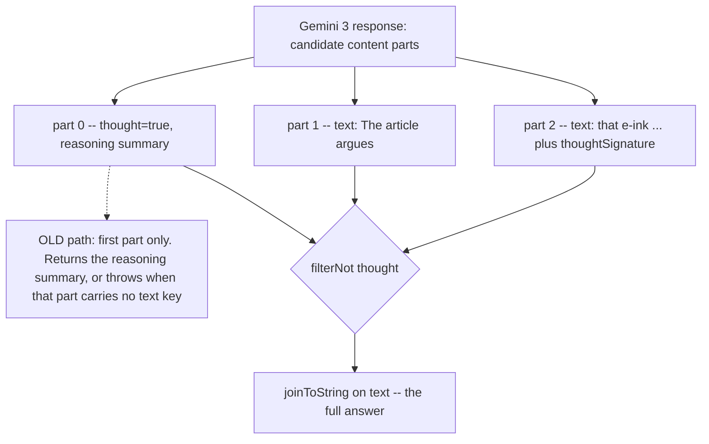

2026-08-03

# EinkBro iOS: Gemini 3 reasoning summaries leaking into AI replies

## What was broken

Gemini-backed AI features (chat over a web page, GPT actions, YouTube caption
summarising) started returning the wrong thing once a Gemini 3 model was
selected. Three distinct symptoms, all from the same source:

- the reply shown was the model's **reasoning summary**, not its answer;
- longer answers came back **truncated** to their first fragment;
- some requests failed outright with a parse failure that surfaced as a generic
  "network error", even though the HTTP call had returned 200.

## Root cause

Gemini 3 changed the shape of `candidates[].content.parts[]`. It is no longer
"one part, one answer":

- reasoning-summary parts are emitted inline and flagged `thought: true`;
- the final answer part carries a `thoughtSignature`, and that part may arrive
  with **no `text` key at all**.

The port's model and extraction predated that. `GeminiContentPart.text` was a
non-defaulted `String`, so a signature-only part failed kotlinx deserialization
and blew up the whole response — that is symptom three. And both call sites read
`parts.firstOrNull()?.text`, which is symptoms one and two: if a thought part
came first you got the reasoning, and if the answer spanned parts you got only
the head of it.

## The fix

`GeminiContentPart` is shared between request and response bodies (same as on
Android), so the model change had to be safe in both directions:

- `text` now defaults to `""` and a `thought: Boolean = false` field was added.
  Because kotlinx serialization runs with `encodeDefaults = false`, an outgoing
  request part still serialises to `text` only — it never starts sending a
  spurious `thought` key to the API.
- Extraction became `parts.filterNot { it.thought }.joinToString { it.text }` in
  `OpenAiRepository.queryGemini`, and the same in `YouTubeCaptionFetcher`, which
  keeps its own private mirror of these DTOs.
- `GeminiCandidate` also gained `finishReason`, so a `MAX_TOKENS` or `SAFETY`
  stop is visible in the payload rather than looking like an empty answer.

The caption fetcher already requests `thinkingBudget = 0`; the filter is the
belt to that suspenders, since a model that declines to honour the budget would
otherwise fold its reasoning straight into the transcript.

Commit `9836a81`.
