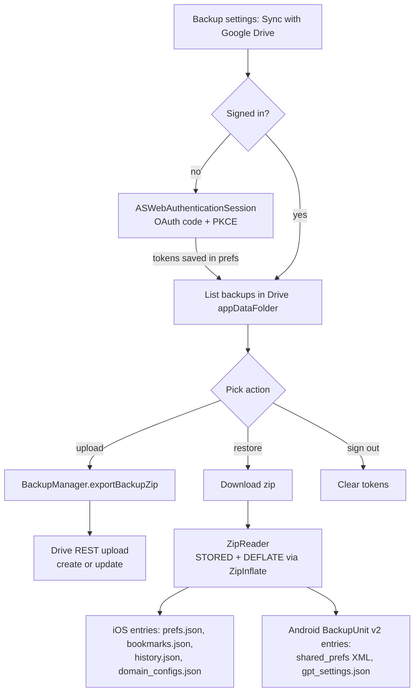

2026-07-18

# EinkBro iOS: sync app data with Google Drive

Backup settings gain a "Sync with Google Drive" entry (port of Android `ff81280ca`): sign in with a Google account, upload the app's backup zip, or restore any backup found there — including backups made by the Android app, so the pair now gives users cross-device migration in both directions. The backup lives in the Drive **appDataFolder**, a hidden app-private area of the user's own Drive, so there is no developer-hosted backend to run or trust; the client talks straight to the Drive REST API over Ktor.

Auth is OAuth 2.0 Authorization Code with PKCE (`Crypto` grew raw `sha256` and `randomBytes` for the challenge/verifier). The interactive part is the one deliberate divergence from Android: Android runs Google's consent page as a normal browser tab and completes the flow when the redirect comes back into the app, persisting state across the round-trip. On iOS an embedded web view would be rejected outright by Google (`disallowed_useragent`), so the port introduces a small `WebAuth` expect/actual whose iOS actual wraps **ASWebAuthenticationSession** — the system auth sheet that shares Safari's cookies and intercepts the custom-scheme redirect itself. That collapses sign-in to a single suspend call (`GoogleDriveRepository.signIn()`), with no persisted begin/complete pair. Expired or revoked refresh tokens surface as `DriveReauthRequiredException`, which the settings layer answers with one interactive re-sign-in before failing over to a toast.

Restoring Android-made backups drove the rest of the changes. Android's `BackupUnit` v2 zips are written by `ZipOutputStream`, which deflates every entry — but the iOS `ZipReader` (built for EinkBro's own EPUBs, which are all STORED) skipped compressed entries entirely. It now inflates DEFLATE entries through a new `ZipInflate` expect/actual (Apple's built-in zlib via `compression_decode_buffer` on iOS) and locates entry data via the central directory, which also keeps sizes correct for Android's streamed zips with data descriptors. On top of that, `BackupManager.importBackupZip` learned Android's entry shapes: raw `shared_prefs/*.xml` SharedPreferences dumps and the flat `gpt_settings.json`, alongside the iOS-native JSON entries (which Android's `bookmarks.json`/`history.json` already share).

The feature had been sitting finished-but-uncommitted across several sessions' working trees, tangled with three unrelated in-progress changes (status-bar hiding, keyboard-inset fixes, favicon fallback). It was committed as a whole after verifying the Drive-only tree compiles standalone with the other clusters stashed.
