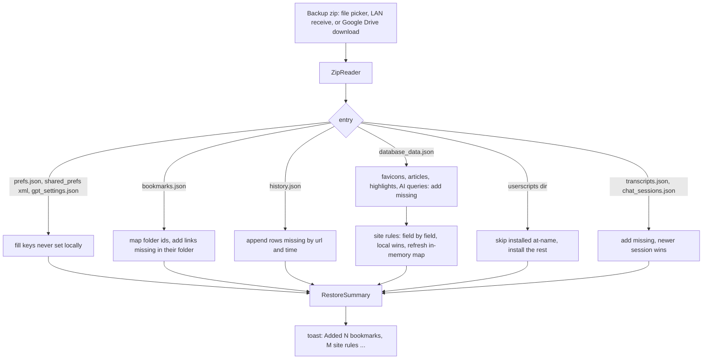

2026-08-30

# EinkBro iOS: `einkbro://googlesync` unlock, Android-format backup zip, append-only restore

Three related changes to the backup/restore subsystem, driven by one goal: an
iOS install that already has data should be able to pull the Android app's
Google Drive backup in **without losing anything it already has**.

## 1. The Backup screen is unlocked by typing `einkbro://googlesync`

The Backup settings screen (Google Drive sync, export/import, LAN share) had
been hidden behind a compile-time flag, `BuildConfig.BACKUP_RESTORE_ENABLED =
false`, so App Review never met a flow that needs a second device or a Google
sign-in. That made it unreachable for real users too.

The gate is now a runtime pref, `ConfigManager.isBackupRestoreUnlocked`
(key `backup_restore_unlocked`). Typing `einkbro://googlesync` in the URL bar
and pressing Enter flips it on, shows a toast, and opens Settings directly on
the Backup screen. The same pref gates the settings-search index, the NavHost
route, and the two LAN menu items (Send Link / Receive Data) that ride on the
same multicast entitlement.

Two details were deliberate:

- The key has **no `sp_` prefix**, so `exportPrefs("sp_")` never sweeps it into
  a backup — the unlock is a per-device gesture, not a synced setting.
- The URL bar previously had no `einkbro://` handling at all: `loadUrlOrSearch`
  sent `einkbro://anything` to the search engine (or, with a dot in it, built
  `https://einkbro://...`). `handleTypedCommand` now intercepts typed commands;
  anything unrecognised loads as a URL, which the engine already accepts for
  its internal scheme (`einkbro://startpage`).

The Android app has no such URL — its Backup screen is always visible. This
is an iOS-only addition, not a port.

## 2. The zip now matches Android's `BackupUnit` v2 layout

The Android reference (`unit/BackupUnit.kt`) writes a plain zip of JSON files
with a `_manifest.json` (`{"version":2,"categories":[...]}`). Its Google Drive
sync is nothing more than that same zip uploaded as `einkbro-backup.zip` into
the Drive `appDataFolder`, replaced wholesale on every upload; all merging
happens client-side at restore time. The iOS app already downloads that file,
so "restore from Drive" and "import a zip" are one code path.

Before this change the iOS zip carried `manifest.json` (not `_manifest.json`),
`prefs.json`, `bookmarks.json`, `history.json` and `domain_configs.json`.
Android treats a zip **without** `_manifest.json` as a legacy raw-database
backup and writes its entries straight into `shared_prefs/`, so an iOS backup
was effectively unreadable by the Android app. Restore on iOS covered only
prefs, bookmarks, history and site rules.

`BackupManager.exportBackupZip` now writes:

| entry | contents |
|---|---|
| `_manifest.json` | version 2 + categories (`GPT_SETTINGS`, `BOOKMARKS`, `HISTORY`, `DATABASE_DATA`, `USERSCRIPTS`, plus `TRANSCRIPTS` / `CHAT_SESSIONS` when non-empty) |
| `prefs.json` | every portable `sp_` pref (iOS-only; Android ignores unknown entries) |
| `gpt_settings.json` | the Gen-AI subset of prefs, using Android's `GPT_PREF_KEYS` list |
| `bookmarks.json`, `history.json` | unchanged, already the same shape on both platforms |
| `database_data.json` | `favicons`, `articles`, `highlights`, `chat_gpt_queries`, `domain_configurations` |
| `userscripts/NAME.user.js` + `userscripts/userscripts.json` | script bodies; enabled state, source URL, GM values |
| `transcripts.json`, `chat_sessions.json` | only when non-empty (Android's `OPTIONAL_WHEN_EMPTY`) |

and `importBackupZip` reads every one of those back, plus Android's
`shared_prefs/*.xml` and the old iOS `domain_configs.json`.

Left out on purpose, in both directions:

- `saved_pages` — file-backed (`.mht` on Android, `.webarchive` here); the zip
  carries no page bytes, so the rows would only name files that do not exist.
- `whitelist_domains` / `javascript_domains` / `cookie_domains` — the iOS port
  keeps these lists in memory only (`BaseWebConfig`), so there is nothing
  durable to append to. Worth revisiting if those lists ever get a table.

A latent bug surfaced while wiring `database_data.json`: Android's
`DomainConfigurationData` declares its four toggles as `Boolean?` and
serialises the unset ones as `null`, while the iOS class has them as
non-null `Boolean`. kotlinx decoded `null` into `Boolean` by throwing, and the
surrounding `runCatching` silently dropped **every** imported site rule. The
`Json` instance now sets `coerceInputValues = true`, so `null` becomes the
field default.

## 3. Restore is append-only

The requirement was explicit: restoring must add, never override what the
device already has. Android's own restore is already a merge for most
categories (commit `c93970fcb`), but it **overwrites** prefs and history. The
iOS restore goes one step further and is append-only everywhere:

| data | merge key / rule |
|---|---|
| prefs (`prefs.json`, `shared_prefs/*.xml`, `gpt_settings.json`) | only keys this device has **never written**; existing values are kept. The Drive OAuth state, e-ink image tuning and saved-file lists stay excluded. |
| bookmarks | Android's `mergeBookmarks`: folders match by (mapped parent, title) and are created with fresh ids when missing; links match by (mapped folder, url). Imported ids are per-device autoincrements, so they are remapped, never trusted. |
| history | append rows not present by (url, time) — Android does delete-all-then-insert here |
| site rules | field by field, local wins; the backup fills unset fields and adds new domains. The four non-null toggles use OR (a rule the backup turned on is added, never turned off). The in-memory `domainConfigurationMap` is refreshed so the user need not relaunch. |
| favicons / transcripts | add only domains / video ids without a local row |
| articles + highlights | article matches on (url, date) with an id map so highlights land on the right local article; highlights dedupe on (article, content); an unmapped article id is skipped rather than tripping the foreign key |
| AI queries | dedupe on (date, url, model, selectedText) |
| chat sessions | same UUID: the newer `lastUpdated` wins, and the local `webContent` (not in the zip) is kept |
| userscripts | a script whose `@name` is already installed is left alone — code, enabled state and GM values (Android updates in place; append-only means skip) |

`importBackupZip` returns a `RestoreSummary` instead of a boolean, and the
toast reports it: `Added 1 bookmarks, 1 site rules` or `Nothing new to
restore — everything was already here`.

## Verification

Driven in the simulator with `sim-use`:

- `einkbro://googlesync` + Enter (`sim-use ios key 40`) set the pref and opened
  the Backup screen.
- A hand-crafted Android v2 zip (manifest, `shared_prefs` XML with a poisoned
  `sp_drive_auth_state`, `gpt_settings.json`, bookmarks with a folder, history,
  `database_data.json` with `null` toggles, a disabled userscript with a GM
  value) imported through the document picker: the folder got a fresh id and
  its child was re-parented, the duplicate Wikipedia URL was skipped, every DB
  table gained its row, and the OAuth key was not imported.
- A second zip with conflicting values (changed prompt, edited script, flipped
  site-rule field, one new bookmark) left every existing value untouched and
  reported `Added 1 bookmarks, 1 site rules` — the one site-rule change being
  the previously unset `desktopMode`.
- Export produced the Android layout listed above.

Remaining gap versus Android: the per-category picker (Android lets the user
choose which categories to back up or restore; iOS always does all of them).
