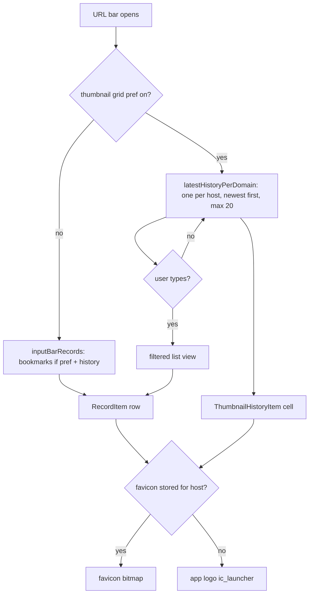

2026-08-21

# einkbro-ios: history favicons in the input bar, thumbnail grid capped per domain

## What was broken

Every history row in the URL-bar suggestion list drew the generic `ic_history` clock, and the "history thumbnails" grid mode was just that same list rendered as a wall of clocks — one cell per visit, so a site opened fifty times took fifty cells.

## Root cause

The favicon pipeline itself was fine: `WKWebViewEngine.fetchFavicon` resolves and stores icons into the `favicons` table (the test simulator had 8 rows), and `BookmarkManager.findFaviconBitmapBy(url)` decodes them on demand. The break was one line in `BrowserScreen.kt`:

```kotlin
bookmarkManager = if (config.browser.showBookmarksInInputBar)
    AppServices.bookmarkManager else null,
```

`bookmarkManager` is the list's *favicon source*, but it had been wired up as the switch for the "show bookmarks in input bar" behaviour pref. With that pref off (the default) the list got `null`, every lookup short-circuited to `null`, and every row fell through to the clock. Meanwhile the pref itself was inert — iOS never actually merged bookmarks into the records.

For the grid, Android has a dedicated query — `RecordRepository.listLatestHistoryPerDomain()` — that `SearchSuggestionViewModel.initSuggestions()` swaps in when the thumbnail pref is on. The iOS port had the grid composable but fed it the raw history list.

## Fix



- **`BrowserViewModel.inputBarRecords(includeBookmarks)`** — port of Android's `listEntries`: bookmarks (non-folders, as `RecordType.Bookmark`) first, then history minus rows that equal a bookmark (`Record.equals` is title+url). `BrowserScreen` now always passes `AppServices.bookmarkManager` and lets this function decide which rows appear, so the pref does what Android's does instead of gating icons.
- **`BrowserViewModel.latestHistoryPerDomain(limit = 20)`** — port of `listLatestHistoryPerDomain`. History comes back `ORDER BY TIME DESC`, so the first record seen per host is the most recent visit. The 20-icon cap (`HISTORY_GRID_MAX_DOMAINS`) is an iOS addition: the grid is meant to be a quick pick list, not a full history. Typing switches to the normal filtered list, mirroring Android's `showHistoryThumbnailGrid && !inputHasTyped`.
- **Fallback icon** — when no favicon is stored for the host, both the grid cell and the list row now draw the app logo (`ic_launcher`, the same fallback the bookmarks dialog already uses) instead of the clock. Android still uses the clock in the list rows; applying the logo to both views on iOS was deliberate so the two views agree.

## Verification

Driven on the iOS 18.6 simulator with real browsing data plus 25 seeded distinct-host history rows (removed afterwards):

- List view showed the stored favicons (wikisource, wikipedia, github, yicai, codeberg, vogue, google).
- Grid showed exactly 20 cells: 8 real favicons for the 8 distinct real hosts (codeberg and wikisource, each visited twice, appeared once) and 12 logo fallbacks for the seed hosts.
- Typing a query collapsed the grid into the filtered list. After the clear (x) button the list stays as-is — same as Android, where `inputHasTyped` latches and the clear button doesn't fire `onTextChange`.

One simulator note worth keeping: injecting `sp_history_thumbnail_grid` into the app-container plist worked for the test, but removing it afterwards didn't stick — cfprefsd wrote its cached `true` back on the next launch. Flipping it off through the app's own Appearance settings is what actually restored it.
