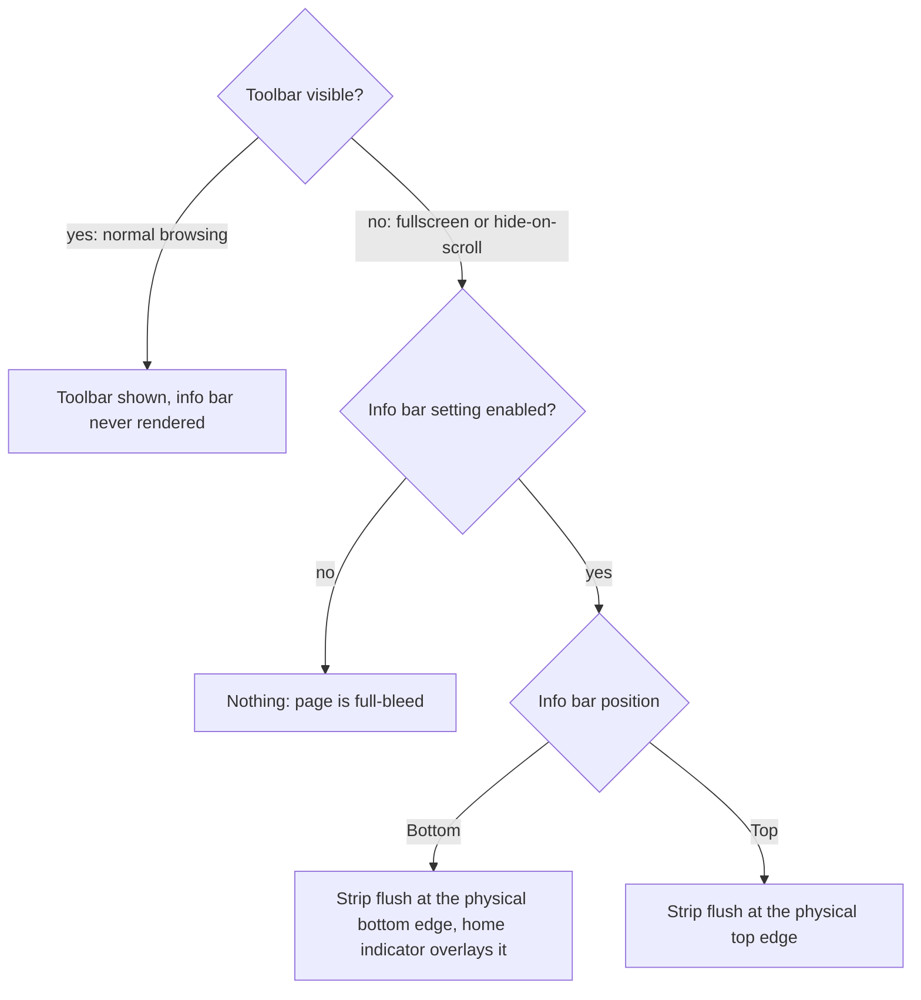

2026-07-19

# EinkBro iOS: info bar shows only while the toolbar is hidden

The custom info bar (the slim strip with time, battery, wifi, and pagination status — `statusbar` in code, "Info bar" in the settings UI) was both mispositioned and shown at the wrong times: whenever the setting was enabled it rendered permanently, stacked next to the visible toolbar.

## Root cause

The iOS port rendered the info bar as an always-on layout slot gated only on `statusbarEnabled`. But on Android, `StatusbarViewController` is driven by toolbar visibility: `if (!binding.appBar.isVisible) statusbarViewController.show() else hide()`, and `FullscreenDelegate.toggleFullscreen()` shows it exactly when it hides the app bar. The Android setting string spells the contract out: *"Show info bar when toolbar is hidden."* The port had lost that coupling.

## The fix

`statusbarVisible = statusbarEnabled && (isFullscreen || toolbarHiddenByScroll)` — the strip is a stand-in for the hidden toolbar, never a sibling of a visible one.

Unlike the toolbar (which is padded above the home indicator so its buttons don't collide with the system gesture), the info bar is deliberately **full-bleed**: it has no tap targets, and in fullscreen the content area should extend into the safe areas. At Bottom it sits flush at the physical edge with the home indicator overlaying it; at Top it sits at the physical top. A first iteration gave it the same safe-area padding as the toolbar; that was reverted on review — insets exist here to protect interactivity, and a non-interactive strip doesn't need protecting.

## Verification detour: pref injection lies

Driving this in the simulator surfaced a testing trap worth recording: `xcrun simctl spawn <udid> defaults write <bundle> sp_statusbar_position -integer 1` showed `1` in `defaults read` yet the app kept reading `0` — even across a device reboot. The injected write lands in the sim user's domain plist, but the sandboxed app's `NSUserDefaults` reads its app-container plist, and a key already present there (the app had previously persisted `sp_statusbar_position = 0`) shadows the injected value permanently. Keys the app never wrote (`sp_statusbar_enabled`) appeared to inject fine, which made it look intermittent. The reliable path for app-owned keys is the app's real Settings UI — which also gave the fix an end-to-end test: toggling "Info bar position" to Bottom, entering fullscreen, and seeing the strip appear above the home indicator; exiting fullscreen restores the toolbar and removes the strip.
