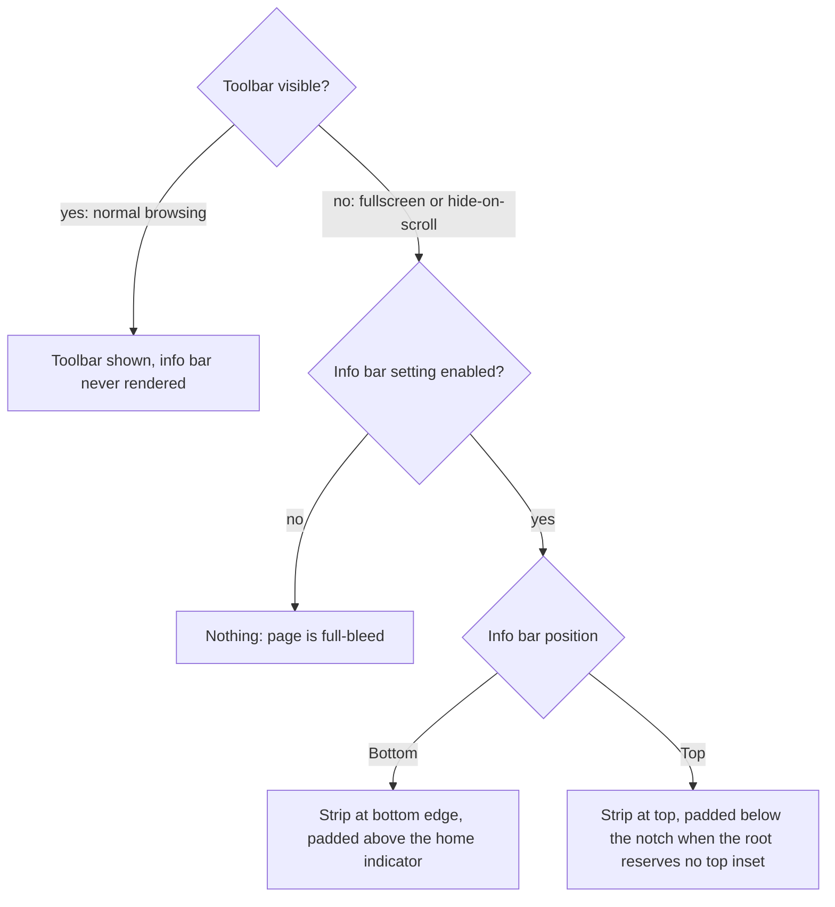

2026-07-19

# EinkBro iOS: info bar shows only while the toolbar is hidden

The custom info bar (the slim strip with time, battery, wifi, and pagination status — `statusbar` in code, "Info bar" in the settings UI) was both mispositioned and shown at the wrong times: whenever the setting was enabled it rendered permanently, stacked next to the visible toolbar.

## Root cause

The iOS port rendered the info bar as an always-on layout slot gated only on `statusbarEnabled`. But on Android, `StatusbarViewController` is driven by toolbar visibility: `if (!binding.appBar.isVisible) statusbarViewController.show() else hide()`, and `FullscreenDelegate.toggleFullscreen()` shows it exactly when it hides the app bar. The Android setting string spells the contract out: *"Show info bar when toolbar is hidden."* The port had lost that coupling.

## The fix

`statusbarVisible = statusbarEnabled && (isFullscreen || toolbarHiddenByScroll)` — the strip is a stand-in for the hidden toolbar, never a sibling of a visible one.

Since the strip now renders at the actual screen edges, it also gets the safe-area treatment introduced for the toolbar in the previous change:

- **Bottom position**: it is by definition the bottom-most chrome (the toolbar is always hidden when it shows), so it takes the home-indicator padding — content lifted above the gesture band, background painted down to the physical edge.
- **Top position**: fullscreen removes the root layout's top inset, which put the strip under the Dynamic Island. It now wraps in a `windowInsetsPadding(WindowInsets.statusBars)` of its own — Compose inset padding is consumption-aware, so in normal (non-fullscreen) mode where the root already reserved the top, this adds nothing.

## Verification detour: pref injection lies

Driving this in the simulator surfaced a testing trap worth recording: `xcrun simctl spawn <udid> defaults write <bundle> sp_statusbar_position -integer 1` showed `1` in `defaults read` yet the app kept reading `0` — even across a device reboot. The injected write lands in the sim user's domain plist, but the sandboxed app's `NSUserDefaults` reads its app-container plist, and a key already present there (the app had previously persisted `sp_statusbar_position = 0`) shadows the injected value permanently. Keys the app never wrote (`sp_statusbar_enabled`) appeared to inject fine, which made it look intermittent. The reliable path for app-owned keys is the app's real Settings UI — which also gave the fix an end-to-end test: toggling "Info bar position" to Bottom, entering fullscreen, and seeing the strip appear above the home indicator; exiting fullscreen restores the toolbar and removes the strip.
