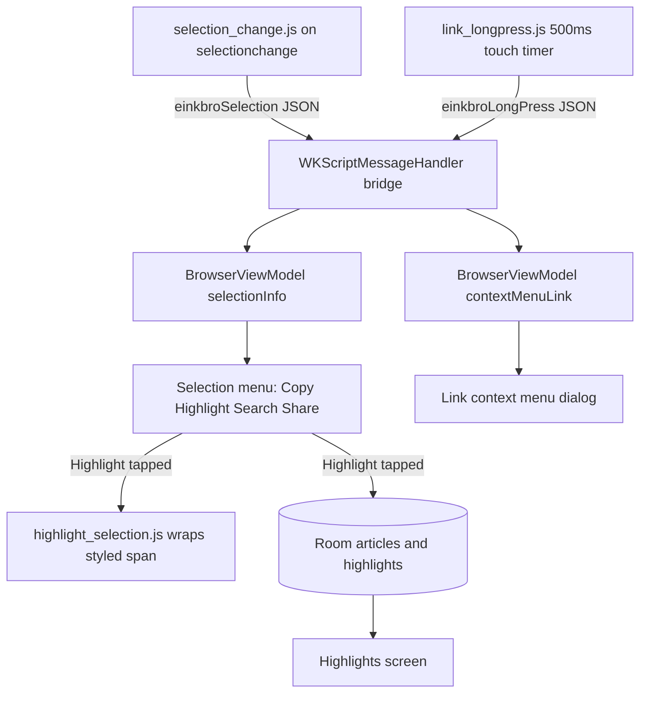

2026-07-16

# EinkBro iOS Phase 5 — text-selection highlights and the link context menu

Phase 5 brings EinkBro's on-page *interaction* to the iOS port: highlighting a
passage of text, and long-pressing a link to get the action menu. On Android
both features lean on capabilities WKWebView simply does not have — a
`JavascriptInterface` object bound into the page, and `WebView.getHitTestResult()`
for "what did the user just long-press". So the phase is really about building
the missing plumbing first, then wiring the two features on top of it.

## The bridge is the phase

Everything here needs the page to tell Kotlin something. iOS gives exactly one
sanctioned channel for that: `window.webkit.messageHandlers.<name>.postMessage(...)`,
received by a `WKScriptMessageHandler`. So the first piece is a small seam on the
engine — `WebViewEngine.addMessageHandler(name, handler)` — whose iOS actual
registers a handler on the web view's `userContentController` and hands the JSON
body back to Kotlin as a string. The handler is held strongly (the content
controller only keeps a weak reference) and removed in `destroy()` so a closed
tab does not leak its web view through the captured closure.

Two page scripts feed that bridge, and one acts on the result:

- `selection_change.js` listens for `selectionchange` and posts the current
  selection — its text plus a bounding rect in the page's CSS pixels — under the
  name `einkbroSelection`. When the selection clears it posts an empty text.
- `link_longpress.js` stands in for the absent hit-test: a `touchstart` on an
  anchor arms a 500ms timer, and if the finger is still down it posts the link
  URL under `einkbroLongPress`. It also sets `-webkit-touch-callout: none` on
  links and `allowsLinkPreview = false` so the native long-press sheet does not
  fight our menu.
- `highlight_selection.js` wraps the live selection in a styled span, using the
  classic "safe ranges" split so `surroundContents` never throws across element
  boundaries.

## Selection menu and the highlight flow

`BrowserViewModel` turns the two message streams into observable state:
`selectionInfo` (text + rect, or null) and `contextMenuLink` (a URL, or null).
`BrowserScreen` renders a compact action menu — Copy, Highlight, Search, Share —
anchored just below the selection rect (CSS pixels map one-to-one to Compose dp
on iOS, so no scale conversion). Copy and Share go through a new `PlatformActions`
expect/actual (UIPasteboard / `UIActivityViewController`); Search opens a query
in a fresh tab.

Highlight is the substantive one. The span's CSS class is chosen from the
existing `highlightStyle` preference (underline / yellow / green / blue / pink),
exactly matching Android's `WebViewJsBridge`, and `highlight.css` rides in its
own CSS slot so it survives the reader/main style churn. As on Android the
highlight is **text-only and ephemeral** — it is not re-applied when the page
reloads. What persists is the text: one `Article` per URL, with each highlight
attached to it. That required adding `articles` and `highlights` tables to Room.
Rather than a destructive `fallbackToDestructiveMigration`, the schema goes to
v2 with a hand-written `MIGRATION_1_2` that only creates the two new tables, so a
user's bookmarks and history carry across untouched. `HighlightViewModel`, which
until now held in-memory sample data, is rewritten to read and mutate through
`BookmarkManager`, and the already-ported Highlights screen is finally reachable
from the main menu.

## Link long-press, and the two-menus problem

A long-press on a link posts its URL, and `BrowserScreen` shows the ported
`ContextMenuDialog` with the real link URL; New tab (foreground/background),
Share link and Open-with are wired to real actions, the rest are deferred.

The one genuinely iOS-specific wrinkle surfaced only under test: a long-press on
a link *also* starts a native word selection, so `selection_change.js` fires too
and both menus tried to show at once. `-webkit-touch-callout: none` suppresses
the native link sheet but not text selection, and the trailing `selectionchange`
that fires when the finger lifts arrives *after* the long-press message — so
clearing the selection once in the long-press handler was not enough; it came
right back. The fix makes the context menu own the interaction: while
`contextMenuLink` is set the selection stream is ignored and the selection menu
is not rendered, and dismissing the context menu clears the selection so its menu
does not resurface underneath.

## Known limitations, deferred to later phases

- The native iOS selection callout (Copy / Look Up / Translate) still appears
  alongside our menu for plain-text selection; fully replacing it would need
  UITextInteraction-level subclassing, which is out of scope here.
- The selection menu covers Copy / Highlight / Search / Share; Translate, TTS,
  GPT actions and split-screen-from-selection are stubs for later.
- The link menu wires New tab / Share / Open-with; Split screen, Select text,
  Read content, Save-as and Summarize toast for now.
- Opening a highlight's source URL from the Highlights screen still stubs to a
  toast rather than loading it in a tab.

Verified end-to-end on the iPhone 16 simulator: selecting text raises the action
menu, Highlight styles the passage and it shows up (persisted and grouped by
article) in the Highlights screen and survives an app relaunch; long-pressing a
link raises the context menu with the correct URL and New tab opens it, with no
stray selection menu left behind.
