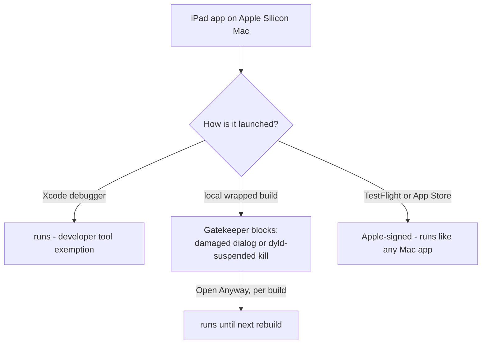

2026-07-22

# EinkBro iOS: running the iPad app on the Mac — why TestFlight is the answer

Goal: run EinkBro's iPad build natively on the development Mac (not in the
simulator). The attempt surfaced how macOS 26 treats locally-built
Designed-for-iPad apps, and ended with TestFlight as the sanctioned path
(commit `27b6aac` bumps `CFBundleVersion` to 2 for the upload).

## What failed, and why there were never crash reports

A Designed-for-iPad build compiles and signs fine (`xcodebuild
-destination 'platform=macOS,variant=Designed for iPad'`), and the wrapped
bundle (`EinkBro.app/Wrapper/EinkBro.app` + `WrappedBundle` symlink) is how
iOS apps live on macOS. But launching it outside Xcode hits a trust wall,
seen two ways:

- Opened from Finder: Gatekeeper refuses the non-notarized bundle with the
  blunt "damaged and can't be opened" dialog — the process never spawns.
- Opened via `open` from a terminal: the process spawns *suspended*. Every
  `sample` showed a single thread parked at `_dyld_start` for its whole
  life (~10s debug, ~1min release) before the OS reaped it. Not one
  instruction of app code ran — which is why there was never a crash
  report, no log line, nothing to debug.

Dead ends checked along the way: the provisioning profile did include the
Mac's UDID; Release vs Debug (get-task-allow) made no difference;
`/Applications` + `lsregister` only upgraded the failure to the Finder
dialog; `com.apple.provenance` (not quarantine) was the only xattr.

## The unlocks

System Settings → Privacy & Security → **Open Anyway** writes a per-app
exception into `syspolicyd`'s database, after which the app launches and
runs normally. But the exception is tied to that signed binary — every
rebuild needs a new click.

**Notarization cannot remove the friction**: it requires Developer ID
signing, which exists only for Mac-platform binaries. An iOS
(`platform=iphoneos`) executable can never be notarized — Apple routes all
iPad-on-Mac trust through the App Store and TestFlight, where Apple signs
the distributed binary.

## Decision

Ship dev builds to the Mac through TestFlight: bump `CFBundleVersion`,
archive + upload with the established headless recipe, install from the
TestFlight app on the Mac. Builds auto-update, no Gatekeeper dialogs, and
the same upload serves iPhone/iPad testing. Build 2 (0.1.0) uploaded
2026-07-22 with the e-ink image-filter fix aboard.
