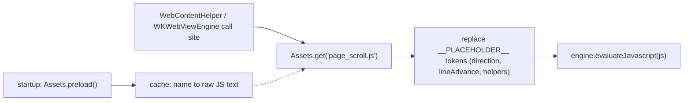

2026-07-16

# EinkBro iOS: move all injected JavaScript out of Kotlin into .js assets

The content pipeline built in Phase 3 grew a lot of injected JavaScript that
lived as string literals inside Kotlin — the paging math, the reader-mode
enter/teardown scripts, the vertical-rl scroll-convention shims, and the
engine's fallback scroll calls. This refactor moves every one of those scripts
into its own file under `composeApp/src/commonMain/composeResources/files/`, so
Kotlin holds orchestration and the JavaScript lives as JavaScript. It carries no
behaviour change — reader mode, vertical-rl layout, and bidirectional page
turning were re-verified on the simulator and behave identically.

## How the scripts are loaded and parameterised

The pieces were already in place: an `Assets` object preloads every file into a
name-to-text cache at startup, and two existing assets
(`update_css_slot.js`, `set_viewport_content.js`) established a `__PLACEHOLDER__`
+ `String.replace()` convention for injecting Kotlin values. The extracted
scripts follow the same path:

`page_scroll.js`, for instance, exposes `__DIRECTION__`, `__LINE_ADVANCE__`,
`__IS_VERTICAL_READER__`, `__TWO_COLUMN__`, `__RESERVE_PCT__`, `__RESERVE_PX__`,
and a `__VERTICAL_SCROLL_HELPERS__` slot that is filled with the shared
`vertical_scroll_helpers.js` text. Placeholder tokens are wrapped in trailing
underscores so they never collide with the script's own `__ebFromStart` /
`__ebMax` identifiers.

## What moved, and what deliberately did not

Eight new files came out of `WebContentHelper` and `WKWebViewEngine`:

| File | Was |
| --- | --- |
| `vertical_scroll_helpers.js` | `VERTICAL_SCROLL_HELPERS` companion constant |
| `page_scroll.js` | `pagingJsBody()` |
| `replace_reader_body.js` / `disable_reader_mode.js` | reader enter / teardown strings |
| `vertical_scroll_to.js`, `scroll_to_top.js`, `scroll_to_bottom.js` | jump-to-position strings |
| `engine_scroll_by_page.js` | the engine's fallback `scrollBy` string |

Two judgement calls kept the scope honest:

- **CSS constants stayed in Kotlin.** The request was about JavaScript; the font,
  colour, and filter blobs are CSS, and several are composed from config values
  at call time.
- **The userscript sample generator stayed.** It fabricates demonstration
  userscript text for a stubbed list UI (a later phase), not code the browser
  injects — moving it to an asset would only obscure it.

A small simplification fell out of the move: `evaluateJsFile` used to wrap its
asset in an IIFE, but every file it loads (`process_text_nodes`,
`measure_line_advance`, and both `audio_only_mode` scripts) is already a
self-contained IIFE, so the wrapper was double-wrapping the audio scripts. It
is gone, and `evaluateJsFile` now evaluates the asset as-is.
