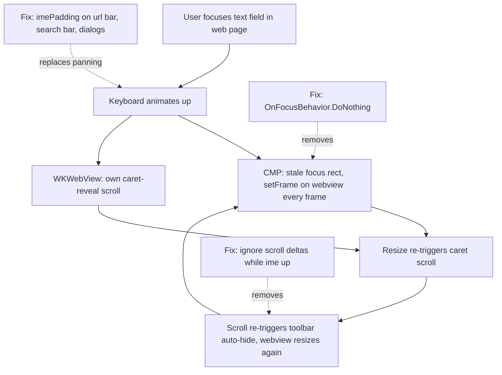

2026-07-18

# EinkBro iOS: stop the keyboard from shaking the page and covering inputs

Focusing a text field inside a web page made the whole page visibly shake for as long as the keyboard was animating, and with the toolbar at the bottom the URL input and in-page search bar could end up hidden behind the keyboard. Both trace back to how Compose Multiplatform 1.8 handles the iOS keyboard.

The shake was a three-party feedback loop. CMP's default `OnFocusBehavior.FocusableAboveKeyboard` pans the scene against a Compose focus rect — but CMP 1.8 never clears that rect once a *native* view (the WKWebView) becomes first responder, a bug fixed upstream only in 1.10 (CMP-9238). So CMP kept `setFrame`-ing the webview every frame of the keyboard animation while WKWebView ran its own caret-reveal scroll; each resize re-triggered the caret scroll, and the scroll deltas also re-triggered toolbar auto-hide, which resizes the webview again.

The fix opts out of CMP's panning entirely (`OnFocusBehavior.DoNothing` in `MainViewController`) and handles the keyboard only where Compose owns the input: `imePadding` lifts the URL-bar input row, wraps the in-page search bar, and re-centers `NoDimAlertDialog` in the space above the keyboard. In `BrowserScreen`, scroll deltas are ignored while the IME is visible — those are WKWebView revealing the caret, not user intent — so toolbar auto-hide can't join the oscillation. Web-page text fields need nothing: WKWebView scrolls its own content to keep the caret visible.
