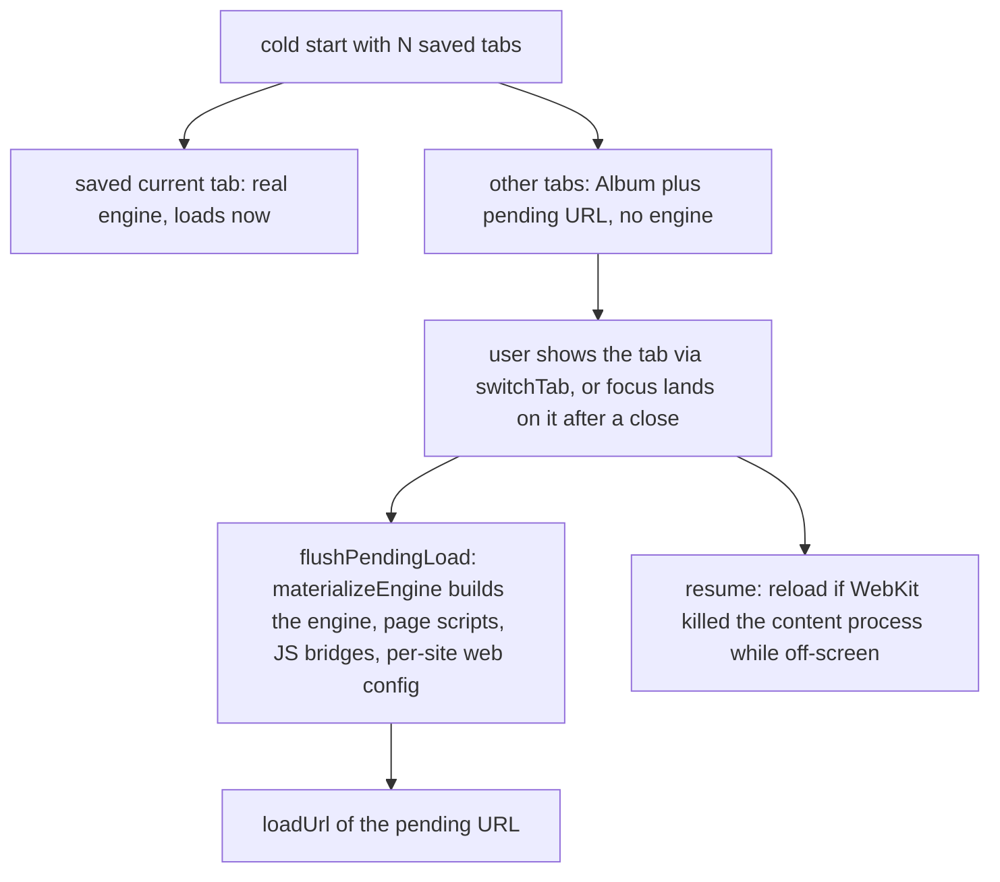
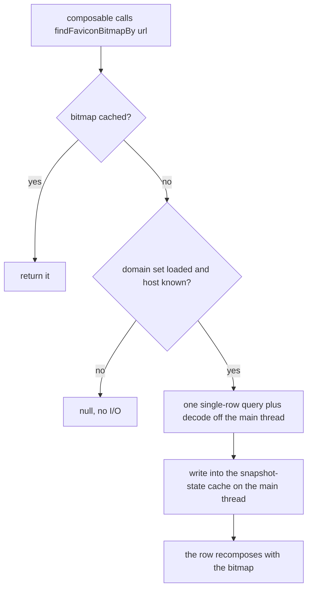
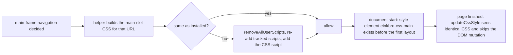

2026-09-03

# iOS: lazy tab restore, on-demand favicons, document-start style CSS

Commit `d513ea8`. The Android app had a same-day memory/page-load/APK-size pass (see `einkbro-architecture-study-memory-speed-size` and `einkbro-memory-speed-size-implementation`). This ADR records which of those items the iOS port actually shared, which it did not, and how the shared ones were applied on a WKWebView engine.

## What carried over and what did not

Mapping each Android finding against the iOS code first, rather than porting the diffs, mattered: roughly half the Android items do not exist on iOS at all.

| Android item | iOS | Outcome |
|---|---|---|
| Instance-lazy tab restore (`LazyAlbumController`) | `ensureFirstTab` built a full `WKWebViewEngine` for every saved tab | applied |
| Favicon blobs resident forever, linear scan | same code shape in `BookmarkManager` | applied |
| Backup exports favicon blobs | same, Base64-inflated | applied (export only) |
| Inject big JS only when the site has rules | no extended-css/scriptlets on iOS, but every enabled userscript body rode into every page | applied to userscripts |
| Style CSS at document start | applied after `didFinishNavigation`, so pages restyled after first paint | applied |
| Memoize saved-tab decode | decoded on every get and again in the setter's equality check | applied |
| `onTrimMemory` | no handler | applied (memory warning drops decoded favicons) |
| Ad-filter blobs off the main thread | `WKContentRuleListStore` compiles async already, but recompiled every launch | applied (look up cached list first) |
| Tab switch by visibility toggle instead of re-parenting | `WebViewHost` is keyed by tab id and re-embeds the WKWebView | not applied: WebKit's detach cost is lower than Android's compositor teardown, measure first |
| Full-page screenshot OOM, once-per-document guard, idempotent invert, per-subresource hot path, DEEP image mode, all APK-size items, ExtendedCss to `:has()` | viewport-only snapshot, one `didFinish` per navigation, CSS-only invert, no subresource intercept on WKWebView, stubs, native PDF/EPUB/TTS, network-only ad rules | not applicable |

One iOS-specific find of the same class rode along: the engine's `fetchFavicon` ran a JS probe, an `NSURLSession` download, a decode and two DB inserts on every page finish, with no check whether the host already had an icon. Android only receives an icon when the WebView pushes one.

## Lazy tab restore

Restoring N saved tabs used to construct N `WKWebViewEngine`s before the first frame, each with its own configuration, user scripts and message handlers, and every one of those web views stayed alive for the session. Now `newTab` with `lazyLoad` and no activation records only the `Album` and its pending URL. The Android port needed an adopting `LazyAlbumController` because its tab identity lives on the WebView; on iOS `Album` is a plain object the engine merely references, so the same object simply gains an engine later.

The choke point already existed: every path that moves focus runs `flushPendingLoad` (it was there for deferred loads when background loading is off), so materialization lives in exactly one place.

The `resume` step is the second half. Nothing handled `webViewWebContentProcessDidTerminate`, so a background tab whose WebContent process iOS reclaimed under memory pressure came back as a blank white view. A visible tab now reloads immediately; an off-screen one sets a flag and reloads when next shown, so the memory jetsam freed is not re-taken behind the user's back. `switchTab` was reordered to flush before resume so the reload lands on the materialized engine.

## Favicons on demand

`BookmarkManager` loaded `SELECT * FROM favicons` into a list at startup and answered every lookup by scanning it. Only the domain-name set is resident now; a bitmap is decoded per host on a miss into a bounded cache.

The constraint that shaped this: the three composition call sites read favicons synchronously through `remember { findFaviconBitmapBy(url) }`, and a `remember` that captured null would never ask again. The cache is therefore a `mutableStateMapOf`, the call sites read it directly instead of through `remember`, and the readiness of the domain set is itself a state read, so a row that asked before the set landed on a cold start recomposes and asks again.

The engine uses the same domain set to skip its per-page probe and download for known hosts, setting the tab cover from the stored icon instead. Backup import inserts through the manager so the resident set learns restored rows; export no longer writes icon blobs, matching Android's new backup format, while restore still accepts them.

## Document-start style CSS

`WebContentHelper.updateCssStyle` ran after `didFinishNavigation`, so a page rendered in its own fonts and then restyled: a visible snap and a second layout, the exact thing Android moved to `onPageStarted`. WKWebView has a cleaner tool for this: a `WKUserScript` at document start. The engine now tracks every installed user script (a `WKUserContentController` can only remove all scripts, never one), and per main-frame navigation, at policy-decision time, asks the listener for the main-slot CSS of the target URL.

The new asset `document_start_css.js` uses the same element id as `update_css_slot.js`, so the page-finished path is now a no-op check rather than a second injection. The reader-mode flags are always off for a fresh document, so the document-start CSS is the non-reader variant; invert persists per tab and is included. The custom-font data URL was already cached per path, so building the CSS twice per navigation costs nothing extra.

## The rest

- **Userscripts.** `UrlMatcher` gained a Kotlin-side `matches` on the same regex sources the runtime evaluates, and `buildInjectionJs` takes the page URL and serializes only the scripts that match; most pages skip the `evaluateJavascript` entirely. A source Kotlin's `Regex` rejects (the raw `/regex/` include form can use JS-only syntax) counts as a match on the include side and no match on the exclude side, so the runtime keeps the final say.
- **Saved-tab list.** `TabConfig` caches the decoded list keyed on the raw stored string, which survives a pref import that rewrites the key.
- **Content rule lists.** `ContentBlocker` looks the compiled list up from WebKit's on-disk store before compiling, under an identifier carrying a hash of the JSON, and prunes superseded identifiers after a fresh compile.
- **Memory warning.** `MainViewController` observes the memory-warning notification and drops decoded favicon bitmaps; WebKit trims its own caches.

## Verification

The shared module type-checks and a Release device build installed on the maintainer's iPhone for hands-on checking: relaunch with several tabs (only the current one should load; others load on tap with their saved titles), bookmarks and history icons appearing a moment after the list, and a site with a custom font rendering styled from the first paint.
