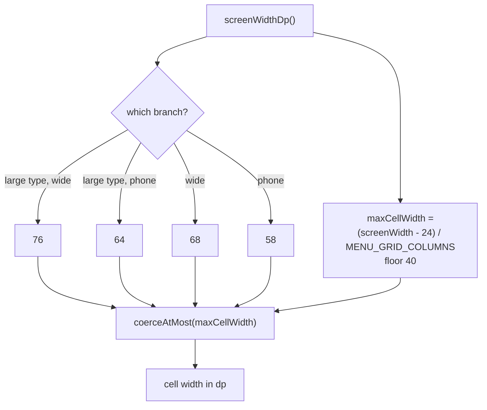

2026-07-29

# Menu grid cells widened so English labels stop breaking mid-word

## What was wrong

The menu dialog's grid cells were 45.dp wide, and at that width several labels were narrower than their own single word at 8.sp. Compose does not overflow a word that does not fit — it breaks it. So the menu shipped with:

- **Instapaper** rendered as `Instapape` / `r`
- **Downloads** rendered as `Download` / `s`

A two-line label is normal and expected here; `maxLines = 2` is deliberate and most entries are two or three words. A word split across a line break is not, and in an otherwise dense monochrome grid it was the first thing the eye landed on.

This was never an Android problem in the same way. The original grid is sized against a different set of translated strings and a different default typeface, and the port carried the 45.dp/8.sp pairing across without re-checking it against the English label set actually being rendered by Compose on iOS.

## The sizing

Cells go from 45.dp to 58.dp on phones. The other three branches of the same `when` move proportionally: the wide/tablet branch 55 to 68, and the large-type variants used by the link context menu 50 to 64 (phone) and 62 to 76 (wide).

58.dp was picked empirically rather than computed — build, screenshot, read the labels, repeat. 54.dp was enough to stop the mid-word breaks but left a lot of two-word labels wrapping; 58.dp additionally pulls most of them onto one line:

| now single-line | still wraps (on word boundaries) |
| --- | --- |
| Save for later, Save as MHT, Save as PDF, Receive link, Share link, Send link, Instapaper, Read content, Invert colors, Split screen, Reader mode, Touch setting, Toolbar icons, Quick toggle, Site Settings, Downloads | Save as homepage, Save as bookmark, Open link with…, White background, Vertical mode, Search on site |

The right-hand column cannot be fixed by widening. Six cells across a 393pt phone caps a cell at roughly 62.dp, and "Save as homepage" needs well past that at 8.sp. Those labels wrap cleanly at a space, which is the acceptable outcome.

## Why the width is capped rather than constant

The obvious change — swap the constants and stop — breaks on small screens. Six 58.dp cells need 348.dp, comfortable on a 393pt iPhone 16 but wider than a 320pt screen, and the deployment target is iOS 15, which still reaches devices that narrow.

So the constant became a ceiling:

On a 393pt screen the cap lands at 61, so the phone branch keeps its 58 and the large-type branch is trimmed from 64 to 61. On a 320pt screen everything collapses to 49 and the six-column grid still fits.

The cap protects a surface that is easy to forget, too. `MenuItem` has three consumers, not one:

1. the menu dialog itself, which lays rows out with `chunked(MENU_GRID_COLUMNS)` inside a `width(IntrinsicSize.Max)` column;
2. `ContextMenuDialog`, which passes `isLargeType = true` and builds rows of up to six items;
3. `MenuItemHideScreen`, the hide/reorder grid, where the cells sit inside `GridCells.Fixed(6)` slots that are themselves derived from the screen width, minus 2.dp of padding each side.

Consumer 3 is why the cap subtracts 24 rather than 16. At 16 the ceiling on a 320pt screen would have come out fractionally *wider* than the grid slot containing it, which is the one arrangement that produces clipping instead of just a tight fit.

## Verification

All three surfaces driven in the simulator on an iPhone 16: the main menu dialog, the link long-press context menu, and the hide/reorder grid reached through Appearance → Hide seldom used menu items. No mid-word breaks anywhere, no clipping, and the reorder grid's cells sit inside their slots with room to spare.

## The trade-off

Wider cells with the same 8.sp text means less space between neighbouring labels. Two adjacent single-line labels — "Save for later" next to "Save as MHT", "Reader mode" next to "Touch setting" — now sit only a few dp apart, where at 45.dp everything wrapped and the gutters were obvious.

That is the actual choice being made: at six columns on a phone you can have generous gutters or you can have unwrapped labels, not both. This went with unwrapped, since the broken words were the reported problem. Backing off toward 54.dp restores the spacing and re-wraps about six labels, and is a one-constant change if the crowding ever reads worse than the wrapping did.
