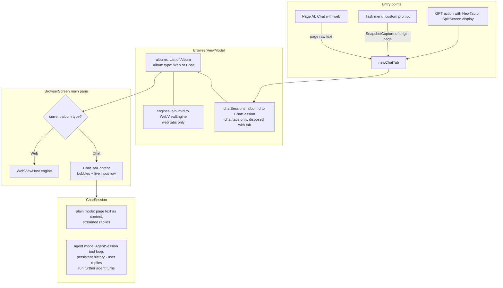

2026-07-18

# EinkBro iOS: Chat With Web and Agent Tasks Run in Native Chat Tabs

## What it does and why

On Android, "chat with web" and the custom-task agent live in browser tabs: a
`chat.html` page is loaded into a new tab and driven through a JS bridge
(`ChatWebInterface`), so the conversation is switchable, persistent in the tab
list, and — crucially for the agent — the user can keep replying to steer it.

The iOS port had collapsed both into modal surfaces: chat-with-web was a
popup dialog, and a custom task streamed its progress into the read-only
translate/AI result popup with no input field at all. You could not reply to
the agent, and you could not flip between the page and the conversation.

This change gives the iOS tab layer a second tab type. A tab (`Album`) is now
either `Web` or `Chat`; a chat tab mounts a native Compose conversation pane
(`ChatTabContent`) in exactly the slot where a web tab mounts its WKWebView.
We deliberately diverged from Android's implementation (chat.html in a
WebView) while converging on its UX: each platform renders the feature the
way it renders best — see the "why not chat.html" rationale below.

## How it was built

The tab layer was already shaped for this: the iOS `Album` is a plain state
holder (unlike Android's WebView-subclass Album), engines live in a separate
`Map<albumId, WebViewEngine>`, and every toolbar action already null-guards
`currentEngine`. So a chat tab is an Album with no engine entry and a
`ChatSession` in a parallel map; ~40 existing call sites degrade to no-ops on
a chat tab without modification.

- **`ChatSession`** (renamed from `ChatWithWebViewModel`, no longer a
  ViewModel — it owns its own scope and is disposed by `closeTab`). Plain
  mode keeps the old behavior: page text injected once as context, each turn
  streamed from the `gptForChatWeb` engine. Agent mode wires
  `BrowserToolsImpl` sinks into the chat transcript: tool calls, notes and
  the final answer accumulate in that turn's assistant bubble, matching how
  Android streams the whole agent turn into one bubble.
- **`AgentSession`** (renamed from `FreeFormAgentTask`). The tool-calling
  loop used to build its history inside one `run()` owned by `TaskRunner` and
  throw it away. The history is now a conversation-lifetime field and
  `runTurn(userMessage)` runs one bounded loop per user message — a direct
  port of Android `ChatWebInterface.agentLoop`. This is what makes replies
  work: a follow-up like "now open the first one" resolves against the
  previous turns' history.
- **Routing**: `BrowserAction.ChatWithWeb` opens a chat tab (both the tap and
  the long-press/split variant — the split-pane chat rendering is deferred);
  `RunCustomTask` snapshots the originating page (`SnapshotCapture`) before
  the chat tab replaces it as the active tab, then opens an "Agent Chat" tab.
  Built-in template tasks intentionally keep the result popup — that is also
  Android's behavior.
- **Persistence**: chat tabs are conversation state, not URLs; they are
  filtered out of tab save/restore (Android's chat tabs restore as blanks —
  skipping them is the honest version of the same behavior).
- **`MarkdownParser`** gained inline-code spans (monospace, wins ties against
  emphasis) so tool lines like `read_initial_page` don't render their
  underscores as italics; chat renders them as `` 🔧 `tool args` ``.

## Why not chat.html in a WKWebView tab

It was feasible — the engine seam already has `loadHtml`, user scripts, and
named message handlers — but three costs tipped the decision: WKWebView has
no synchronous JS-bridge returns, so chat.html's `getWebMetadata()` style
calls need an async shim; the ~560-line Android `ChatWebInterface` logic is
`android.webkit`-bound and had to be rewritten in common Kotlin anyway, at
which point a Compose UI over that logic is less work than maintaining the
HTML asset plus bridge shims in sync with Android; and streaming LLM tokens
through repeated `evaluateJavaScript` string-escaping is a known bug farm.
Native tabs also fix the original complaint directly: the agent conversation
is now a persistent, switchable tab you can keep talking to.

## Verified

Driven end-to-end in the iPhone Air simulator: chat tab opens from Page AI
with the page title as subtitle; a question about the page streams a real
answer; switching Wikipedia ↔ chat preserves the conversation; a custom task
opens an Agent Chat tab whose tool calls stream into the bubble; a follow-up
reply ran further agent turns with context (it opened the link the previous
turn had found); closing the tab disposes the session.
