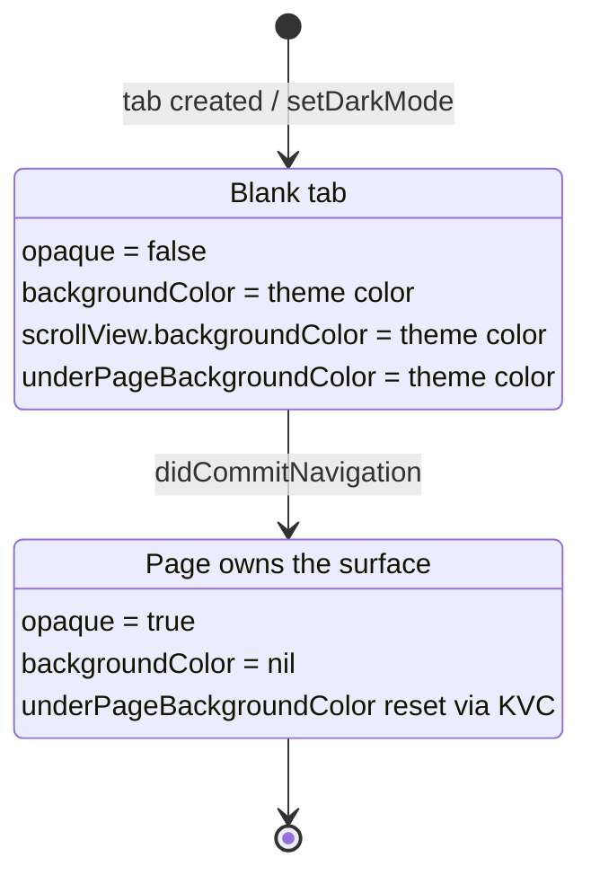

2026-08-03

# EinkBro iOS: new tabs flashed white in dark mode

## What was broken

Opening a new tab with dark mode on showed a white rectangle. With the default
new-tab behavior — show the URL input, load nothing — it was not even a flash:
the tab stayed white for as long as it was empty, which on an e-ink-styled
browser is exactly the wrong first impression.

## Root cause

A freshly created `WKWebView` paints an **opaque white base layer** until a
navigation commits. `overrideUserInterfaceStyle` (which EinkBro already sets, and
which correctly drives `prefers-color-scheme` inside the page) has no effect on
that base — there is no page yet for it to apply to. So the gap between "tab
created" and "first paint of a committed document" is white regardless of theme,
and if no navigation is ever started, the gap never ends.

## The fix

Paint the gap ourselves, and hand the surface back to WebKit the moment a real
page is about to draw.

`applyBlankBackground()` clears `opaque` so the view's own background shows
through the empty base, and sets that background on the web view, its scroll
view, and `underPageBackgroundColor` (which covers the over-scroll area). The
color follows the tab's dark-mode override: black when forced dark, white when
forced light, and `UIColor.systemBackgroundColor` when following the system —
a dynamic color, so UIKit resolves it against the web view's own trait
collection and it tracks the system theme for free. `setDarkMode` now stores the
override and re-applies the background, so toggling the theme on an empty tab
repaints it.

The release side is the part that actually needs care. `releaseBlankBackground()`
runs at **commit**, not at finish: a document that declares no `color-scheme`
renders with a transparent background, so if our black placeholder were still in
place when it painted, its black text would land on black. Commit is the last
moment before the incoming page draws, so that is the handoff point.

`underPageBackgroundColor` is null-resettable in Objective-C but the Kotlin/Native
binding types it non-null, so restoring WebKit's default goes through
`setValue(null, forKey:)` rather than a direct assignment.

Wiring up the commit callback needed one more concession to the ObjC bridge:
`webView(_:didCommitNavigation:)` and `webView(_:didFinishNavigation:)` collapse
to the *same* Kotlin signature `(WKWebView, WKNavigation?)` once the selector
labels are dropped, so the pair only coexists in `NavigationDelegate` with
`@ObjCSignatureOverride` on both.

Commit `01a4427`.
