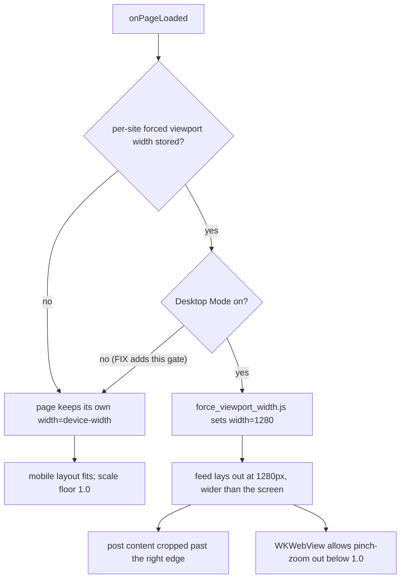

2026-07-25

# EinkBro iOS: an orphaned per-site viewport width forced facebook.com into a broken wide layout

## What was broken

On the iPhone, browsing facebook.com in EinkBro was visibly wrong in two ways:

1. The page could be **pinched out below scale 1.0** — the feed shrank and panned around, instead of staying locked at a fit-to-width 1.0 minimum.
2. **Post content overflowed the right edge** of the screen and was cropped at scale 1.0.

Both reproduced together and survived several attempted fixes, which is what made it interesting.

## The false trails

The first instinct was that this was a WKWebView viewport quirk. WKWebView really does ignore a `minimum-scale=1.0` in the viewport meta when the page's content is wider than the viewport (it lets you zoom out to reveal the overflow), so the first fix pinned `minimum-scale=1.0` in `force_zoom.js` and added a `html, body { overflow-x: hidden }` "fit-width clip" that collapses `documentElement.scrollWidth` back to the viewport. That fix was validated against a **synthetic** stand-in page (a 900px-wide block declaring `width=device-width, user-scalable=no`, exactly facebook's shape) and it worked there — but it did **nothing** on the real logged-in feed.

The reason it couldn't be diagnosed from a simulator is that the bug only shows on the *logged-in* feed, and there is no Facebook login on the sim. So an on-device diagnostic overlay was built into `force_zoom.js` that printed, right on the feed, the live layout metrics. The decisive reading was:

```
iW=925  deScW=1280  FITclip=NO  ox=visible/visible  mobile-UA
VP=[width=1280, initial-scale=1.0, user-scalable=yes]
```

`VP=[width=1280, initial-scale=1.0, user-scalable=yes]` is the **exact** string emitted by `force_viewport_width.js`. So the feed wasn't hitting a WebKit quirk at all — something was actively forcing the viewport to **1280px**, and `FITclip=NO` showed the clip was being skipped.

## Root cause

The per-site **"Force Desktop Viewport Width"** in Site Settings is designed as a refinement of **Desktop Mode**: the stepper is only editable while Desktop Mode is on (`enabled = desktopMode`), and Reset clears the two together. But turning Desktop Mode **off does not clear the stored width**, and `onPageLoaded` applied the width whenever it was non-null — with no Desktop Mode check.

So facebook.com carried an **orphaned width of 1280** (the default) with Desktop Mode off. That forced a 1280px desktop layout under a mobile user-agent: the feed spilled off the right edge, and because the content was now wider than the viewport, WKWebView let it pinch-zoom out below 1.0. The same orphaned width also tripped the clip's gate (a forced width means "intentionally wide"), which is why the earlier clip fix never applied — `FITclip=NO`.

The Android original has the same latent shape: `injectForcedViewportWidth` applies the stored width without a Desktop Mode check.



## The fix

Gate the forced-width application on Desktop Mode, matching what the UI already implies (and mirroring Android's `width=` override, which only fires in desktop mode):

```kotlin
val fitUrl = engine.currentUrl().orEmpty()
val width = config.getDesktopViewportWidth(fitUrl)
if (config.getDesktopMode(fitUrl) && width != null && width > 0) { ... }
```

The two companion changes stay as defense-in-depth for pages that are legitimately a little wider than the viewport:

- `force_zoom.js` pins `minimum-scale=1.0`.
- `updateFitWidthClip()` applies `html, body { overflow-x: hidden }` in normal browsing (skipped in desktop / reader / vertical / two-column modes, which pan sideways on purpose), collapsing `documentElement.scrollWidth` so the fit scale is exactly 1.0.

## Verified, not guessed

The failure was reproduced deterministically on the simulator without a Facebook login by injecting the orphaned config straight into the app's Room DB:

```sql
INSERT OR REPLACE INTO domain_configuration(domain, configuration)
VALUES('www.facebook.com',
       json('{"domain":"www.facebook.com","desktopMode":false,"desktopViewportWidth":1280}'));
```

- **Pre-fix build**, same DB: the facebook login page loaded at `deScW=1280`, a near-blank forced-wide layout.
- **Post-fix build**, same DB: the login page rendered its normal full-width mobile form.

## A remaining, non-EinkBro symptom

After the fix, the user still saw some **post content wider than the screen and cropped** — and reported the same in the Safari app. Since it reproduces in Safari (which has none of EinkBro's injection), that overflow is Facebook's own page — either a desktop site being requested (Safari's per-site "Request Desktop Website", the direct analogue of the bug fixed here) or specific wide feed elements (images, reels, link cards). It is tracked separately from this fix.

## Follow-ups

- Port the same Desktop-Mode gate to the Android original.
- Dialog hygiene: clear the stored `desktopViewportWidth` when Desktop Mode is turned off, so no new orphans can form.
