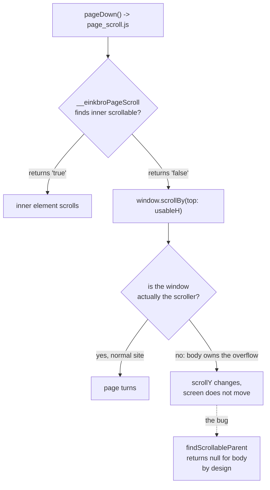
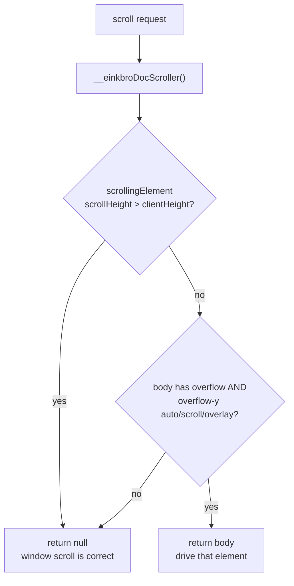

2026-07-29

# Page turning was dead on Wikipedia because body, not the document, was the scroller

Tapping a touch-area zone on an `en.wikipedia.org` article did nothing. Not a
short scroll, not a janky one — the page simply did not move. Every other site
tried paged normally, which made it look Wikipedia-specific and sent the first
round of theorising in the wrong direction.

## What was actually happening

The paging path had no visible failure to inspect: `window.scrollBy` does not
report success or failure, and the JS runs inside a WKWebView with no console.
So the app was instrumented from the inside — the JS assets in the *installed
simulator bundle* were patched to paint a debug banner onto the page itself,
which gives live geometry without a rebuild cycle. Tapping page-down then
produced:

```
innerH=709 pct=0 px=80 usableH=629
scrollY 0->629   HTML.scrollTop 0->629   body.scrollTop 0->0
SE.scrollH=709 SE.clientH=709   bodyScrollH=2732 bodyClientH=709
html oy=visible h=709px pos=static | body oy=scroll h=709px pos=static
```

`window.scrollBy` **succeeded**. `scrollY` really did move to 629. And nothing
moved on screen, because the window was not the scroller.

Enumerating the page's own stylesheets named the culprit, and it was not our
CSS:

```
load.php?...modules=ext   {html, body}  height: 100%
load.php?...modules=ext   {body}        overflow-y: scroll
```

MediaWiki ships both rules. Together they give `body` the viewport's height and
its own scrollbar, so the article's 2732px of content overflows *body*, and
`documentElement` is left with `scrollHeight == clientHeight == 709` — nothing
to scroll. Scrolling the document is then a no-op that still updates `scrollY`.

## Why neither paging path caught it



`page_scroll.js` falls through to `window.scrollBy` whenever no inner
scrollable is found. The inner-scrollable rescue in `fix_scrolling.js` could
not help either, because `findScrollableParent` explicitly returns null for
`document.body` and `document.documentElement`. Body was simultaneously the
real scroller and the one element excluded from detection — the two mechanisms
had a gap exactly the width of this case.

That exclusion is not a mistake. `findScrollableParent` answers a different
question — "did the finger land inside a nested scroll container?", used to
suppress pull-to-refresh — and widening it to include body would change that
behaviour on every site. So the fix is a separate resolver rather than a tweak
to the existing one.

## The fix

`__einkbroDocScroller()` in `fix_scrolling.js` (already injected as a user
script on every page) resolves which element paging must actually drive:



Null means the window is fine and the existing call stands, so the common path
is unchanged.

All four scroll entry points shared the blind spot, so all four now go through
the resolver: `page_scroll.js`, `scroll_to_top.js`, `scroll_to_bottom.js` and
`engine_scroll_by_page.js`. Jump-to-top and jump-to-bottom — bound to the
long-press gestures — were broken on these pages too, which had not been
reported yet.

## What this was not

Two wrong turns worth recording, because both were plausible enough to waste
time on:

- **A horizontally-scrollable wrapper mistaken for a vertical one.** Per CSS
  Overflow 3, `overflow-x: auto` forces a `visible` `overflow-y` to compute to
  `auto`, and Wikipedia wraps wide tables in horizontal scrollers — so
  `findScrollableParent` might plausibly have latched onto one and swallowed
  the scroll. The instrumentation killed it outright: `NO inner scrollable ->
  document scroll`.
- **Our own injected CSS.** `FIT_WIDTH_CSS` had caused a closely related
  problem before (see the fit-width clip fix that moved it from
  `overflow-x: hidden` to `clip` for Threads/Instagram), so it was the natural
  suspect. But the computed value here was `overflow-y: scroll` — an explicit
  declaration, not the `auto` that the forced-computation rule produces — and
  the stylesheet dump traced it to MediaWiki.

The habit that paid off: the failing mechanism reports no error, so guessing
had nothing to push against. Getting the page to describe its own geometry
turned a site-specific mystery into a two-line rule.

Finally, nothing here was ever Wikipedia-specific. `body { overflow-y: scroll }`
paired with a full-height body is a common pattern; every site using it had
dead page turning, and Wikipedia was just where it got noticed.
