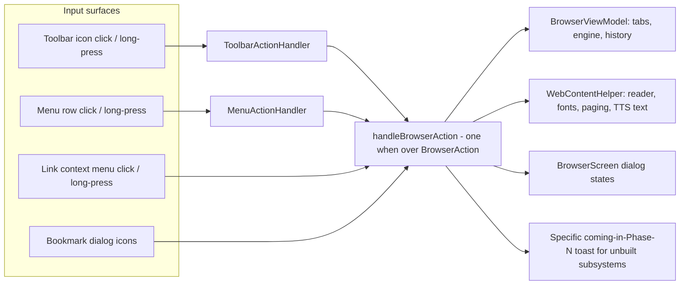

2026-07-17

# EinkBro iOS parity Phase A: central BrowserAction dispatcher + long-press plumbing

The iOS port's 8 structural migration phases left a browser that works on
happy paths but stubs most toolbar/menu entries with a generic "later phase"
toast — and has no long-press behavior at all outside two hardcoded cases.
This change executes Phase A of `docs/PARITY_PLAN.md`: port Android's
action-dispatch architecture so every input surface funnels into one
`BrowserAction` dispatcher, then light up everything whose subsystem already
exists.

## What it does

Android routes all input (toolbar click/long-press, menu click/long-press,
context menus, gestures) through mapper classes into a single
`when(BrowserAction)` in `BrowserActivity.dispatch()`. The iOS port now
mirrors that exactly:

- `view/handlers/ToolbarActionHandler.kt` and `MenuActionHandler.kt` are
  near-verbatim ports of the Android classes (same mapping tables), with
  activity-only branches adapted: impossible-on-iOS items (new window,
  move-to-background, home-screen shortcut, share-to-last-target) toast the
  reason per PARITY_PLAN §7.
- `handleBrowserAction` lives in `BrowserScreen` because that is where the
  Compose dialog states live — BrowserScreen *is* the Android activity's
  counterpart. It reads `currentEngine`/`currentHelper` from the view model
  at dispatch time so stale composition captures can't act on a dead tab.
- `BrowserAction` gained a clearly-marked iOS-host section (`ToggleBoldFont`,
  `ToggleDesktopMode`, `ShowToolbarConfigDialog`, `OpenSettings`, …) for
  actions Android performs via SharedPreferences listeners or activity
  intents. On iOS there are no pref listeners, so the toggle and its CSS/
  engine re-apply must happen together — routing them through the dispatcher
  keeps that in one place.

## Newly functional (wire-up only, subsystems existed)

Toolbar long-presses: Back → recent history, Bookmark → save bookmark,
Font → reader toggle, Settings → fast-toggle, ReaderMode → reader-settings
dialog, BoldFont → boldness dialog, Touch → touch-area dialog, Translation →
translation config, TranslateByParagraph → language config, Share → copy
stripped URL, PageInfo → AI summarize, TabCount → incognito toggle (this one
previously toggled the tab strip, which matches nothing on Android).

Menu: ShareLink, OpenWith, SetHome, OpenHome (now uses `favoriteUrl`),
ToolbarSetting (live toolbar reconfiguration), all Android menu long-presses.
Bookmark dialog: open-in-new-tab foreground/background callbacks. Context
menu: SaveBookmark, GotoLink, long-press ShareLink → copy stripped URL.
Page-AI action menu now lists the user's real GPT actions and runs any of
them through the translate dialog (not just Summarize). TOC dialog works via
two new JS assets (`get_toc.js` heading extraction, `goto_toc.js`
scrollIntoView) — usable in horizontal and vertical-rl modes.

## Design notes

- **DialogFrame dismissal**: the port's dialog chrome fills the whole dialog
  window, so taps "outside" the card never reached `Dialog(onDismissRequest)`.
  That was survivable while every dialog had a close button; Phase A adds
  long-press-opened dialogs that have none (fast-toggle), which would have
  been undismissable. `DialogFrame` now takes an optional `onDismiss` and
  forwards padding-area taps to it; the card's own Surface blocks
  propagation, so in-card taps are unaffected.
- **Toolbar re-render**: `config.ui.toolbarActions` is not observable state,
  so saving the toolbar-config dialog bumps a `toolbarRefreshTick` counter
  that the toolbar row remembers against. Confirmed live re-render on OK.
- Genuinely-new subsystems toast a *specific* phase ("Split screen: coming
  in Phase G"), never a generic "later phase" — the toast doubles as a
  progress map of the parity plan.

## Verification (iPhone 16 simulator)

Every long-press listed above exercised via sim-use; boldness slider changes
apply to the page CSS; toolbar-config OK removes/restores icons with the bar
re-rendering immediately; history overview opens from Back long-press and
navigates on row tap; incognito/desktop/copy-link toasts appear; Page AI
without an API key shows the guard toast; fast-toggle now dismisses by
tapping outside the card.
