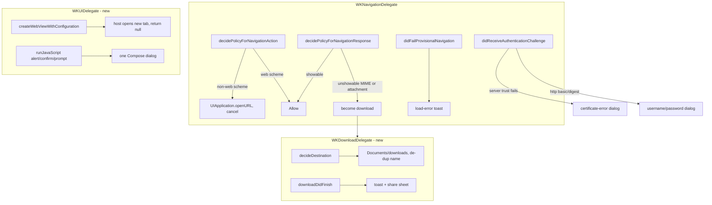

2026-07-17

# EinkBro iOS parity Phase B: deepening the WKWebView engine delegate

The iOS port's web engine was Phase-1 thin: its navigation delegate
implemented only `didFinishNavigation`. That left a whole cluster of everyday
browser behaviors dead — popups and `target=_blank` links silently did
nothing, JavaScript `alert`/`confirm`/`prompt` were swallowed, downloads
couldn't happen, and HTTP-auth or untrusted-certificate sites just failed to
load. Phase B of `docs/PARITY_PLAN.md` fills in the delegate surface and wires
each new signal to host UI.

## The delegate surface added

Every new signal crosses from iosMain to commonMain through
`WebViewEngineListener` callbacks (`onNewWindowRequested`, `onAuthChallenge`,
`onSslError`, `onJsDialog`, `onDownloadStarted/Finished`, `onLoadError`).
Because auth, SSL, and JS panels each require *exactly one* response back into
a WebKit completion handler, each is delivered as a one-shot responder object
(`AuthRequest` / `SslErrorRequest` / `JsDialogRequest`) whose `respond()` is
idempotent — the completion handler cannot be called twice or dropped even if
the Compose dialog is dismissed oddly.

The view model turns those into observable `mutableStateOf` requests;
`BrowserScreen` renders a dialog whenever one is non-null. The SSL dialog is
gated on `enableCertificateErrorDialog` (when off, the load fails silently
with a toast, matching Android). New windows just call `newTab(url)`.

## Downloads

`decidePolicyForNavigationResponse` converts an unshowable MIME type or an
`attachment` Content-Disposition into a download; both the response- and
action-`didBecomeDownload` hooks attach the `WKDownloadDelegate`, which writes
into `Documents/downloads` (de-duplicating the filename) and, on completion,
toasts and opens the iOS share sheet. A `WebViewEngine.startDownload(url)`
seam lets the link context menu's SaveAs trigger a download directly.

## Kotlin/Native gotchas hit

- **Same-selector navigation family**: `didStart`/`didCommit`/`didFinish`/
  `didFailProvisional` all share the `(WKWebView, WKNavigation?)` shape, and
  K/N will only let one Kotlin override exist per signature. `didFinish` and
  `didFailProvisional` are each their family's representative.
- **No fields on an ObjC-subclass companion**: a `companion object` holding a
  `val` on an `NSObject`-subclass delegate fails to compile ("Fields are not
  supported for Companion of subclass of ObjC type"). The scheme allow-list
  moved to a file-level `private val`.
- **`NSURLCredentialPersistenceForSession`** is an enum member
  (`NSURLCredentialPersistence.NSURLCredentialPersistenceForSession`), not a
  top-level constant.

## Verification (iPhone 16 simulator, local test server)

`target=_blank` link and `window.open()` each raise the tab count by one;
`alert`/`confirm`/`prompt` panels render (prompt prefilled with its
`defaultText`); tapping a download link writes `phaseb_test.bin` (1000 bytes)
into `Documents/downloads` and presents the share sheet; a `401` page's basic
auth prompts for credentials and, given user/pass, loads the protected
"Authenticated!" page. The certificate-error path shares the same
challenge-handler plumbing as basic auth and is code-complete but was not
driven with a self-signed HTTPS server.
