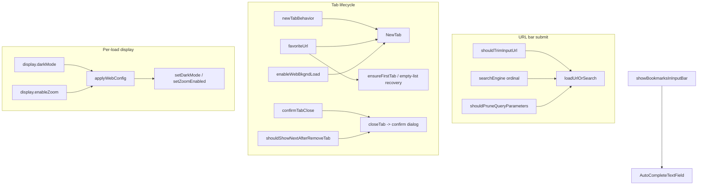

2026-07-17

# EinkBro iOS parity Phase C: making the settings facade real (core read-sites)

On the iOS port almost every Settings toggle persisted correctly but was never
*read* at a behavior site — a facade. Phase C of `docs/PARITY_PLAN.md` wires
the core browser prefs (tabs, URL bar, search engine, homepage, display) to
the code that should act on them. No new settings UI; only new read-sites.

## The search-engine bug

The clearest symptom was the search-engine dropdown doing nothing. Selecting
DuckDuckGo (or any built-in engine) wrote the engine's ordinal to
`SP_SEARCH_ENGINE_9`, but both `loadUrlOrSearch` and `searchInNewTab` built
their query URL only from the *custom* `searchEngineUrl` template — so every
choice except "Custom" silently fell back to Google. New `SearchEngineUrls`
ports Android's `UrlHelper.queryToUrl` ordinal→prefix table (the ordinals
predate the enum's declaration order, so the cases are explicit numbers, not
`enum.entries` lookups), and both search paths now route through it.

## What each pref drives now

- **URL bar**: `UrlTidy.trimBeforeScheme` drops pasted prefix junk;
  `UrlTidy.pruneQueryParameters` removes a built-in tracking-param set
  (`utm_*`, `fbclid`/`gclid`/`msclkid`, share tags) — a compact stand-in for
  Android's NeatURL config. `showBookmarksInInputBar` passes the
  `BookmarkManager` into the autocomplete field so bookmarks (with favicons)
  appear among suggestions.
- **Homepage**: `favoriteUrl` now backs `ensureFirstTab` and empty-tab-list
  recovery (both were hard-coded to `DEFAULT_HOME`). `newTabBehavior` decides
  what the + button does — start in the URL input, load the homepage, or open
  the bookmarks list.
- **Tab lifecycle**: `confirmTabClose` routes `closeTab` through a host
  confirm dialog (`pendingTabClose`); `shouldShowNextAfterRemoveTab` picks
  whether focus lands on the next or previous tab; `enableWebBkgndLoad` off
  defers a background tab's load until it's first shown (a `pendingLoads` map
  drained in `switchTab`), while still persisting the deferred URL so it
  survives a relaunch.
- **Display**: `darkMode` maps `FORCE_ON`/`DISABLED`/`SYSTEM` to
  `WKWebView.overrideUserInterfaceStyle`, which drives the page's
  `prefers-color-scheme`; `enableZoom` toggles the scroll view's pinch
  gesture. Both are new engine seams (`setDarkMode`, `setZoomEnabled`).

## A note on dark mode's reach

`overrideUserInterfaceStyle` is the correct iOS lever, but it only darkens
sites that actually honor `prefers-color-scheme`. During verification
DuckDuckGo went fully dark while Wikipedia stayed light — Wikipedia's dark
theme is an account preference, not a media-query response. This is a site
limitation, not a defect; forcing dark on a light-only page would require the
invert-colors filter, which is a separate existing feature.

## Verification (iPhone 16 simulator)

With `SP_SEARCH_ENGINE_9=4` seeded, selecting a word and tapping the
selection-menu **Search** opened a **DuckDuckGo** results tab (not Google),
directly confirming the ordinal fix — and that tab rendered **dark** under
`sp_dark_mode=1`, confirming the color-scheme override in the same shot. With
`confirmTabClose` on, closing a tab from the overview raised the "Close this
tab?" dialog and **Close** removed it.
