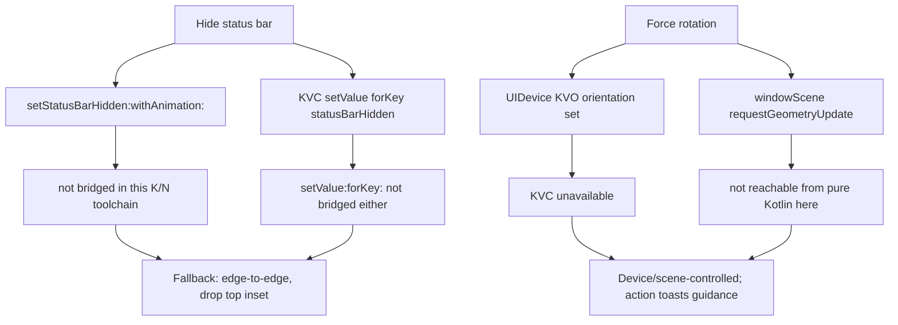

2026-07-17

# EinkBro iOS parity Phase D: host bridge (fullscreen, keep-awake, video, pull-to-refresh)

Phase D of `docs/PARITY_PLAN.md` wires the settings that need to reach *outside*
the Compose/WebKit sandbox into the iOS host — screen wake, fullscreen, video
playback mode, and pull-to-refresh — plus the two items §7 flagged as
constrained on iOS (status-bar hiding, forced rotation).

## What landed cleanly

- **Fullscreen** (Refresh long-press, or the FullScreen toolbar action): hides
  the toolbar and drops the Compose root's top safe-area inset so the page runs
  edge-to-edge; a floating exit chip in the bottom-right restores the toolbar.
  Android restores its toolbar with the back key — iOS has none, hence the chip.
- **keepAwake** → `UIApplication.idleTimerDisabled`, through a new `HostBridge`
  expect/actual, applied at startup and whenever the pref changes.
- **Video prefs** set on the `WKWebViewConfiguration` at engine creation:
  `enableVideoAutoFullscreen` flips `allowsInlineMediaPlayback`,
  `enableVideoPip` flips `allowsPictureInPictureMediaPlayback`.
- **Pull-to-refresh** (`enablePullToRefresh`, opt-out): a `UIRefreshControl` on
  the web view's scroll view, driven by a `RefreshTarget : NSObject` whose
  `@ObjCAction onRefresh` reloads; the spinner ends in `notifyFinished`.

## What the toolchain constrained

Two features hit a wall that is worth recording, because the obvious code
doesn't compile here:

- **Status-bar hiding**: the honest iOS lever is a per-view-controller
  `prefersStatusBarHidden` override, which a framework-provided
  `ComposeUIViewController` can't be given without a Swift container.
  `UIApplication.setStatusBarHidden` and `setValue:forKey:` (the two app-level
  escape hatches) are both absent from this Kotlin/Native binding. So
  `hideStatusbar`/fullscreen go **edge-to-edge** instead — content fills the
  top, the bar text stays visible. `UIViewControllerBasedStatusBarAppearance`
  is pre-set to `false` in Info.plist so a later Swift override can take over.
- **Rotation** is device/scene-controlled: neither the KVO orientation hack
  nor `requestGeometryUpdate` is reachable from Kotlin here, so `RotateScreen`
  toasts guidance. Info.plist allows portrait + both landscapes, so physically
  rotating rotates the app.

These are the same shape as the other deferred iOS items (share extension,
signing): a Swift seam would finish them, but nothing in the Kotlin layer can.

## Verification (iPhone 16 simulator)

Refresh long-press entered fullscreen — the toolbar disappeared, the web
content's frame grew from `0,59 393x709` to `0,0 393x818` (edge-to-edge under
the status bar), and the exit chip appeared bottom-right; tapping it restored
the toolbar. keep-awake, the video config flags, and pull-to-refresh are wired
at engine/startup construction (the refresh control is the standard
UIRefreshControl + target-action pattern) and were not separately driven.
