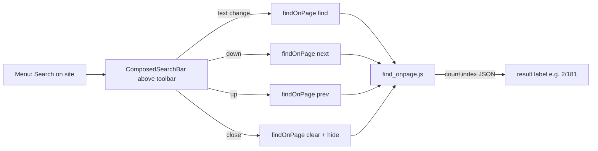

2026-07-17

# EinkBro iOS parity Phase E: find on page

Android's find-on-page rides on `WebView.findAllAsync` / `findNext`. WKWebView
has no equivalent, so Phase E of `docs/PARITY_PLAN.md` implements find entirely
in injected JavaScript — the "JS highlight + scroll" option the plan called out
as the easy path.

## How it works

`find_onpage.js` keeps its state on `window.__ebFind` so the four commands
compose:

- **find(query)**: clears any prior run, then walks the document's text nodes
  with a `TreeWalker` (rejecting `script`/`style`/`noscript`/`textarea` and
  empty nodes), and for each node containing the query splits it into a
  fragment where every case-insensitive match becomes a
  ``. All marks are collected into an array; match 0
  is promoted to the "current" colour and scrolled to centre.
- **next/prev**: advance the current index with wraparound and re-highlight.
- **clear**: replace each mark span with a plain text node and `normalize()`
  the touched parents, so the DOM returns to exactly its original shape (no
  leftover wrapper elements).

Each call returns `{count, index}` (1-based index for display).
`WebContentHelper.findOnPage` fills the `__CMD__`/`__ARG__` placeholders,
percent-encodes the query, runs the script, and parses the two integers back
out for the search bar's `2/181`-style label.

The current match is drawn orange (`#ff8c00`), the rest yellow (`#ffe000`), a
deliberate high-contrast pair for e-ink.

## Why not UIFindInteraction

iOS 16's `UIFindInteraction` would give a native find bar, but it requires
bumping the deployment target and surrenders control of the styling and the
count read-out. The JS approach works on the current target, matches Android's
inline-highlight look, and reuses the existing `ComposedSearchBar` UI
unchanged (only a result-count label was added).

## Verification (iPhone 16 simulator)

Menu → "Search on site" opened the bar; typing "Holden" on the Wikipedia
article highlighted every occurrence (current one orange) and reported
**1/181**; the down arrow advanced to **2/181**; the close button removed all
highlights and restored the original text, with the bar dismissed.
