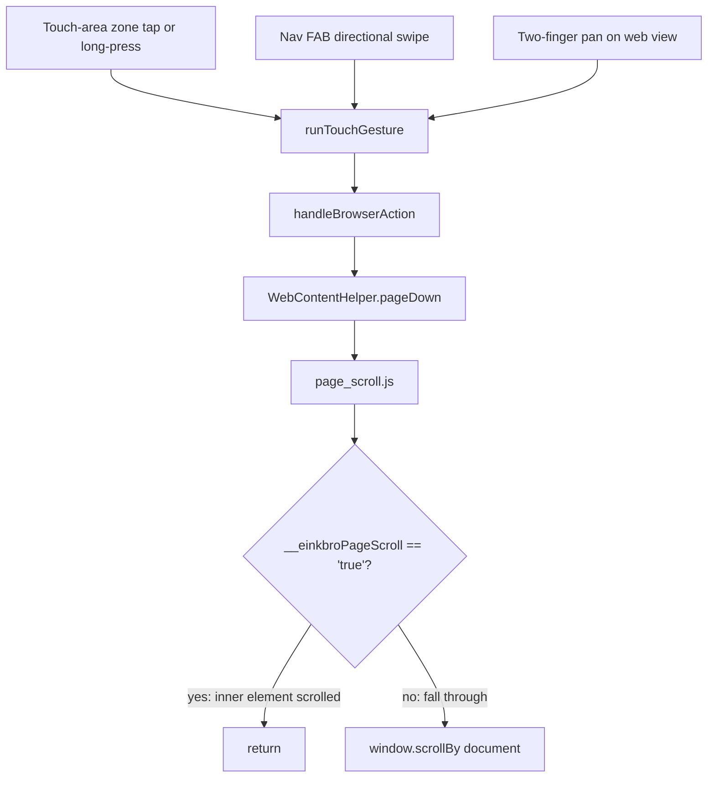

2026-07-17

# EinkBro iOS parity Phase F: touch-area zones, gesture FAB, multitouch

Phase F of `docs/PARITY_PLAN.md` brings the e-ink gesture surface to the
Compose Multiplatform iOS port: tappable page-turn zones on the screen
edges, a draggable floating "nav gesture" button, and two-finger
multitouch paging. All three route through the central `BrowserAction`
dispatcher (Phase A) via `runTouchGesture`, which also flips
PageUp/PageDown when the page is in CJK vertical-reading mode.

But wiring the gestures up surfaced a bug that had quietly broken *every*
page-turn path on iOS, so this phase is really a bug fix wearing a
feature's clothes.

## The bug: nothing paged, and a truthy string was why

Tapping a touch-area zone dispatched `PageDown` correctly (a temporary
toast confirmed the tap reached the zone's `combinedClickable`), yet the
page never moved. The engine's own `pageDown` (a plain `window.scrollBy`)
worked fine, which isolated the fault to the `WebContentHelper` path that
runs `page_scroll.js`.

`page_scroll.js` defers to an injected helper before falling back to a
document-level scroll:

```
if (window.__einkbroPageScroll && window.__einkbroPageScroll(dir, ...)) return;
window.scrollBy({top: dir * usableH, ...});   // fallback
```

`window.__einkbroPageScroll` returns the **string** `"true"` or `"false"`
(its Android JS-bridge contract), and returns `"false"` whenever the page
has no inner scrollable element — which is the *common* case. In
JavaScript a non-empty string is truthy, so `"false"` satisfied the
guard, the function returned early, and the document-level fallback never
ran. The fix is to honor the string contract explicitly:

```
if (window.__einkbroPageScroll &&
    window.__einkbroPageScroll(dir, ...) === "true") return;
```

Now a genuine inner-scroll ("true") still short-circuits, but "false"
falls through to `window.scrollBy`. This one line is what makes touch
zones, volume keys, and multitouch all actually turn the page on iOS.

## The dispatch, and where each gesture can live



The zones and the FAB are Compose siblings drawn *above* the
`UIKitView`-hosted WKWebView, so they win hit-testing and receive their
taps and drags directly — verified live. Multitouch is different: it was
first written as a `pointerInput` on the parent container, but a parent's
pointer input loses hit-testing to the interop child that sits on top of
its area, so two-finger gestures never reached it.

## Multitouch: native recognizer, not a Compose overlay

The reliable path on iOS is a native `UIPanGestureRecognizer` installed
on the web view (two fingers required), with the scroll view's own pan
capped to a single finger so one-finger scrolling is untouched and two
fingers belong to us. A *pan* recognizer, not a *swipe* recognizer:
swipe recognizers are velocity-sensitive and drop slower gestures, so the
pan reads its net translation on end and reduces it to the dominant-axis
direction. The engine exposes this through a small
`setMultitouchSwipeHandler` seam on the `WebViewEngine` interface; the
Compose side installs the handler in a `LaunchedEffect(engine)` and reads
the configured bindings live from `TouchConfig`.

All the gesture bindings (touch-area, multitouch, and nav-button) are
already user-configurable through the existing gesture settings screen,
so the `Noop` defaults are correct parity — the user assigns actions.

## Verification (iPhone 16 simulator)

Touch paging was enabled through the app's own toolbar toggle (external
`defaults` seeding proved unreliable — the simulator's global defaults
domain is not the app's sandbox store, so a seeded value can read back as
set via `defaults read` while the app still sees its own value). With it
on: a right-zone tap paged down a full viewport, a left-zone tap paged
back up, a right-zone long-press jumped to the page bottom, and a
swipe-up on the nav FAB opened the tab overview.

The two-finger recognizer is real-device-only: the simulator's synthetic
multi-touch does not drive custom gesture recognizers over WKWebView
content (the recognizer's action never fires), so multitouch is verified
structurally — it compiles, installs, and shares the proven dispatch
path — rather than by simulated gesture.
