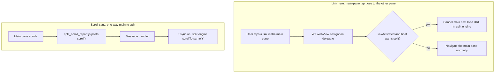

2026-07-17

# EinkBro iOS parity Phase G: split screen

Phase G of `docs/PARITY_PLAN.md` brings EinkBro's two-pane "split screen" to the
Compose Multiplatform iOS port: a second web view beside the current tab, for
reading two pages at once, sending links from one pane to the other, and
keeping them scrolled together. On Android this is the "translation panel"
(`TwoPaneController`) reused for browsing; the iOS port rebuilds the same model
in Compose over a second WKWebView.

## What it does

A second engine renders beside the current tab — side-by-side (Horizontal) or
stacked (Vertical), remembered in `TranslationConfig`. It is reached from the
menu, a link's context menu, and the bookmark dialog, all routed through one
entry point that mirrors Android:

- `toggleSplitScreen(null)` opens the pane on the current page, or closes it if
  already open.
- `toggleSplitScreen(url)` opens (or, if already open, replaces) the pane with
  that URL.

The second pane carries a compact control bar — Rotate (orientation), Swap
(content), Link and Sync toggles (bold when on), font +/-, Close.

## How the panes are held and laid out

The split engine is deliberately **not** a tab. It is created outside the
`albums` list, so it never appears in the tab strip, and its
title/URL/progress callbacks are ignored for the main toolbar because the view
model already filters those by `engine === currentEngine`. That one existing
guard is what makes a second live engine safe to add with almost no new state.

The main pane and all its overlays (touch zones, gesture FAB, selection menu)
were lifted into a `@Composable (Modifier) -> Unit` slot so the same block can
be dropped into either a single-pane layout or a Row/Column beside the second
pane, without duplicating the (large) main-pane body.

## Two things that needed native/JS help

**Link here** can't be done from Compose — the decision has to be made where the
navigation is decided. A new `shouldRouteLinkToSplit` seam on the engine
listener is consulted from `decidePolicyForNavigationAction` on a
`WKNavigationTypeLinkActivated` action; when the host loads the URL in the
second pane it returns true and the main navigation is cancelled.

**Scroll sync** rides on the existing JS-to-Kotlin message bridge: a small
reporter script posts the main pane's `scrollY`, and a handler scrolls the
second engine to match when the toggle is on. It is one-way (main to second),
matching Android.

## Verification (iPhone 16 simulator)

Menu → "Split screen" opened both panes on the same article. Rotate switched
from side-by-side to stacked. With "Link" on, tapping a link in the main pane
loaded it in the second pane while the main pane stayed put. With "Sync" on,
paging the main pane scrolled the second pane in step. Close dismissed the
split and returned to a single pane.
