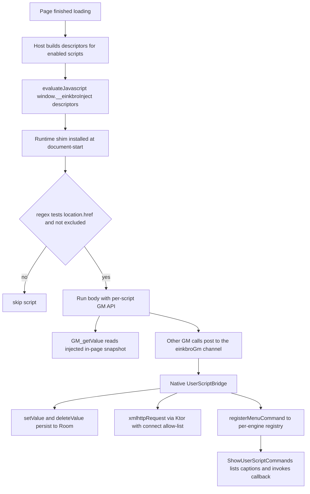

2026-07-17

# EinkBro iOS parity Phase H: userscript runtime

Phase H of `docs/PARITY_PLAN.md` gives the Compose Multiplatform iOS port a real
Tampermonkey / Greasemonkey userscript engine, replacing an in-memory stub that
held sample rows and simulated everything. Users can now install userscripts,
have them injected into matching pages, and use the common GM_* API — value
storage, cross-origin fetch, page styling, and toolbar menu commands.

## What it does

A userscript is a `// ==UserScript== ... // ==/UserScript==` script that runs on
pages matching its `@match` / `@include` patterns. The manager (reachable from
Settings > Site Settings > Userscripts, previously a toast stub) lists installed
scripts with enable toggles, update checks, and an add/edit dialog that can paste
code or fetch it from a URL. When a page finishes loading, every enabled script
whose patterns match the page URL runs, with its own GM_* API bound to it.

## How it is built

The Android feature spreads across a parser, a matcher, a Room store, a JS GM
shim, and a native bridge. The port keeps that shape but adapts three things to
WKWebView.

The descriptors carry each script's match regexes, run-at, GM_info, a snapshot of
its stored values, and its body.

**Storage.** The two entities (`user_scripts` and a `user_script_values` KV table
for GM_setValue) already existed; Phase H registers them in the database (v4 with
a `MIGRATION_3_4`) and adds the DAOs. Android moves large script bodies to files
to dodge its 2 MB `CursorWindow` limit; the iOS SQLite driver has no such cursor,
so bodies stay inline in the `code` column and the file spill is dropped.

**Injection timing.** Android injects from the WebViewClient page callbacks —
document-start in `onPageStarted`, document-end in `onPageFinished`. On iOS the
Kotlin/Native navigation delegate can only implement one of the same-signature
`didStart` / `didCommit` / `didFinish` callbacks, and it already uses
`didFinish`. There is therefore no document-start hook to ride, so every matching
script (whatever its `@run-at`) is injected once at page-finished. A single
document-start `WKUserScript` (the runtime shim) defines the GM API and a
`window.__einkbroInject(descriptors)` entry point; the host calls it with the
enabled scripts' compiled regexes, `GM_info`, value snapshot, and body, and the
shim does the URL matching against `location.href`. This also means script edits
take effect on the next navigation without rebuilding any `WKUserScript`.

**GM_getValue is synchronous, but WKWebView message handlers are one-way.**
Android's bridge is an `@JavascriptInterface` whose methods return values
synchronously; WKWebView's `postMessage` cannot. So each script's stored values
are snapshotted into its descriptor at injection time, and GM_getValue reads that
in-page cache synchronously; GM_setValue updates the cache and posts to the native
side to persist. This is the standard WKWebView userscript pattern.

The matcher was ported to emit JavaScript-compatible regex source strings rather
than testing in Kotlin — the per-page test runs in the shim, and JS `RegExp`
rejects the `\Q..\E` quoting Kotlin's `Regex.escape` produces, so the escaping is
hand-rolled. The rest of the GM bridge (GM_xmlhttpRequest over Ktor with the
`@connect` allow-list, GM_registerMenuCommand surfaced through the existing
`ShowUserScriptCommands` action, GM_setClipboard, GM_openInTab) rides on one
`einkbroGm` string channel.

One consequence worth noting: script bodies are executed with `new Function` in
the page's main world, so a site with a strict `script-src` CSP that forbids
`eval` can block a userscript. Getting full CSP immunity would mean baking each
body into its own `WKUserScript`, which the injection model deliberately avoids.

## Verification

On the iPhone 16 simulator, with a document-end script matching
`http://localhost:8000/*`: loading the target page injected a styled red banner
(so injection, URL matching, and GM_addStyle all worked), and GM_setValue /
GM_getValue persisted a run counter across two loads (banner `#1` then `#2`, with
the `user_script_values` row reading `runs=2`). The manager listed the script
with its parsed name, the edit dialog opened populated, and delete removed the
script and cascade-cleared its stored values.
