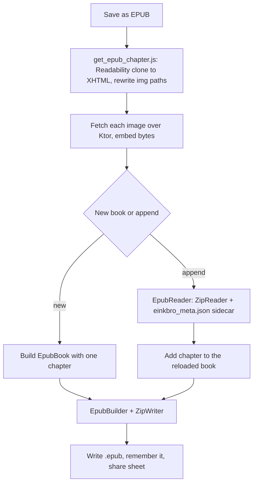

2026-07-17

# EinkBro iOS parity Phase I: EPUB export

Phase I of `docs/PARITY_PLAN.md` makes the Compose Multiplatform iOS port's
"Save as EPUB" real. It captures the current page as a reader-mode chapter and
writes a valid EPUB — either as a new book or appended to a previously saved one
— entirely in shared Kotlin, with no EPUB library and no platform zip API.

## What it does

From the menu or a toolbar button, "Save as EPUB" opens a dialog with two modes,
mirroring Android:

- **Save as new EPUB** — the current page becomes chapter 1 of a new book (book
  name and chapter title are editable, defaulting to the page title).
- **Add chapter to …** — the page is appended as a new chapter to a book saved
  earlier; the whole EPUB is then rewritten.

Each saved book is remembered (in `savedEpubFileInfos`) and offered as an append
target. Export shows a progress bar, then hands the finished `.epub` to the iOS
share sheet.

## How it is built

Android uses the epub4j library; the port hand-rolls the pieces so everything
lives in `commonMain`.

**The writer.** `ZipWriter` emits STORED (uncompressed) zip entries with a
pure-Kotlin CRC-32 — enough for a valid archive and, conveniently, exactly what
the EPUB OCF spec demands of the leading `mimetype` entry. `EpubBuilder` lays out
the standard container: `mimetype`, `META-INF/container.xml`, and an `OEBPS/`
folder with `content.opf` (an EPUB 2 manifest + spine), `toc.ncx` (a navMap), the
chapter XHTML, and the embedded images.

**The chapter.** `get_epub_chapter.js` runs Mozilla Readability over a document
clone (non-destructive) and serializes the article through `XMLSerializer`, which
yields well-formed XHTML with self-closed void elements. It rewrites each ``
to a local path and returns the image URLs; the exporter fetches those over Ktor
and embeds the bytes, namespacing each chapter's images so two chapters that both
number images from zero don't collide.

**Append without an OPF parser.** WKWebView has no epub4j to reopen a book, so
`EpubBuilder` embeds a small `einkbro_meta.json` sidecar carrying the book model
(chapter titles, bodies, image names). To append, `ZipReader` reads the stored
entries of EinkBro's own EPUB, `EpubReader` rebuilds the `EpubBook` from that
sidecar plus the image bytes, the new chapter is added, and the whole file is
rewritten — matching Android's re-serialize behavior. A non-EinkBro or compressed
EPUB simply has no readable sidecar, and append falls back to a new book.

**One UI subtlety.** The export dialog dismisses itself on a monotonic
"done" counter rather than by watching the progress value return to null: a fast
export (no images) finishes so quickly that Compose coalesces the progress
transitions, so a null-watcher never sees them. A counter increment is always
delivered as a distinct new value.

## Verification (iPhone 16 simulator)

Exporting an article produced a valid EPUB — iOS classified the file as a "Book",
the `mimetype` entry was STORED, and the OPF/NCX were well-formed with the chapter
holding clean Readability text. A page with an image embedded
`images/c0_img0.png` (declared `image/png` in the manifest, with valid PNG bytes).
Appending a second page to the saved book yielded a two-chapter EPUB with the
spine and NCX navMap both extended.
