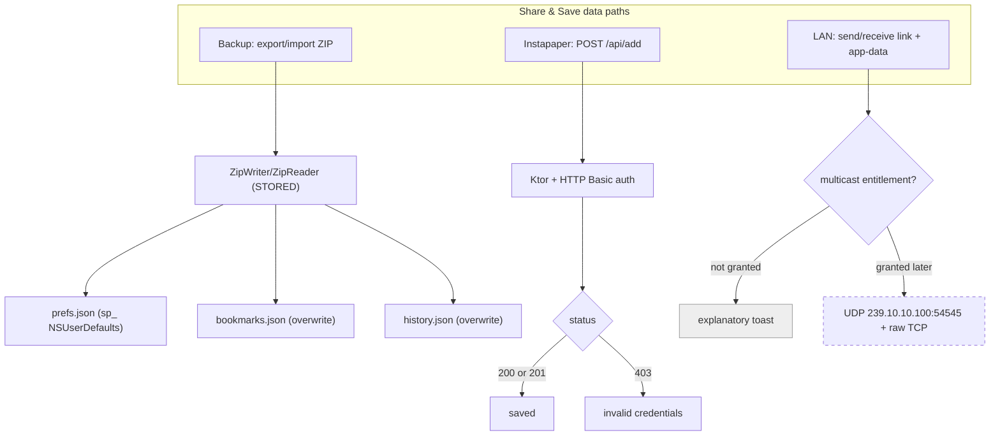

2026-07-17

# EinkBro iOS Parity Phase J — App-data backup, bookmark import, Instapaper (and an honest LAN deferral)

Phase J ports EinkBro's "Share & Save" data plumbing to the Compose Multiplatform iOS build. Android exposes four device-data paths under one Backup screen: full app-data backup, bookmark export/import, "send to Instapaper", and LAN device-to-device transfer of both links and app data. Three of those port cleanly. The fourth cannot ship yet — not because the code is hard, but because iOS gates the transport behind an Apple-granted entitlement — so it degrades to an explanatory toast rather than a button that silently does nothing.

## What shipped

**App-data backup.** `BackupManager.exportBackupZip()` builds a ZIP with the same pure-Kotlin `ZipWriter` written for the EPUB work in Phase I, containing `manifest.json`, `prefs.json` (every `sp_`-prefixed `NSUserDefaults` value), `bookmarks.json`, and `history.json`. `importBackupZip()` reads it back through `ZipReader` and restores each section: prefs through the prefs store, bookmarks and history through the Room DAOs with an overwrite (delete-all then insert). The important design choice is that restore never swaps a raw database file — it goes through the same DAO and preference APIs the running app uses, so a restore applies to the live database without risking corruption of an open connection. A relaunch is still suggested only so that cached sub-configs re-read.

**Bookmark import** accepts either the app's own JSON array or a flat Netscape/Chrome bookmark HTML export (every `<A HREF>` becomes a bookmark), matching Android's dual-format importer.

**Instapaper.** `InstapaperRepository.addUrl()` issues `POST https://www.instapaper.com/api/add` with HTTP Basic auth over Ktor and maps the documented status codes — 200/201 success, 400 invalid URL, 403 bad credentials, 500 service down — to a small result type. `InstapaperDialog` collects the username and password (persisted as `sp_instapaper_*`); the first invocation with no stored credentials opens the dialog and, on save, auto-submits the current page.

**File import** needed a picker. A new `expect object FilePicker` has an iOS actual backed by `UIDocumentPickerViewController` opened `asCopy`, reading the chosen file's bytes via `NSData`. The delegate is held in a strong reference because the picker only holds it weakly.

## Why LAN is deferred

The tempting assumption is that "share over local network" is an HTTP server. It is not. Reading the Android implementation showed link-sharing is a raw UDP multicast of the URL string to `239.10.10.100:54545`, and app-data sharing is a one-shot raw TCP socket whose address is announced over that same multicast group. On iOS, *joining a multicast group or binding a multicast socket* requires the `com.apple.developer.networking.multicast` entitlement, which Apple issues only by request against a paid developer account. Without it the transport cannot even open. Rather than ship four buttons where one pair fails opaquely, the LAN actions call a toast: "LAN link sharing needs the multicast entitlement (Apple account required)." This is consistent with the other Apple-account-gated items deferred earlier in the port (share extension, TestFlight). A Ktor CIO server dependency was briefly added to test whether an HTTP fallback could resolve on iOS native — it compiles and links fine, a useful fact for later — but it was reverted because it would not interoperate with the Android protocol, which is the whole point of the feature.

## Verification

Everything was exercised on the simulator against the real endpoints and a real document picker. Export produced a ZIP whose four entries carried actual data (twenty `sp_` prefs, live bookmarks, the loaded article's history row). For import, a marker ZIP with a uniquely named bookmark, history row, and preference was selected through the document picker; afterward the on-device database held only the marker bookmark, exactly one history row, and the marker preference had been flushed to the preferences plist — proving the whole picker → bytes → `importBackupZip` → prefs/DAO chain applied. Instapaper with deliberately wrong credentials produced the "Invalid username or password" toast, confirming the request actually reaches the API and the 403 mapping works. "Send link" produced the multicast-entitlement toast.

One reusable detail worth recording: the iOS simulator's document picker can only see files in the Files app, so to test import end-to-end the marker ZIP was dropped into the simulator's `group.com.apple.FileProvider.LocalStorage` container ("On My iPhone"), and it had to be a STORED (method 0) ZIP because `ZipReader` only reads uncompressed entries.
