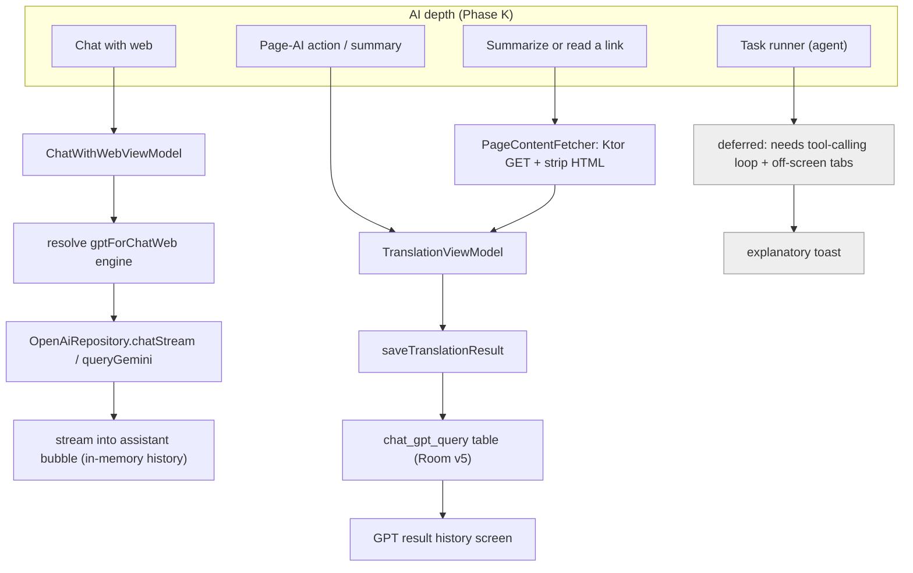

2026-07-17

# EinkBro iOS Parity Phase K — AI depth: chat-with-web, query persistence, GPT editors

Phase K fills out the AI surface of the Compose Multiplatform iOS port. Earlier phases already gave it working page summaries, page-AI actions, and translation over an OpenAI-compatible / Gemini client. What was still stubbed: an interactive chat about the current page, a real persisted query history, and the two GPT editor screens that Android reaches from Settings. This phase ships those three, and honestly defers the fourth — the agentic task runner — because it is a subsystem of its own.

## Chat with web

Android implements "chat with web" by loading a 1,200-line `chat.html` into a browser tab and driving it through a `ChatWebInterface` JavaScript bridge. Porting that verbatim to WKWebView would mean shimming a synchronous `getWebMetadata()` return, streaming assistant tokens into an HTML page over `evaluateJavascript`, and making the chat page behave as a real tab. The iOS port instead renders a **native Compose chat** (`ChatWithWebViewModel` + `ChatWithWebDialog`). The conversation model is the same as Android's: the page's raw text is injected once as context, then every user turn streams an assistant reply from the engine chosen by the `gptForChatWeb` preference — OpenAI-compatible SSE or a Gemini one-shot — appended live into the last assistant bubble. History stays in memory, exactly as `ChatWebInterface` keeps it. This is a deliberate divergence in the same spirit as the port's other WebView-UI-to-Compose swaps: cleaner over the interop, and fully drivable in a simulator.

## Query persistence

`chat_gpt_query` was a dangling entity with no table and an in-memory view model seeded with sample rows. It is now a real Room table (database v5, a non-destructive `MIGRATION_4_5`, and a committed `5.json` schema) with a `ChatGptQueryDao`, surfaced through `BookmarkManager`. `GptQueryViewModel` reads the live table, and `TranslationViewModel.saveTranslationResult()` — previously a toast placeholder — writes a row when the user taps Save in the translate/summary popup, recording the model, the query, and the result.

## Summarize or read a link

The link context menu's Summarize and "read aloud" entries were stubs. Android runs the target through an off-screen `EBWebView` + Readability; the iOS port adds a small `PageContentFetcher` that fetches the URL over Ktor and reduces the HTML to plain text with a lightweight tag stripper — enough to seed the LLM summary popup or hand text to the TTS reader without spinning up a hidden WebView.

## Editors from Settings

"ChatGPT action definition" and "GPT result history" in GPT Settings were placeholder toasts; they now open the existing `GptActions` and `GptQueryList` screens through two new `SettingScreenDeps` callbacks, the same pattern used to wire the userscript manager in Phase H.

## Why the task runner is deferred

Android's chat-with-web has an agent mode: user prompts run through an OpenAI tool-calling loop where the model can open tabs, run JavaScript in the background, search, and save EPUBs via a `BrowserTools` façade backed by off-screen WebViews, orchestrated by a `TaskRunner`. That is a large, self-contained subsystem — the bridge alone is ~560 lines, and the iOS `OpenAiRepository` does not yet implement the tool-calling API. Rather than ship a half-built agent, the task-runner menu entries show an explanatory toast, and the work is left for a dedicated pass. The non-agent chat, which is what most users mean by "chat with the page", is fully functional.

## Verification

Everything was exercised on the simulator against a local mock OpenAI server (SSE for streaming, JSON otherwise). The v4→v5 migration succeeds — the `chat_gpt_query` table is present, the database reports version 5, and the app launches without incident. Chat-with-web streams a reply into the assistant bubble with the page supplied as context. Tapping Save on a result adds a row to the table, and the history screen renders it (a seeded marker row confirmed the read path independently). Both GPT editors open from GPT Settings. The link context menu's Summarize fetches the target and returns a summary. The task-runner entries show the deferral toast.

One reusable detail: seeding the self-hosted-server preferences to point at the mock only worked through `xcrun simctl spawn <UDID> defaults write <bundle-id> …` with the app terminated first — a host-side `defaults write` against the container plist did not reach the app's sandbox, because the simulator's own `cfprefsd` owns that domain.
