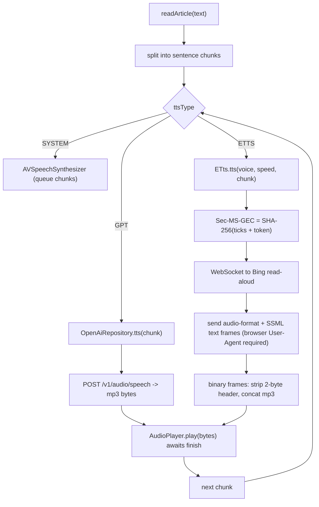

2026-07-17

# EinkBro iOS Parity Phase L — Network TTS engines: OpenAI and Edge

The Compose Multiplatform iOS port already read pages aloud through the system voice (AVSpeechSynthesizer). Phase L adds the two network engines Android offers alongside it — OpenAI's TTS and Microsoft Edge's neural "read aloud" — selectable from the TTS dialog's engine row (Built-in / OpenAI / ReadAloud). Both work the same way: the article is split into sentence chunks, each chunk is fetched as an mp3, and a shared audio player plays it before the next chunk is fetched.

## The shared player

Both network engines needed something the system path didn't: a way to play arbitrary audio bytes. `AudioPlayer` (expect/actual) wraps `AVAudioPlayer`; its `play()` suspends until the clip finishes (resumed from the player's finish delegate), so the read loop can `await` each chunk. Pause, resume, and stop route to whichever engine is active — the system synthesizer or the audio player — tracked by a flag the view model flips when a network chunk is playing.

## OpenAI TTS

The simpler of the two: `OpenAiRepository.tts()` POSTs to `/v1/audio/speech` with the configured voice, model, speed, and optional instructions prompt, and returns the audio bytes. It honors the self-hosted server URL, so an OpenAI-compatible TTS endpoint works too.

## Edge TTS

Ported from Android's `ETts` (itself from Edge-TTS-Lib). It streams audio over a WebSocket to Microsoft's free Bing read-aloud endpoint — no API key. The request is signed with a `Sec-MS-GEC` token, which is a SHA-256 hash of the current time rounded to a 5-minute window in Windows ticks, concatenated with a fixed trusted-client token; that required a new `Crypto.sha256Hex` over CommonCrypto. Two text frames are sent — an audio-format config and the SSML payload — and the server replies with binary frames whose leading header block (a two-byte big-endian length prefix) is stripped and the trailing mp3 concatenated until a `turn.end` text frame arrives.

## Two iOS gotchas

The Ktor Darwin client has no WebSocket support until the `WebSockets` plugin is installed on the shared client — once it was, the Darwin engine's WebSocket compiled and connected fine.

The second was subtler and cost a debugging pass. Edge's read-aloud endpoint accepts the WebSocket handshake even without a browser `User-Agent`, but then never synthesizes — so the read loop blocks forever on `incoming`, presenting as a hang rather than an error. Sending the same browser User-Agent Android sends fixed it. (An independent check confirmed the endpoint itself: a minimal client 403'd without a User-Agent and returned audio with one.)

## Verification

On the simulator: OpenAI TTS, pointed at a local mock, fetched each chunk and the audio player played them spaced by the clip's duration — the chunk requests arrived ~2.6 seconds apart, exactly the sample's length, which proves each clip played fully before the next fetch rather than racing through on a playback failure. Edge TTS, against the real Bing endpoint, streamed ~38 KB of mp3 for a single sentence and completed on `turn.end`, then played through the same audio player. The system voice path is unchanged.
