2026-07-17

# EinkBro iOS Parity Phase M — Translation extras: Google widget, per-site memory, image OCR, dual captions

The Compose Multiplatform iOS port already had text translation (Google/DeepL/Papago), paragraph translation, and LLM in-place translation. Phase M fills in the remaining translation surfaces Android offers: the Google website-translate widget, per-site translation memory that survives a relaunch, Papago image OCR (long-press an image, or translate the whole screen), and dual-language YouTube captions.

## Google in-place widget

`WebContentHelper.addGoogleTranslation()` injects Google's `TranslateElement` (loaded from `translate.google.com/translate_a/element.js`) in its auto in-place mode — the widget rewrites the page's text nodes directly, no container div needed — then injects a small CSS asset that hides the "Original text" balloon Google pops up on tap, which otherwise hijacks scrolling and selection on e-ink. `preferredTranslateLanguageString` (a comma-separated Google language-code list) narrows the widget's target-language menu when set. The bootstrapper and popup-hider are the two new JS assets, ported verbatim from Android's `WebViewJsBridge`.

## Per-site translation memory

The per-site configuration store already existed on iOS (mode picker in the translation dialog wrote it to the `domain_configuration` table), but with a gap: the in-memory map was never hydrated from the DB at startup, so a marked site forgot its setting after a relaunch. Phase M hydrates the map in the browser view model's init. It also wires auto-translate-on-load: `onPageFinished` bumps a tick carrying the finished URL, and a `LaunchedEffect` fires the site's stored translation mode when `shouldTranslateSite` is set. Two modes are skipped in the auto path — `GOOGLE_URL` would open a new tab on every load (a redirect loop) and `PAPAGO_TRANSLATE_BY_SCREEN` captures a screenshot, neither suited to firing automatically.

## Papago image OCR

Both the long-press-image path and translate-by-screen post an image to Papago's OCR endpoint, which returns a base64 JPEG with the translation rendered onto it; the request is signed HMAC-SHA1 with the user's `imageApiKey`. For a long-pressed image the translated JPEG is laid over the original as a tappable overlay (tap toggles original/translation); the long-press-item variant translates every image from that point down. Translate-by-screen captures the WebView with `takeSnapshot` and shows the returned image as a page. The multipart request and the overlay/collector JS are faithful ports; the screenshot capture and `loadHtml` are the new iOS engine hooks.

## Dual captions

```mermaid
flowchart TB
    subgraph GW["Google in-place widget"]
        G1["addGoogleTranslation()"] --> G2["inject element.js TranslateElement (auto in-place)"]
        G2 --> G3["hide the Original-text balloon"]
    end

    subgraph PS["Per-site memory"]
        P1["app start: hydrate domain map from DB"] --> P2["onPageFinished: tick + finished URL"]
        P2 --> P3{"shouldTranslateSite?"}
        P3 -->|yes| P4["translateWithMode(getTranslationMode)"]
        P3 -->|no| P5["do nothing"]
    end

    subgraph IMG["Papago image OCR"]
        I1["long-press image, or by-screen"] --> I2["download image, or takeSnapshot JPEG"]
        I2 --> I3["multipart POST, HMAC-SHA1(imageApiKey)"]
        I3 --> I4["renderedImage base64"]
        I4 --> I5["overlay on image, or load translated_image.html"]
    end

    subgraph CAP["Dual captions"]
        C1["document-start fetch/XHR shim"] --> C2{"url has timedtext?"}
        C2 -->|yes| C3["fetch original plus tlang variant"]
        C3 --> C4["merge by tStartMs: original + newline + translated"]
        C2 -->|no| C5["passthrough"]
    end
```

Android intercepts YouTube's `timedtext` network request in its WebViewClient and merges a second-language copy into the caption JSON. WKWebView can't intercept page subresources natively, so the iOS port moves the interception in-page: a document-start shim patches `fetch` and `XMLHttpRequest`, and when a `timedtext` request is seen it also fetches the `&tlang=<locale>` variant and merges the two — appending the translated line under each original line, keyed by `tStartMs`. The merge algorithm is a 1:1 port; only the interception seam changed. The shim is installed (with the locale baked in) when `dualCaptionLocale` is set.

## Verification

On the simulator, seeding a per-site config row (auto-translate + Google in-place) and opening a Japanese test page made the Google banner appear and the page translate to Chinese without any manual action — proving the DB hydration, the auto-translate-on-load path, and the widget injection at once. The dual-caption shim, pointed at a mock `timedtext` endpoint that returned English normally and German under `&tlang`, produced merged per-line captions ("Hello\nHallo", "world\nWelt") with the roll-up styles zeroed, matching Android's output. The image-overlay asset laid a red "translated" JPEG cleanly over a blue original. The live Papago OCR round-trip needs the user's scraped `imageApiKey`, which is user-supplied on Android too; the request signing (CommonCrypto HMAC-SHA1) and multipart shape are ported as-is.
